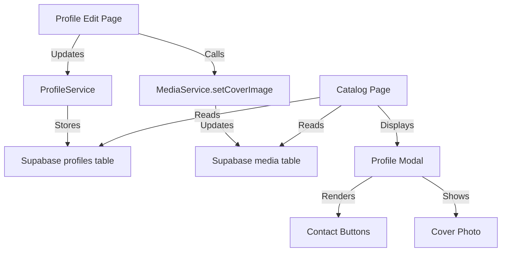

# Design Document: Contact and Cover Photo

## Overview

This design document specifies the technical implementation for two related profile enhancement features: WhatsApp and Telegram contact integration, and cover photo selection functionality. These features extend the existing profile management system to provide better communication options and visual customization for service providers in the Brazilian marketplace.

The implementation leverages the existing Next.js 16.1.6 architecture with TypeScript, Supabase backend, and established patterns from the ProfileService and MediaService classes. The design focuses on minimal changes to existing code while maintaining consistency with current UI patterns and data structures.

## Architecture

### System Context

The features integrate into three main areas of the application:

1. **Profile Edit Page** (`app/portal/profile/page.tsx`): Where users configure contact information and select cover photos
2. **Catalog Page** (`app/page.tsx`): Where contact buttons are displayed in the profile modal
3. **Backend Services**: ProfileService and MediaService handle data persistence

### Component Architecture



### Data Flow

**Contact Information Flow:**
1. User enters WhatsApp number or Telegram username in Profile Edit Page
2. User toggles visibility checkboxes
3. Form data is validated and formatted client-side
4. ProfileService.updateProfile() persists to database
5. Catalog Page fetches profile data including contact fields
6. Profile Modal conditionally renders contact buttons based on enabled flags

**Cover Photo Flow:**
1. User uploads photos via existing media upload mechanism
2. User clicks "Set as Cover" button on desired photo
3. MediaService.setCoverImage() is called with profileId and mediaId
4. Service unsets all existing covers, then sets new cover
5. Catalog Page queries media with is_cover flag for display
6. Profile cards show cover photo, falling back to first photo if no cover set

## Components and Interfaces

### ProfileService Interface Updates

The ProfileService interfaces require extension to support contact fields:

```typescript
interface CreateProfileInput {
  // ... existing fields
  whatsapp_number?: string;
  whatsapp_enabled?: boolean;
  telegram_username?: string;
  telegram_enabled?: boolean;
}

interface UpdateProfileInput {
  // ... existing fields
  whatsapp_number?: string;
  whatsapp_enabled?: boolean;
  telegram_username?: string;
  telegram_enabled?: boolean;
}
```

These fields are optional to maintain backward compatibility with existing profile creation flows.

### Profile Edit Page Components

**Contact Input Section:**
- Location: Basic Information Section (after physical measurements)
- Components:
  - WhatsApp number input field (numeric only)
  - WhatsApp visibility checkbox
  - Telegram username input field (alphanumeric, no @ symbol)
  - Telegram visibility checkbox
- Validation: Client-side input filtering for format compliance

**Media Section Enhancement:**
- Location: Existing media section
- New Component: "Set as Cover" button for each photo
- Visual Indicator: Badge or icon showing current cover photo
- Behavior: Button only visible for photo type media items

### Catalog Page Components

**Contact Buttons in Profile Modal:**
- Location: Right column sidebar (above pricing card)
- Components:
  - WhatsApp button (green #25D366 background)
  - Telegram button (blue #0088cc background)
- Behavior:
  - Only render if corresponding enabled flag is true
  - Open contact URL in new tab on click
  - Stack vertically when both present

**Cover Photo Display:**
- Location: Profile cards and modal gallery
- Logic:
  - Query media where is_cover = true
  - Fallback to first media item by sort_order if no cover
  - Display with object-fit: cover for consistent aspect ratio

## Data Models

### Database Schema

The database schema already exists with the required fields. This design documents their usage:

**profiles table:**
```sql
whatsapp_number TEXT NULL
whatsapp_enabled BOOLEAN DEFAULT FALSE
telegram_username TEXT NULL
telegram_enabled BOOLEAN DEFAULT FALSE
```

**media table:**
```sql
is_cover BOOLEAN DEFAULT FALSE
-- Existing fields: id, profile_id, type, storage_path, public_url, sort_order
```

### Data Validation Rules

**WhatsApp Number:**
- Format: Numeric digits only (no formatting characters)
- Storage: Raw digits without country code
- Display: Prepend +55 for Brazil when generating wa.me URL
- Example: Input "11987654321" → URL "https://wa.me/5511987654321"

**Telegram Username:**
- Format: Alphanumeric characters, underscores allowed
- Storage: Without @ symbol prefix
- Display: Prepend @ for user-facing display if needed
- Example: Input "username" → URL "https://t.me/username"

**Cover Photo:**
- Constraint: Only one photo per profile can have is_cover = true
- Type: Only applies to media items with type = "photo"
- Atomicity: Setting new cover must unset previous cover in same transaction

## Data Models


### URL Generation Patterns

**WhatsApp URL Pattern:**
```
https://wa.me/55{whatsapp_number}
```
- Always prepend Brazil country code (+55)
- No spaces or formatting in URL
- Opens WhatsApp web or app depending on device

**Telegram URL Pattern:**
```
https://t.me/{telegram_username}
```
- Username without @ symbol
- Opens Telegram web or app depending on device

### Form State Management

The Profile Edit Page already uses a comprehensive formData state object. The contact fields integrate naturally:

```typescript
const [formData, setFormData] = useState({
  // ... existing fields
  whatsapp_number: "",
  whatsapp_enabled: false,
  telegram_username: "",
  telegram_enabled: false,
});
```

This state is populated from the profile data on load and submitted via the existing handleSubmit function.


## Correctness Properties

A property is a characteristic or behavior that should hold true across all valid executions of a system—essentially, a formal statement about what the system should do. Properties serve as the bridge between human-readable specifications and machine-verifiable correctness guarantees.

### Property 1: Contact Data Persistence Round Trip

For any profile with contact information (WhatsApp number, WhatsApp enabled flag, Telegram username, Telegram enabled flag), saving the profile and then retrieving it should return the same contact values.

**Validates: Requirements 1.4, 1.5, 2.4, 2.5**

### Property 2: WhatsApp Input Numeric Filtering

For any input string entered into the WhatsApp number field, the resulting value should contain only numeric digits (0-9), with all non-numeric characters removed.

**Validates: Requirements 1.3, 8.1**

### Property 3: Telegram Username @ Symbol Removal

For any input string entered into the Telegram username field, the resulting value should have all @ symbols removed.

**Validates: Requirements 2.3, 8.4**

### Property 4: WhatsApp URL Generation with Country Code

For any valid WhatsApp number stored in a profile, the generated contact URL should follow the format `https://wa.me/55{number}` where the Brazil country code (+55) is prepended to the stored number.

**Validates: Requirements 1.8, 1.9**

### Property 5: Telegram URL Generation

For any valid Telegram username stored in a profile, the generated contact URL should follow the format `https://t.me/{username}` where the username is used without the @ symbol.

**Validates: Requirements 2.8**

### Property 6: Contact Button Conditional Rendering

For any profile, the contact buttons displayed in the Profile Modal should match the enabled flags: both buttons when both are enabled, only WhatsApp when only whatsapp_enabled is true, only Telegram when only telegram_enabled is true, and no buttons when neither is enabled.

**Validates: Requirements 1.6, 2.6, 7.2, 7.3, 7.4, 7.5**

### Property 7: Set as Cover Button Display by Media Type

For any media item in the Profile Edit Page, the "Set as Cover" button should be displayed if and only if the media type is "photo" (not displayed for "video" type).

**Validates: Requirements 4.4, 4.5**

### Property 8: Cover Photo Visual Indicator

For any media item in the Profile Edit Page with is_cover set to true, a visual indicator should be displayed showing it is the current cover photo.

**Validates: Requirements 4.2**

### Property 9: MediaService.setCoverImage Invocation

For any photo media item, when the "Set as Cover" button is clicked, the MediaService.setCoverImage() method should be called with the correct profileId and mediaId parameters.

**Validates: Requirements 4.3**

### Property 10: Cover Photo Uniqueness

For any profile, after calling MediaService.setCoverImage() with a specific mediaId, exactly one photo should have is_cover set to true (the selected photo), and all other photos in that profile should have is_cover set to false.

**Validates: Requirements 5.1, 5.2**

### Property 11: No Automatic Cover Reassignment on Deletion

For any profile where the cover photo is deleted, no other photo should be automatically assigned as the new cover (all photos should have is_cover set to false).

**Validates: Requirements 5.4**

### Property 12: Cover Photo Display Priority

For any profile displayed on the Catalog Page, if a media item exists with is_cover set to true, that item should be displayed; otherwise, the first media item by sort_order should be displayed; if no media items exist, no image should be displayed.

**Validates: Requirements 6.1, 6.2, 6.3**


## Error Handling

### Input Validation Errors

**WhatsApp Number Validation:**
- Client-side: Silently filter non-numeric characters during input
- No explicit error messages needed as filtering is transparent
- Empty values are acceptable (optional field)

**Telegram Username Validation:**
- Client-side: Silently remove @ symbols during input
- No explicit error messages needed as filtering is transparent
- Empty values are acceptable (optional field)

### Service Layer Errors

**ProfileService.updateProfile() Errors:**
- Database connection failures: Propagate error to UI, display generic "Failed to save profile" message
- Validation errors from Supabase: Display specific error message if available
- Network timeouts: Display "Connection error, please try again" message

**MediaService.setCoverImage() Errors:**
- Invalid mediaId: Display "Photo not found" error
- Invalid profileId: Display "Profile not found" error
- Database transaction failures: Display "Failed to set cover photo" error
- Ensure atomic operation: If unsetting previous covers fails, don't set new cover

### Edge Cases

**No Media Items:**
- Profile cards display gracefully without images
- No "Set as Cover" buttons shown in edit page
- No errors thrown

**Multiple Covers (Data Integrity Issue):**
- If database somehow has multiple is_cover=true photos, display first by sort_order
- MediaService.setCoverImage() will correct this on next cover change

**Deleted Cover Photo:**
- System does not auto-assign new cover
- Profile cards fall back to first photo by sort_order
- No error messages to user

**Contact URL Generation:**
- Empty WhatsApp number: Don't render button (handled by enabled flag)
- Empty Telegram username: Don't render button (handled by enabled flag)
- Invalid characters in stored data: URL encoding handles special characters

## Testing Strategy

### Dual Testing Approach

This feature requires both unit tests and property-based tests for comprehensive coverage:

- **Unit tests**: Verify specific examples, edge cases, and UI component rendering
- **Property tests**: Verify universal properties across randomized inputs

Both testing approaches are complementary and necessary. Unit tests catch concrete bugs in specific scenarios, while property tests verify general correctness across a wide range of inputs.

### Property-Based Testing

**Framework:** fast-check (JavaScript/TypeScript property-based testing library)

**Configuration:**
- Minimum 100 iterations per property test
- Each test must reference its design document property via comment tag
- Tag format: `// Feature: contact-and-cover-photo, Property {number}: {property_text}`

**Property Test Coverage:**

1. **Property 1 - Contact Data Persistence**: Generate random contact data, save via ProfileService, retrieve and verify equality
2. **Property 2 - WhatsApp Numeric Filtering**: Generate random strings with mixed characters, verify only digits remain
3. **Property 3 - Telegram @ Removal**: Generate random strings with @ symbols, verify all @ removed
4. **Property 4 - WhatsApp URL Format**: Generate random numeric strings, verify URL format with +55 prefix
5. **Property 5 - Telegram URL Format**: Generate random usernames, verify URL format
6. **Property 6 - Button Conditional Rendering**: Generate all combinations of enabled flags, verify correct buttons rendered
7. **Property 7 - Cover Button by Type**: Generate media items of different types, verify button display logic
8. **Property 8 - Cover Visual Indicator**: Generate media items with various is_cover values, verify indicator display
9. **Property 9 - setCoverImage Invocation**: Generate random media items, verify service method called correctly
10. **Property 10 - Cover Uniqueness**: Generate profiles with multiple photos, set cover, verify exactly one is_cover=true
11. **Property 11 - No Auto-Reassignment**: Generate profiles with covers, delete cover, verify no auto-assignment
12. **Property 12 - Cover Display Priority**: Generate profiles with various media configurations, verify correct display logic

### Unit Testing

**Focus Areas:**

1. **UI Component Rendering:**
   - WhatsApp input field exists in Basic Information Section
   - Telegram input field exists in Basic Information Section
   - Visibility checkboxes render correctly
   - "Set as Cover" buttons render for photos only
   - Contact buttons have correct colors (#25D366 for WhatsApp, #0088cc for Telegram)
   - Placeholder text displays correctly
   - Labels indicate Brazilian numbers for WhatsApp

2. **Edge Cases:**
   - First photo upload automatically sets as cover when no cover exists
   - Profile with no media displays without errors
   - Profile with no cover falls back to first photo
   - Deleting cover photo doesn't auto-assign new cover

3. **Integration Points:**
   - Form submission includes contact fields
   - MediaService.setCoverImage() called on button click
   - Profile modal renders contact buttons based on data
   - Contact buttons open correct URLs in new tabs

4. **Error Conditions:**
   - ProfileService errors display appropriate messages
   - MediaService errors display appropriate messages
   - Network failures handled gracefully

### Test Data Generators

For property-based tests, create generators for:

- **Random phone numbers**: 10-11 digit Brazilian phone numbers
- **Random usernames**: Alphanumeric strings with underscores
- **Random strings**: Mixed alphanumeric, special characters, whitespace
- **Random media items**: Objects with type, is_cover, sort_order fields
- **Random profiles**: Objects with contact fields and media arrays
- **Random boolean combinations**: All permutations of enabled flags

### Testing Tools

- **Unit Tests**: Jest or Vitest (existing project test framework)
- **Property Tests**: fast-check library
- **Component Tests**: React Testing Library
- **Integration Tests**: Playwright or Cypress for end-to-end flows

### Continuous Integration

All tests should run on:
- Pre-commit hooks (unit tests only for speed)
- Pull request CI pipeline (all tests)
- Main branch CI pipeline (all tests)

Property tests with 100+ iterations may take longer but provide high confidence in correctness.

