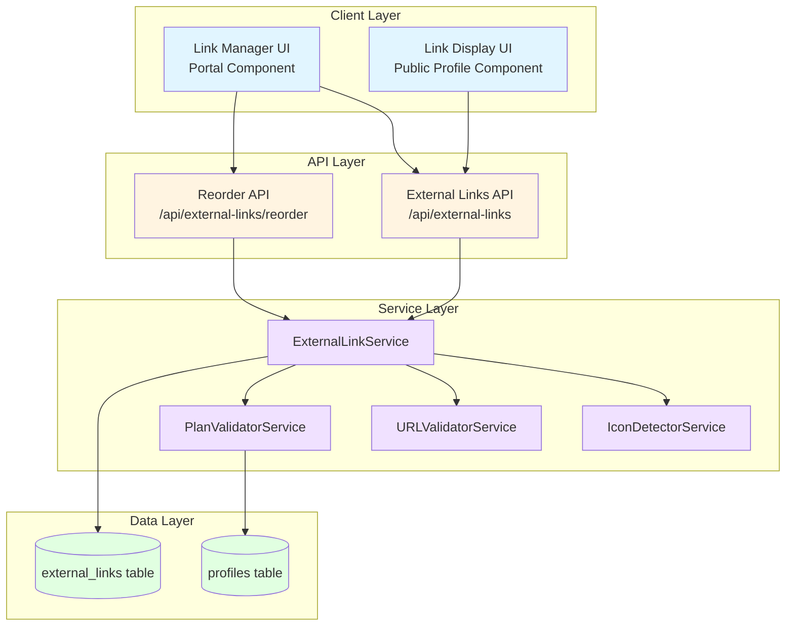
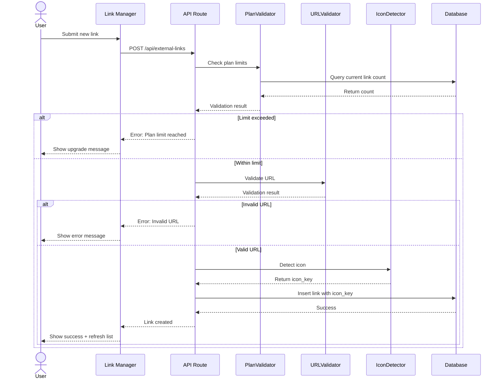
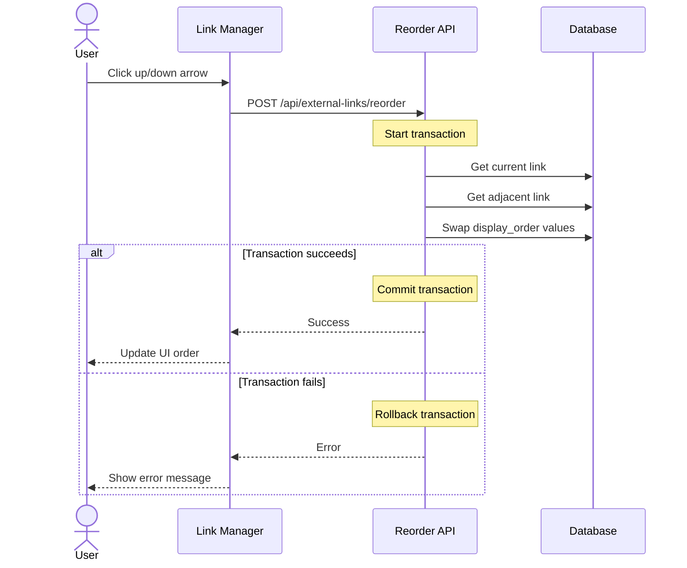

# Design Document: Sistema de Links Externos Estilo Linktree

## Overview

O sistema de Links Externos permite que profissionais premium adicionem múltiplos links personalizados em seus perfis públicos, similar ao Linktree. O sistema detecta automaticamente ícones baseados no domínio da URL, permite ordenação customizável via drag-and-drop ou botões de seta, e respeita limites por plano de assinatura.

### Key Features

- Armazenamento seguro de links com RLS (Row Level Security)
- Detecção automática de ícones para plataformas populares (Instagram, WhatsApp, LinkedIn, etc.)
- Validação robusta de URLs e títulos
- Limites por plano: Free (3 links), Premium (10 links), Black (ilimitado)
- Interface de gerenciamento no portal do profissional
- Exibição pública no perfil com ordenação customizável
- Reordenação via swap de posições

### Technology Stack

- **Backend**: Next.js 14 App Router com Server Actions
- **Database**: Supabase PostgreSQL com RLS
- **Frontend**: React 18 com TypeScript
- **UI Components**: Radix UI + Tailwind CSS
- **Icons**: Lucide React
- **Validation**: Zod schemas

## Architecture

### System Components



### Data Flow

#### Link Creation Flow



#### Link Reordering Flow



## Components and Interfaces

### Database Schema

#### external_links Table

```sql
CREATE TABLE external_links (
  id UUID PRIMARY KEY DEFAULT gen_random_uuid(),
  profile_id UUID NOT NULL REFERENCES profiles(id) ON DELETE CASCADE,
  title VARCHAR(100) NOT NULL,
  url TEXT NOT NULL,
  display_order INTEGER NOT NULL,
  icon_key VARCHAR(50) NOT NULL,
  created_at TIMESTAMPTZ NOT NULL DEFAULT NOW(),
  updated_at TIMESTAMPTZ NOT NULL DEFAULT NOW(),
  
  CONSTRAINT unique_profile_display_order UNIQUE (profile_id, display_order),
  CONSTRAINT valid_url_length CHECK (LENGTH(url) <= 2048),
  CONSTRAINT valid_title_length CHECK (LENGTH(title) >= 1 AND LENGTH(title) <= 100)
);

CREATE INDEX idx_external_links_profile_order ON external_links(profile_id, display_order);
```

### TypeScript Interfaces

```typescript
// types/index.ts

export interface ExternalLinkRecord {
  id: string;
  profile_id: string;
  title: string;
  url: string;
  display_order: number;
  icon_key: IconKey;
  created_at: Date;
  updated_at: Date;
}

export type IconKey = 
  | 'instagram'
  | 'whatsapp'
  | 'linkedin'
  | 'facebook'
  | 'twitter'
  | 'youtube'
  | 'tiktok'
  | 'github'
  | 'link';

export interface CreateExternalLinkInput {
  profile_id: string;
  title: string;
  url: string;
}

export interface UpdateExternalLinkInput {
  id: string;
  title?: string;
  url?: string;
}

export interface ReorderExternalLinkInput {
  id: string;
  direction: 'up' | 'down';
}

export interface ExternalLinkWithIcon extends ExternalLinkRecord {
  iconComponent: React.ComponentType;
}
```

### Service Interfaces

#### ExternalLinkService

```typescript
export class ExternalLinkService {
  /**
   * Create a new external link
   * Validates plan limits, URL format, and detects icon
   */
  static async createLink(input: CreateExternalLinkInput): Promise<ExternalLinkRecord>;
  
  /**
   * Update an existing external link
   * Preserves display_order, re-detects icon if URL changes
   */
  static async updateLink(input: UpdateExternalLinkInput): Promise<ExternalLinkRecord>;
  
  /**
   * Delete an external link and reorder remaining links
   */
  static async deleteLink(linkId: string, profileId: string): Promise<void>;
  
  /**
   * Get all links for a profile, ordered by display_order
   */
  static async getLinksForProfile(profileId: string): Promise<ExternalLinkRecord[]>;
  
  /**
   * Reorder a link by swapping with adjacent link
   */
  static async reorderLink(input: ReorderExternalLinkInput, profileId: string): Promise<void>;
  
  /**
   * Get link count for a profile
   */
  static async getLinkCount(profileId: string): Promise<number>;
}
```

#### IconDetectorService

```typescript
export class IconDetectorService {
  /**
   * Detect icon key from URL domain
   * Returns 'link' as default for unknown domains
   */
  static detectIcon(url: string): IconKey;
  
  /**
   * Extract domain from URL
   */
  private static extractDomain(url: string): string;
  
  /**
   * Map of domain patterns to icon keys
   */
  private static readonly DOMAIN_ICON_MAP: Record<string, IconKey>;
}
```

#### URLValidatorService

```typescript
export class URLValidatorService {
  /**
   * Validate URL format and security
   * Checks protocol, domain, length, and XSS patterns
   */
  static validate(url: string): ValidationResult;
  
  /**
   * Sanitize URL to prevent XSS
   */
  static sanitize(url: string): string;
  
  /**
   * Check if URL has valid protocol
   */
  private static hasValidProtocol(url: string): boolean;
  
  /**
   * Check if URL has valid domain
   */
  private static hasValidDomain(url: string): boolean;
}

export interface ValidationResult {
  isValid: boolean;
  error?: string;
}
```

#### PlanValidatorService

```typescript
export class PlanValidatorService {
  /**
   * Check if profile can add more links based on plan
   */
  static async canAddLink(profileId: string): Promise<PlanValidationResult>;
  
  /**
   * Get link limit for a plan
   */
  static getLimitForPlan(planCode: 'free' | 'premium' | 'black'): number | null;
  
  /**
   * Get current plan for profile
   */
  private static async getCurrentPlan(profileId: string): Promise<string>;
}

export interface PlanValidationResult {
  canAdd: boolean;
  currentCount: number;
  limit: number | null;
  planCode: string;
  error?: string;
}
```

### API Routes

#### POST /api/external-links

Create a new external link.

**Request Body:**
```typescript
{
  title: string;      // 1-100 characters
  url: string;        // Valid HTTP(S) URL, max 2048 chars
}
```

**Response (201):**
```typescript
{
  success: true;
  data: ExternalLinkRecord;
}
```

**Error Responses:**
- 400: Invalid input (validation errors)
- 403: Plan limit exceeded
- 401: Unauthorized
- 500: Server error

#### PUT /api/external-links/[id]

Update an existing external link.

**Request Body:**
```typescript
{
  title?: string;
  url?: string;
}
```

**Response (200):**
```typescript
{
  success: true;
  data: ExternalLinkRecord;
}
```

#### DELETE /api/external-links/[id]

Delete an external link.

**Response (200):**
```typescript
{
  success: true;
  message: string;
}
```

#### POST /api/external-links/reorder

Reorder a link by swapping with adjacent link.

**Request Body:**
```typescript
{
  id: string;
  direction: 'up' | 'down';
}
```

**Response (200):**
```typescript
{
  success: true;
  message: string;
}
```

#### GET /api/external-links?profileId=xxx

Get all links for a profile (public endpoint for published profiles).

**Response (200):**
```typescript
{
  success: true;
  data: ExternalLinkRecord[];
}
```

## Data Models

### External Link Entity

The external link entity represents a single link in a professional's profile.

**Attributes:**
- `id`: Unique identifier (UUID)
- `profile_id`: Reference to the profile (UUID, foreign key)
- `title`: Display text for the link (1-100 characters)
- `url`: Target URL (valid HTTP/HTTPS, max 2048 characters)
- `display_order`: Position in the list (integer, unique per profile)
- `icon_key`: Icon identifier for rendering (enum)
- `created_at`: Creation timestamp
- `updated_at`: Last modification timestamp

**Constraints:**
- Unique constraint on (profile_id, display_order)
- Foreign key constraint on profile_id
- Check constraint on URL length (≤ 2048)
- Check constraint on title length (1-100)

**Indexes:**
- Primary key on id
- Composite index on (profile_id, display_order) for efficient ordering queries

### Icon Detection Mapping

The system maintains a mapping of domain patterns to icon keys:

| Domain Pattern | Icon Key | Examples |
|---------------|----------|----------|
| instagram.com, instagram.com.br | instagram | https://instagram.com/user |
| whatsapp.com, wa.me, api.whatsapp.com | whatsapp | https://wa.me/5511999999999 |
| linkedin.com | linkedin | https://linkedin.com/in/user |
| facebook.com, fb.com | facebook | https://facebook.com/user |
| twitter.com, x.com | twitter | https://twitter.com/user |
| youtube.com, youtu.be | youtube | https://youtube.com/@channel |
| tiktok.com | tiktok | https://tiktok.com/@user |
| github.com | github | https://github.com/user |
| * (default) | link | https://example.com |

### Plan Limits

| Plan Code | Max Links | Enforcement |
|-----------|-----------|-------------|
| free | 3 | Hard limit |
| premium | 10 | Hard limit |
| black | ∞ | No limit |

## Correctness Properties

*A property is a characteristic or behavior that should hold true across all valid executions of a system—essentially, a formal statement about what the system should do. Properties serve as the bridge between human-readable specifications and machine-verifiable correctness guarantees.*

### Property 1: Unique Display Order Per Profile

*For any* profile, no two external links should have the same display_order value.

**Validates: Requirements 1.2**

### Property 2: Profile Data Isolation

*For any* authenticated user, all CRUD operations (read, insert, update, delete) on external links should only succeed for links belonging to their own profile, and should fail or return empty results for links belonging to other profiles.

**Validates: Requirements 1.4, 1.5, 1.6, 1.7**

### Property 3: Public Access to Published Profiles

*For any* published profile, unauthenticated requests should be able to read external links, while unpublished profiles should not expose links to unauthenticated requests.

**Validates: Requirements 1.8**

### Property 4: URL Protocol Validation

*For any* URL submitted for link creation or update, the system should accept only URLs starting with "http://" or "https://" and reject all others with an appropriate error message.

**Validates: Requirements 2.1, 2.4**

### Property 5: URL Domain Validation

*For any* URL submitted for link creation or update, the system should verify the presence of a valid domain structure and reject malformed URLs.

**Validates: Requirements 2.2, 2.4**

### Property 6: XSS Prevention in URLs

*For any* URL containing potential XSS payloads (javascript:, data:, vbscript:, etc.), the system should either reject the URL or sanitize it to remove the malicious content.

**Validates: Requirements 2.5**

### Property 7: Default Icon for Unknown Domains

*For any* URL with a domain that doesn't match known social media patterns, the icon detector should return "link" as the default icon_key.

**Validates: Requirements 3.10**

### Property 8: Sequential Display Order on Creation

*For any* profile with existing links, when a new link is created, its display_order should be set to max(existing display_order) + 1, ensuring sequential ordering.

**Validates: Requirements 5.3**

### Property 9: Display Order Preservation on Update

*For any* external link being updated, if only the title or URL changes, the display_order should remain unchanged.

**Validates: Requirements 5.5**

### Property 10: Sequential Reordering After Deletion

*For any* external link that is deleted, the remaining links with higher display_order values should be renumbered to maintain a sequential order without gaps.

**Validates: Requirements 5.7**

### Property 11: Atomic Position Swap

*For any* two adjacent external links, when their positions are swapped, either both display_order values are updated successfully, or neither is updated (atomic transaction).

**Validates: Requirements 6.2, 6.3, 6.4**

### Property 12: Consistent Ordering in Queries

*For any* profile, when external links are queried multiple times, they should always be returned in ascending display_order sequence.

**Validates: Requirements 5.1, 7.1**

### Property 13: Security Attributes on Public Links

*For any* external link rendered in the public profile, the anchor element should include rel="noopener noreferrer" attributes.

**Validates: Requirements 7.4**

### Property 14: Title Non-Empty Validation

*For any* title submitted for link creation or update, the system should reject empty strings and strings containing only whitespace characters.

**Validates: Requirements 8.1, 8.4**

### Property 15: Title Whitespace Normalization

*For any* title with leading or trailing whitespace, the stored title should have whitespace trimmed while preserving internal spaces.

**Validates: Requirements 8.3**

## Error Handling

### Error Categories

#### Validation Errors (400 Bad Request)

- **Invalid URL Protocol**: "URL inválida. Certifique-se de incluir http:// ou https://"
- **Invalid URL Domain**: "URL inválida. O domínio não é válido"
- **URL Too Long**: "URL muito longa. O limite é de 2048 caracteres"
- **Empty Title**: "O título não pode estar vazio"
- **Title Too Long**: "O título deve ter entre 1 e 100 caracteres"
- **XSS Detected**: "URL contém conteúdo potencialmente perigoso"

#### Authorization Errors (403 Forbidden)

- **Plan Limit Exceeded**: "Você atingiu o limite de {limit} links do plano {plan}. Faça upgrade para adicionar mais links."
- **Not Owner**: "Você não tem permissão para modificar este link"

#### Not Found Errors (404)

- **Link Not Found**: "Link não encontrado"
- **Profile Not Found**: "Perfil não encontrado"

#### Server Errors (500)

- **Database Error**: "Erro ao processar sua solicitação. Tente novamente em alguns instantes."
- **Network Error**: "Erro ao criar link. Verifique sua conexão e tente novamente."
- **Transaction Error**: "Erro ao reordenar links. Tente novamente."

### Error Handling Strategy

1. **Input Validation**: All validation errors are caught at the service layer before database operations
2. **Transaction Management**: Reorder operations use database transactions with automatic rollback on failure
3. **Logging**: All errors are logged with context (user_id, profile_id, operation) for debugging
4. **User Feedback**: Error messages are translated to Portuguese and provide actionable guidance
5. **Graceful Degradation**: If icon detection fails, default to "link" icon instead of failing the operation

### Error Response Format

```typescript
{
  success: false;
  error: {
    code: string;        // Machine-readable error code
    message: string;     // User-friendly message in Portuguese
    field?: string;      // Field name for validation errors
    details?: any;       // Additional context for debugging
  }
}
```

## Testing Strategy

### Dual Testing Approach

The system will use both unit tests and property-based tests for comprehensive coverage:

- **Unit Tests**: Verify specific examples, edge cases, and error conditions
- **Property Tests**: Verify universal properties across all inputs using randomized testing

### Property-Based Testing

We will use **fast-check** (JavaScript/TypeScript property-based testing library) to implement the correctness properties defined in this document.

**Configuration:**
- Minimum 100 iterations per property test
- Each test tagged with: `Feature: linktree-style-links, Property {number}: {property_text}`
- Tests located in: `__tests__/external-links/properties/`

**Example Property Test Structure:**

```typescript
import fc from 'fast-check';

describe('Feature: linktree-style-links, Property 1: Unique Display Order Per Profile', () => {
  it('should maintain unique display_order values per profile', async () => {
    await fc.assert(
      fc.asyncProperty(
        fc.uuid(),  // profile_id
        fc.array(fc.record({
          title: fc.string({ minLength: 1, maxLength: 100 }),
          url: fc.webUrl()
        }), { minLength: 2, maxLength: 10 }),
        async (profileId, linkInputs) => {
          // Create multiple links
          const links = await Promise.all(
            linkInputs.map(input => 
              ExternalLinkService.createLink({ ...input, profile_id: profileId })
            )
          );
          
          // Extract display_order values
          const orders = links.map(link => link.display_order);
          
          // Verify uniqueness
          const uniqueOrders = new Set(orders);
          expect(uniqueOrders.size).toBe(orders.length);
        }
      ),
      { numRuns: 100 }
    );
  });
});
```

### Unit Testing

Unit tests will focus on:

1. **Icon Detection Examples**: Test specific domain mappings (Instagram, WhatsApp, etc.)
2. **Plan Limit Examples**: Test Free (3), Premium (10), Black (unlimited) limits
3. **Edge Cases**: URL length at 2048 boundary, title length at 100 boundary
4. **Error Messages**: Verify exact Portuguese error message content
5. **UI Rendering**: Test conditional rendering (empty state, hover effects)
6. **Integration Points**: Test API route handlers with mocked services

**Test Organization:**
```
__tests__/
  external-links/
    properties/           # Property-based tests
      unique-order.test.ts
      data-isolation.test.ts
      url-validation.test.ts
      ...
    unit/                 # Unit tests
      icon-detector.test.ts
      plan-validator.test.ts
      url-validator.test.ts
      ...
    integration/          # Integration tests
      api-routes.test.ts
      ...
```

### Test Coverage Goals

- **Service Layer**: 90%+ coverage
- **API Routes**: 85%+ coverage
- **UI Components**: 80%+ coverage (excluding pure visual elements)
- **Property Tests**: All 15 correctness properties implemented

### Testing Tools

- **Test Runner**: Vitest
- **Property Testing**: fast-check
- **Mocking**: Vitest mocks
- **Database**: Supabase test instance with isolated schemas
- **UI Testing**: React Testing Library

