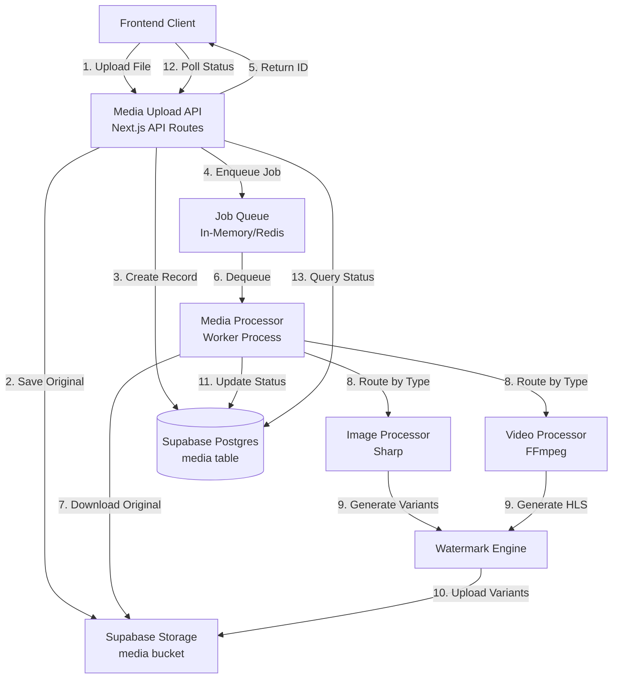

# Design Document: Media Processing Pipeline

## Overview

O Media Processing Pipeline é um sistema completo de processamento assíncrono de mídia (imagens e vídeos) que permite upload, otimização, aplicação de watermark e entrega de conteúdo multimídia. O sistema é construído sobre Next.js 16, Supabase (Storage, Auth, Postgres) e utiliza Sharp para processamento de imagens e FFmpeg para processamento de vídeos.

### Objetivos Principais

1. **Redução de Custos**: Otimizar storage e bandwidth através de compressão e múltiplas variantes
2. **Performance**: Melhorar tempo de carregamento com formatos modernos (WebP) e resoluções adaptativas
3. **Proteção de Conteúdo**: Aplicar watermark em conteúdo público para proteger propriedade intelectual
4. **Experiência do Usuário**: Processamento assíncrono que não bloqueia uploads
5. **Escalabilidade**: Arquitetura que suporta crescimento de volume de mídia

### Decisões Técnicas Fundamentais

**Por que Sharp para Imagens?**
- Performance superior (10-20x mais rápido que ImageMagick)
- Suporte nativo a WebP com controle fino de qualidade
- Processamento em memória eficiente
- API moderna e bem documentada
- Já presente no projeto (dependência existente)

**Por que FFmpeg para Vídeos?**
- Padrão da indústria para processamento de vídeo
- Suporte completo a HLS (HTTP Live Streaming)
- Capacidade de gerar múltiplas resoluções simultaneamente
- Hardware acceleration disponível
- Segmentação automática para streaming adaptativo

**Por que Processamento Assíncrono?**
- Upload retorna imediatamente (< 2s) melhorando UX
- Processamento pesado não bloqueia o usuário
- Permite retry automático em caso de falha
- Escalabilidade horizontal através de workers
- Melhor utilização de recursos do servidor

**Estratégia de Watermark**
- Aplicado apenas em variantes públicas (lightbox_600, large_1200)
- Não aplicado em thumbnails pequenos (avatar_64, thumb_240) para não prejudicar UX
- Opacidade baixa (10-15%) para proteção sem comprometer visualização
- Posicionamento diagonal para dificultar remoção
- Conteúdo privado não recebe watermark (acesso via signed URLs)

## Architecture

### System Components



### Data Flow

**Upload Flow (Synchronous)**
1. Cliente envia arquivo via POST /api/media/upload
2. API valida tipo, tamanho e autenticação
3. Arquivo original é salvo em `media/{userId}/{mediaId}/original/`
4. Registro é criado no banco com status "queued"
5. Job é enfileirado para processamento
6. API retorna mediaId e status em < 2s

**Processing Flow (Asynchronous)**
1. Worker dequeue job da fila
2. Status atualizado para "processing"
3. Arquivo original é baixado do Storage
4. Processador determina tipo (imagem ou vídeo)
5. Delegação para Image Processor ou Video Processor
6. Geração de variantes/streams
7. Aplicação de watermark (quando aplicável)
8. Upload de variantes para Storage
9. Atualização do registro com URLs e status "ready"
10. Limpeza de arquivos temporários

**Query Flow (Synchronous)**
1. Cliente consulta GET /api/media/{id}
2. API valida autenticação e autorização
3. Registro é consultado no banco
4. URLs de variantes são retornadas
5. Frontend seleciona variante apropriada para contexto

### Integration with Supabase

**Supabase Storage**
- Bucket: `media`
- Estrutura de pastas: `{userId}/{mediaId}/{category}/`
- Categories: `original/`, `images/`, `hls/`, `hls_watermarked/`
- Signed URLs para conteúdo privado (1 hora de expiração)
- Public URLs para conteúdo com watermark

**Supabase Auth**
- Autenticação via JWT em todas as APIs
- User ID extraído do token para paths de storage
- RLS policies garantem isolamento de dados

**Supabase Postgres**
- Tabela `media` com metadados
- JSONB para armazenar variantes
- Triggers para updated_at automático
- RLS policies para controle de acesso

## Components and Interfaces

### 1. Media Upload API

**Endpoint**: `POST /api/media/upload`

**Request**:
```typescript
// multipart/form-data
{
  file: File; // Binary file data
}
```

**Response** (201 Created):
```typescript
{
  id: string; // UUID do media
  status: "queued" | "processing" | "ready" | "failed";
  type: "image" | "video";
  created_at: string; // ISO timestamp
}
```

**Validations**:
- Autenticação obrigatória (JWT)
- Tipos permitidos: JPEG, PNG, WebP, GIF, MP4, MOV, AVI, WebM
- Tamanho máximo: 100MB (imagens), 500MB (vídeos)
- Arquivo não vazio

**Implementation Pattern**:
```typescript
export async function POST(request: Request) {
  // 1. Validate authentication
  const supabase = await createClient();
  const { data: { user } } = await supabase.auth.getUser();
  if (!user) return Response.json({ error: "Unauthorized" }, { status: 401 });
  
  // 2. Parse multipart form
  const formData = await request.formData();
  const file = formData.get("file") as File;
  
  // 3. Validate file
  const validation = await validateMediaFile(file);
  if (!validation.valid) {
    return Response.json({ error: validation.error }, { status: 400 });
  }
  
  // 4. Generate media ID and paths
  const mediaId = crypto.randomUUID();
  const originalPath = `${user.id}/${mediaId}/original/${file.name}`;
  
  // 5. Upload to storage
  const { error: uploadError } = await supabase.storage
    .from("media")
    .upload(originalPath, file);
  
  if (uploadError) {
    return Response.json({ error: uploadError.message }, { status: 500 });
  }
  
  // 6. Create database record
  const { data: media, error: dbError } = await supabase
    .from("media")
    .insert({
      id: mediaId,
      user_id: user.id,
      type: file.type.startsWith("image/") ? "image" : "video",
      original_path: originalPath,
      status: "queued"
    })
    .select()
    .single();
  
  if (dbError) {
    return Response.json({ error: dbError.message }, { status: 500 });
  }
  
  // 7. Enqueue processing job
  await jobQueue.enqueue({
    mediaId,
    userId: user.id,
    type: media.type,
    originalPath
  });
  
  // 8. Return response
  return Response.json(media, { status: 201 });
}
```

---

**Endpoint**: `GET /api/media/{id}`

**Response** (200 OK):
```typescript
{
  id: string;
  user_id: string;
  type: "image" | "video";
  status: "queued" | "processing" | "ready" | "failed";
  original_path: string;
  width: number | null;
  height: number | null;
  duration: number | null; // seconds (videos only)
  variants: {
    // For images
    avatar_64?: { url: string; width: 64; height: number; format: "webp"; size_bytes: number };
    thumb_240?: { url: string; width: 240; height: number; format: "webp"; size_bytes: number };
    lightbox_600?: { url: string; width: 600; height: number; format: "webp"; size_bytes: number };
    lightbox_600_watermarked?: { url: string; width: 600; height: number; format: "webp"; size_bytes: number };
    large_1200?: { url: string; width: 1200; height: number; format: "webp"; size_bytes: number };
    large_1200_watermarked?: { url: string; width: 1200; height: number; format: "webp"; size_bytes: number };
    
    // For videos
    thumbnail?: { url: string; width: number; height: number; format: "webp"; size_bytes: number };
    hls_master?: { url: string; resolutions: string[]; format: "m3u8" };
    hls_master_watermarked?: { url: string; resolutions: string[]; format: "m3u8" };
  };
  created_at: string;
  updated_at: string;
  error_message?: string; // Present when status is "failed"
}
```

**Authorization**:
- User pode acessar apenas suas próprias mídias
- RLS policy no banco garante isolamento

---

**Endpoint**: `POST /api/media/{id}/reprocess`

**Response** (202 Accepted):
```typescript
{
  id: string;
  status: "queued";
  message: "Media reprocessing queued"
}
```

**Use Cases**:
- Regenerar variantes após mudança de configuração
- Retry após falha de processamento
- Aplicar novo watermark

### 2. Job Queue System

**Interface**:
```typescript
interface JobQueue {
  enqueue(job: ProcessingJob): Promise<void>;
  dequeue(): Promise<ProcessingJob | null>;
  markProcessing(jobId: string): Promise<void>;
  markComplete(jobId: string): Promise<void>;
  markFailed(jobId: string, error: string): Promise<void>;
}

interface ProcessingJob {
  id: string;
  mediaId: string;
  userId: string;
  type: "image" | "video";
  originalPath: string;
  status: "queued" | "processing" | "completed" | "failed";
  attempts: number;
  createdAt: Date;
  processedAt?: Date;
  error?: string;
}
```

**Implementation Options**:

**Phase 1: In-Memory Queue** (MVP)
```typescript
class InMemoryJobQueue implements JobQueue {
  private queue: ProcessingJob[] = [];
  private processing: Map<string, ProcessingJob> = new Map();
  
  async enqueue(job: ProcessingJob): Promise<void> {
    this.queue.push(job);
  }
  
  async dequeue(): Promise<ProcessingJob | null> {
    const job = this.queue.shift();
    if (job) {
      this.processing.set(job.id, job);
    }
    return job || null;
  }
  
  // ... other methods
}
```

**Phase 2: Redis Queue** (Production)
- Persistência de jobs
- Suporte a múltiplos workers
- Retry automático
- Dead letter queue para falhas

**Configuration**:
- Max concurrent jobs: 3 per worker
- Retry attempts: 3
- Retry delay: exponential backoff (1min, 5min, 15min)
- Job timeout: 10 minutes

### 3. Image Processor

**Responsibilities**:
- Gerar 4 variantes de resolução
- Converter para WebP (quality 80)
- Remover metadados EXIF
- Manter aspect ratio
- Coordenar com Watermark Engine

**Variant Specifications**:
```typescript
const IMAGE_VARIANTS = [
  { name: "avatar_64", width: 64, watermark: false },
  { name: "thumb_240", width: 240, watermark: false },
  { name: "lightbox_600", width: 600, watermark: true },
  { name: "large_1200", width: 1200, watermark: true },
] as const;
```

**Processing Pipeline**:
```typescript
class ImageProcessor {
  async process(job: ProcessingJob): Promise<VariantMetadata[]> {
    const variants: VariantMetadata[] = [];
    
    // 1. Download original
    const originalBuffer = await this.downloadOriginal(job.originalPath);
    
    // 2. Extract metadata
    const metadata = await sharp(originalBuffer).metadata();
    const { width, height } = metadata;
    
    // 3. Generate variants in parallel
    const variantPromises = IMAGE_VARIANTS.map(async (spec) => {
      // Resize
      let buffer = await sharp(originalBuffer)
        .resize(spec.width, null, {
          fit: "inside",
          withoutEnlargement: true
        })
        .webp({ quality: 80 })
        .toBuffer();
      
      // Apply watermark if needed
      if (spec.watermark) {
        buffer = await this.watermarkEngine.apply(buffer, {
          text: "Platform Name",
          opacity: 0.12,
          position: "diagonal"
        });
      }
      
      // Upload variant
      const variantPath = `${job.userId}/${job.mediaId}/images/${spec.name}${spec.watermark ? "_watermarked" : ""}.webp`;
      await this.uploadVariant(variantPath, buffer);
      
      // Get metadata
      const variantMetadata = await sharp(buffer).metadata();
      
      return {
        name: spec.name + (spec.watermark ? "_watermarked" : ""),
        url: this.getPublicUrl(variantPath),
        width: variantMetadata.width!,
        height: variantMetadata.height!,
        format: "webp",
        size_bytes: buffer.length
      };
    });
    
    variants.push(...await Promise.all(variantPromises));
    
    // 4. Update database
    await this.updateMediaRecord(job.mediaId, {
      width,
      height,
      variants,
      status: "ready"
    });
    
    return variants;
  }
}
```

### 4. Video Processor

**Responsibilities**:
- Gerar streams HLS em múltiplas resoluções
- Criar master playlist (m3u8)
- Extrair thumbnail do vídeo
- Coordenar com Watermark Engine
- Segmentar vídeo em chunks de 6s

**HLS Resolution Ladder**:
```typescript
const HLS_RESOLUTIONS = [
  { name: "360p", height: 360, bitrate: "800k" },
  { name: "720p", height: 720, bitrate: "2500k" },
  { name: "1080p", height: 1080, bitrate: "5000k", conditional: true }, // Only if source >= 1080p
] as const;
```

**Processing Pipeline**:
```typescript
class VideoProcessor {
  async process(job: ProcessingJob): Promise<VariantMetadata[]> {
    const variants: VariantMetadata[] = [];
    
    // 1. Download original
    const originalPath = await this.downloadOriginal(job.originalPath);
    
    // 2. Extract metadata
    const metadata = await this.extractMetadata(originalPath);
    const { width, height, duration } = metadata;
    
    // 3. Extract thumbnail at 2s
    const thumbnailPath = await this.extractThumbnail(originalPath, 2);
    
    // 4. Process thumbnail through Image Processor
    const thumbnailVariants = await this.imageProcessor.process({
      ...job,
      type: "image",
      originalPath: thumbnailPath
    });
    
    // 5. Determine resolutions to generate
    const resolutions = HLS_RESOLUTIONS.filter(res => 
      !res.conditional || height >= res.height
    );
    
    // 6. Generate HLS streams (sequential to avoid resource exhaustion)
    for (const res of resolutions) {
      await this.generateHLSStream(originalPath, res, job, false);
      await this.generateHLSStream(originalPath, res, job, true); // watermarked
    }
    
    // 7. Create master playlists
    const masterPath = `${job.userId}/${job.mediaId}/hls/master.m3u8`;
    const masterWatermarkedPath = `${job.userId}/${job.mediaId}/hls_watermarked/master.m3u8`;
    
    await this.createMasterPlaylist(masterPath, resolutions);
    await this.createMasterPlaylist(masterWatermarkedPath, resolutions);
    
    // 8. Update database
    await this.updateMediaRecord(job.mediaId, {
      width,
      height,
      duration,
      variants: {
        ...thumbnailVariants,
        hls_master: {
          url: this.getPublicUrl(masterPath),
          resolutions: resolutions.map(r => r.name),
          format: "m3u8"
        },
        hls_master_watermarked: {
          url: this.getPublicUrl(masterWatermarkedPath),
          resolutions: resolutions.map(r => r.name),
          format: "m3u8"
        }
      },
      status: "ready"
    });
    
    return variants;
  }
  
  private async generateHLSStream(
    inputPath: string,
    resolution: typeof HLS_RESOLUTIONS[number],
    job: ProcessingJob,
    watermark: boolean
  ): Promise<void> {
    const outputDir = `${job.userId}/${job.mediaId}/${watermark ? "hls_watermarked" : "hls"}/${resolution.name}`;
    
    // FFmpeg command
    const command = [
      "-i", inputPath,
      "-vf", `scale=-2:${resolution.height}${watermark ? ",drawtext=..." : ""}`,
      "-c:v", "libx264",
      "-preset", "fast",
      "-b:v", resolution.bitrate,
      "-c:a", "aac",
      "-b:a", "128k",
      "-hls_time", "6",
      "-hls_playlist_type", "vod",
      "-hls_segment_filename", `${outputDir}/segment_%03d.ts`,
      `${outputDir}/playlist.m3u8`
    ];
    
    await this.execFFmpeg(command);
    
    // Upload all segments and playlist to storage
    await this.uploadDirectory(outputDir);
  }
}
```

### 5. Watermark Engine

**Responsibilities**:
- Aplicar marca d'água em imagens
- Aplicar marca d'água em vídeos (via FFmpeg)
- Configuração de opacidade e posicionamento
- Suporte a texto diagonal

**Image Watermark** (Sharp):
```typescript
class WatermarkEngine {
  async applyToImage(
    imageBuffer: Buffer,
    options: WatermarkOptions
  ): Promise<Buffer> {
    const { width, height } = await sharp(imageBuffer).metadata();
    
    // Create watermark SVG
    const watermarkSvg = this.createDiagonalTextSVG(
      options.text,
      width!,
      height!,
      options.opacity
    );
    
    // Composite watermark onto image
    return sharp(imageBuffer)
      .composite([{
        input: Buffer.from(watermarkSvg),
        blend: "over"
      }])
      .toBuffer();
  }
  
  private createDiagonalTextSVG(
    text: string,
    width: number,
    height: number,
    opacity: number
  ): string {
    const fontSize = Math.min(width, height) / 20;
    const angle = -45;
    
    return `
      <svg width="${width}" height="${height}">
        <text
          x="50%"
          y="50%"
          font-size="${fontSize}"
          fill="white"
          opacity="${opacity}"
          text-anchor="middle"
          transform="rotate(${angle} ${width/2} ${height/2})"
        >
          ${text}
        </text>
      </svg>
    `;
  }
}
```

**Video Watermark** (FFmpeg):
```typescript
// FFmpeg drawtext filter
const watermarkFilter = `drawtext=text='${text}':fontsize=${fontSize}:fontcolor=white@${opacity}:x=(w-text_w)/2:y=(h-text_h)/2:angle=${angle}`;
```

### 6. Storage Manager

**Responsibilities**:
- Gerenciar uploads para Supabase Storage
- Gerar signed URLs para conteúdo privado
- Organizar estrutura de pastas
- Limpar arquivos temporários

**Storage Structure**:
```
media/
├── {userId}/
│   ├── {mediaId}/
│   │   ├── original/
│   │   │   └── {filename}.{ext}
│   │   ├── images/
│   │   │   ├── avatar_64.webp
│   │   │   ├── thumb_240.webp
│   │   │   ├── lightbox_600.webp
│   │   │   ├── lightbox_600_watermarked.webp
│   │   │   ├── large_1200.webp
│   │   │   └── large_1200_watermarked.webp
│   │   ├── hls/
│   │   │   ├── 360p/
│   │   │   │   ├── segment_000.ts
│   │   │   │   ├── segment_001.ts
│   │   │   │   └── playlist.m3u8
│   │   │   ├── 720p/
│   │   │   │   └── ...
│   │   │   └── master.m3u8
│   │   └── hls_watermarked/
│   │       └── ...
```

**Interface**:
```typescript
class StorageManager {
  async uploadFile(path: string, buffer: Buffer, contentType: string): Promise<string>;
  async downloadFile(path: string): Promise<Buffer>;
  async deleteFile(path: string): Promise<void>;
  async deleteDirectory(path: string): Promise<void>;
  async generateSignedUrl(path: string, expiresIn: number): Promise<string>;
  getPublicUrl(path: string): string;
}
```

## Data Models

### Media Table Schema

```sql
CREATE TABLE media (
  id UUID PRIMARY KEY DEFAULT gen_random_uuid(),
  user_id UUID NOT NULL REFERENCES auth.users(id) ON DELETE CASCADE,
  type TEXT NOT NULL CHECK (type IN ('image', 'video')),
  original_path TEXT NOT NULL,
  status TEXT NOT NULL DEFAULT 'queued' CHECK (status IN ('queued', 'processing', 'ready', 'failed')),
  width INTEGER,
  height INTEGER,
  duration INTEGER, -- seconds, for videos only
  variants JSONB DEFAULT '{}'::jsonb,
  error_message TEXT,
  created_at TIMESTAMPTZ NOT NULL DEFAULT NOW(),
  updated_at TIMESTAMPTZ NOT NULL DEFAULT NOW()
);

-- Indexes
CREATE INDEX idx_media_user_id ON media(user_id);
CREATE INDEX idx_media_status ON media(status);
CREATE INDEX idx_media_created_at ON media(created_at DESC);

-- Updated_at trigger
CREATE TRIGGER update_media_updated_at
  BEFORE UPDATE ON media
  FOR EACH ROW
  EXECUTE FUNCTION update_updated_at_column();

-- RLS Policies
ALTER TABLE media ENABLE ROW LEVEL SECURITY;

CREATE POLICY "Users can view their own media"
  ON media FOR SELECT
  USING (auth.uid() = user_id);

CREATE POLICY "Users can insert their own media"
  ON media FOR INSERT
  WITH CHECK (auth.uid() = user_id);

CREATE POLICY "Users can update their own media"
  ON media FOR UPDATE
  USING (auth.uid() = user_id);

CREATE POLICY "Users can delete their own media"
  ON media FOR DELETE
  USING (auth.uid() = user_id);
```

### Variants JSONB Structure

**For Images**:
```json
{
  "avatar_64": {
    "url": "https://...",
    "width": 64,
    "height": 64,
    "format": "webp",
    "size_bytes": 2048
  },
  "thumb_240": {
    "url": "https://...",
    "width": 240,
    "height": 180,
    "format": "webp",
    "size_bytes": 8192
  },
  "lightbox_600": {
    "url": "https://...",
    "width": 600,
    "height": 450,
    "format": "webp",
    "size_bytes": 32768
  },
  "lightbox_600_watermarked": {
    "url": "https://...",
    "width": 600,
    "height": 450,
    "format": "webp",
    "size_bytes": 33000
  },
  "large_1200": {
    "url": "https://...",
    "width": 1200,
    "height": 900,
    "format": "webp",
    "size_bytes": 98304
  },
  "large_1200_watermarked": {
    "url": "https://...",
    "width": 1200,
    "height": 900,
    "format": "webp",
    "size_bytes": 99000
  }
}
```

**For Videos**:
```json
{
  "thumbnail": {
    "url": "https://...",
    "width": 1920,
    "height": 1080,
    "format": "webp",
    "size_bytes": 45000
  },
  "thumb_240": {
    "url": "https://...",
    "width": 240,
    "height": 135,
    "format": "webp",
    "size_bytes": 5000
  },
  "hls_master": {
    "url": "https://.../master.m3u8",
    "resolutions": ["360p", "720p", "1080p"],
    "format": "m3u8"
  },
  "hls_master_watermarked": {
    "url": "https://.../master.m3u8",
    "resolutions": ["360p", "720p", "1080p"],
    "format": "m3u8"
  }
}
```


## Correctness Properties

*A property is a characteristic or behavior that should hold true across all valid executions of a system—essentially, a formal statement about what the system should do. Properties serve as the bridge between human-readable specifications and machine-verifiable correctness guarantees.*

### Property Reflection

After analyzing all acceptance criteria, several redundancies were identified and consolidated:

**Consolidated State Transitions**: Requirements 2.1, 2.5, 2.6, 9.3, 9.4, 9.5, 9.6 all deal with status transitions. These can be combined into a single comprehensive state machine property.

**Consolidated Variant Generation**: Requirements 3.1-3.4 all test that specific variants are generated. These can be combined into a single property that validates all required variants exist.

**Consolidated Path Structure**: Requirements 8.2-8.5 all test path structure. These can be combined into a single property that validates the complete path structure.

**Consolidated RLS Policies**: Requirements 10.2-10.5 all test access control. These can be combined into a single property about user isolation.

**Consolidated Error Handling**: Requirements 17.1, 17.2, 17.3 all test error handling. These can be combined into a single property about error state management.

**Consolidated Cleanup**: Requirements 18.1, 18.2, 18.5 all test cleanup behavior. These can be combined into a single property about resource cleanup.

### Property 1: File Type Validation

*For any* file submitted to the Media Upload API, if the file type is not in the allowed list (JPEG, PNG, WebP, GIF, MP4, MOV, AVI, WebM), then the API should reject the file with an appropriate error message.

**Validates: Requirements 1.1, 1.6**

### Property 2: Storage Path Structure

*For any* media file uploaded, the storage path should follow the pattern `media/{userId}/{mediaId}/{category}/` where userId is the authenticated user's ID, mediaId is a unique UUID, and category is one of: original, images, hls, or hls_watermarked.

**Validates: Requirements 1.2, 8.2, 8.3, 8.4, 8.5, 8.6, 8.7**

### Property 3: Upload Creates Record and Job

*For any* valid media file uploaded, the system should create a database record with status "queued" and enqueue a corresponding processing job in the job queue.

**Validates: Requirements 1.3, 1.4, 9.3**

### Property 4: Media Processing State Machine

*For any* media record, the status transitions should follow the valid state machine: queued → processing → (ready | failed), where:
- Starting processing always transitions from "queued" to "processing"
- Successful completion always transitions from "processing" to "ready" with populated variants
- Failed processing always transitions from "processing" to "failed" with error message
- Failed records always contain non-empty error_message field

**Validates: Requirements 2.1, 2.5, 2.6, 2.7, 9.4, 9.5, 9.6, 17.1, 17.2, 17.3**

### Property 5: Type-Based Routing

*For any* media file being processed, if the type is "image" then it should be routed to the Image Processor, and if the type is "video" then it should be routed to the Video Processor.

**Validates: Requirements 2.2, 2.3, 2.4**

### Property 6: FIFO Job Processing

*For any* sequence of jobs enqueued, the jobs should be dequeued and processed in the same order they were enqueued (First-In-First-Out).

**Validates: Requirements 2.8**

### Property 7: Image Variant Completeness

*For any* image processed, the system should generate exactly 4 base variants (avatar_64, thumb_240, lightbox_600, large_1200) with the specified widths (64px, 240px, 600px, 1200px respectively), and all variants should be in WebP format.

**Validates: Requirements 3.1, 3.2, 3.3, 3.4, 3.5, 3.9**

### Property 8: EXIF Metadata Removal

*For any* image variant generated, the output file should not contain EXIF metadata.

**Validates: Requirements 3.6**

### Property 9: Aspect Ratio Preservation

*For any* image resized, the aspect ratio (width/height) of the output should equal the aspect ratio of the input within a small tolerance (< 0.01).

**Validates: Requirements 3.7**

### Property 10: Image Watermark Application Rules

*For any* image processed, watermarks should be applied only to lightbox_600 and large_1200 variants (creating _watermarked versions), and should NOT be applied to avatar_64 and thumb_240 variants. Watermarked variants should have the "_watermarked" suffix in their names.

**Validates: Requirements 4.1, 4.2, 4.3, 4.7**

### Property 11: Watermark Content

*For any* watermarked image or video, the watermark should contain the platform name text.

**Validates: Requirements 4.4**

### Property 12: HLS Resolution Generation

*For any* video processed, the system should generate HLS streams at 360p and 720p resolutions, and should generate 1080p resolution if and only if the original video resolution is 1080p or higher.

**Validates: Requirements 5.1, 5.2, 5.3**

### Property 13: HLS Master Playlist

*For any* video processed, the system should create a master playlist file named "master.m3u8" in both the hls/ and hls_watermarked/ directories.

**Validates: Requirements 5.4, 6.6**

### Property 14: HLS Segment Duration

*For any* HLS stream generated, all video segments should have a duration of approximately 6 seconds (±0.5 seconds tolerance).

**Validates: Requirements 5.6**

### Property 15: Video Metadata Extraction

*For any* video processed, the system should extract and store width, height, and duration in the media record.

**Validates: Requirements 5.7, 15.2, 15.3**

### Property 16: Video Watermark Separation

*For any* video processed, the system should create separate HLS streams: one without watermark in `media/{userId}/{mediaId}/hls/` and one with watermark in `media/{userId}/{mediaId}/hls_watermarked/`.

**Validates: Requirements 6.1, 6.5**

### Property 17: Video Thumbnail Processing

*For any* video processed, the system should extract a thumbnail frame at 2 seconds, and process that thumbnail through the Image Processor to generate all standard image variants with the same watermark rules as regular images.

**Validates: Requirements 7.1, 7.2, 7.3, 7.4**

### Property 18: Automatic Timestamps

*For any* media record created, the created_at field should be automatically set to the current timestamp, and for any media record updated, the updated_at field should be automatically updated to the current timestamp.

**Validates: Requirements 9.8, 9.9**

### Property 19: User Data Isolation

*For any* user, they should be able to read, insert, update, and delete only their own media records, and should not be able to access media records belonging to other users.

**Validates: Requirements 10.2, 10.3, 10.4, 10.5**

### Property 20: Signed URL Expiration

*For any* private content accessed, the Storage Manager should generate signed URLs with exactly 1-hour (3600 seconds) expiration time.

**Validates: Requirements 10.6**

### Property 21: Public Content Watermarking

*For any* public content accessed, the system should serve watermarked variants instead of original or non-watermarked variants.

**Validates: Requirements 10.7**

### Property 22: Authentication Enforcement

*For any* API request to /api/media/upload, /api/media/{id}, or /api/media/{id}/reprocess, if the user is not authenticated, the API should return HTTP 401.

**Validates: Requirements 11.2, 11.6, 12.2, 13.2**

### Property 23: Upload Success Response

*For any* successful media upload, the API should return HTTP 201 with a response body containing the media ID and status "queued".

**Validates: Requirements 11.4**

### Property 24: Upload Failure Response

*For any* failed media upload due to validation errors, the API should return HTTP 400 with error details describing the validation failure.

**Validates: Requirements 11.5, 19.5**

### Property 25: File Size Limits

*For any* file uploaded, if it is an image and exceeds 100MB, or if it is a video and exceeds 500MB, the API should reject the upload with an appropriate error.

**Validates: Requirements 11.7, 19.2**

### Property 26: Authorization Enforcement

*For any* API request to /api/media/{id} or /api/media/{id}/reprocess, if the authenticated user does not own the requested media, the API should return HTTP 403.

**Validates: Requirements 12.3, 12.6, 13.3, 13.7**

### Property 27: Media Query Success Response

*For any* authorized GET request to /api/media/{id} where the media exists, the API should return HTTP 200 with complete media metadata including status, dimensions, duration (for videos), and all variant URLs.

**Validates: Requirements 12.4, 12.7**

### Property 28: Media Not Found Response

*For any* GET request to /api/media/{id} where the media does not exist, the API should return HTTP 404.

**Validates: Requirements 12.5**

### Property 29: Reprocess State Reset

*For any* reprocess request, the system should update the media record status to "queued", enqueue a new processing job, and return HTTP 202.

**Validates: Requirements 13.4, 13.5, 13.6**

### Property 30: Image Metadata Extraction

*For any* image processed, the system should extract and store width and height in the media record before generating variants.

**Validates: Requirements 15.1, 15.3, 15.5**

### Property 31: Metadata Extraction Resilience

*For any* media where metadata extraction fails, the system should log the error and continue with variant generation rather than failing the entire processing job.

**Validates: Requirements 15.4**

### Property 32: Variant Metadata Completeness

*For any* variant generated, the variant metadata should include all required fields: name, url, width, height, format, and size_bytes.

**Validates: Requirements 16.1, 16.2**

### Property 33: Variant Serialization Round-Trip

*For any* valid variant configuration, serializing the variant metadata to JSONB and then parsing it back should produce an equivalent structure (round-trip property).

**Validates: Requirements 16.3, 16.4, 16.5**

### Property 34: Graceful Watermark Failure

*For any* media being processed, if the Watermark Engine fails, the system should continue processing and generate non-watermarked variants rather than failing the entire job.

**Validates: Requirements 17.5**

### Property 35: Partial Variant Failure Resilience

*For any* media being processed, if one variant generation fails, the system should attempt to generate all remaining variants rather than stopping at the first failure.

**Validates: Requirements 17.6**

### Property 36: Temporary File Cleanup

*For any* processing job (whether successful or failed), the system should delete all temporary files and directories created during processing after the job completes.

**Validates: Requirements 18.1, 18.2, 18.3, 18.4, 18.5**

### Property 37: Empty File Rejection

*For any* file uploaded, if the file is empty (size = 0 bytes), the API should reject the upload with an appropriate error message.

**Validates: Requirements 19.1**

### Property 38: Format Validation

*For any* file being processed, if the Image Processor receives an invalid image format or the Video Processor receives an invalid video format, the processor should reject the file and update the media status to "failed" with details.

**Validates: Requirements 19.3, 19.4, 19.6**

### Property 39: Single Original Download

*For any* processing job, the system should download the original file from storage exactly once, regardless of how many variants are generated.

**Validates: Requirements 20.7**

## Error Handling

### Error Categories

**Validation Errors** (HTTP 400)
- Invalid file type
- File size exceeds limits
- Empty file
- Malformed request

**Authentication Errors** (HTTP 401)
- Missing authentication token
- Invalid authentication token
- Expired authentication token

**Authorization Errors** (HTTP 403)
- User does not own the requested media
- Insufficient permissions

**Not Found Errors** (HTTP 404)
- Media ID does not exist
- Storage path not found

**Processing Errors** (Status: "failed")
- Corrupted file detected
- Metadata extraction failure
- Variant generation failure
- FFmpeg encoding failure
- Storage upload failure

### Error Response Format

All API errors follow a consistent format:

```typescript
{
  error: string; // Human-readable error message
  code?: string; // Machine-readable error code
  details?: Record<string, any>; // Additional error context
}
```

### Error Handling Strategies

**Graceful Degradation**
- Watermark failures don't stop processing
- Single variant failures don't stop other variants
- Metadata extraction failures allow processing to continue

**Automatic Retry**
- Job queue implements exponential backoff retry (3 attempts)
- Retry delays: 1 minute, 5 minutes, 15 minutes
- After 3 failures, job moves to dead letter queue

**Error Logging**
- All errors logged with context (mediaId, userId, timestamp)
- FFmpeg errors include full command and output
- Stack traces captured for debugging

**User Notification**
- Failed status visible in API responses
- Error messages stored in database
- Frontend can poll status and display errors

### Cleanup on Failure

Even when processing fails, the system ensures:
- Temporary files are deleted
- Partial uploads are cleaned up
- Database status is updated
- Error details are recorded

## Testing Strategy

### Dual Testing Approach

The testing strategy combines two complementary approaches:

**Unit Tests**: Verify specific examples, edge cases, and error conditions
- Specific file format examples (JPEG, PNG, MP4, etc.)
- Edge cases (empty files, oversized files, corrupted files)
- Error conditions (network failures, storage errors)
- Integration points between components
- Database schema validation
- API endpoint existence

**Property-Based Tests**: Verify universal properties across all inputs
- All 39 correctness properties defined above
- Randomized input generation for comprehensive coverage
- Minimum 100 iterations per property test
- Each test tagged with: **Feature: media-processing-pipeline, Property {number}: {property_text}**

### Property-Based Testing Configuration

**Library**: fast-check (already in project dependencies)

**Test Configuration**:
```typescript
import fc from 'fast-check';

describe('Media Processing Pipeline Properties', () => {
  it('Property 1: File Type Validation', () => {
    fc.assert(
      fc.property(
        fc.record({
          name: fc.string(),
          type: fc.oneof(
            fc.constant('image/jpeg'),
            fc.constant('image/png'),
            fc.constant('video/mp4'),
            fc.constant('application/pdf'), // invalid
            fc.constant('text/plain'), // invalid
          ),
          size: fc.nat(600 * 1024 * 1024),
        }),
        async (file) => {
          const validTypes = [
            'image/jpeg', 'image/png', 'image/webp', 'image/gif',
            'video/mp4', 'video/quicktime', 'video/x-msvideo', 'video/webm'
          ];
          
          const result = await validateMediaFile(file);
          
          if (validTypes.includes(file.type)) {
            expect(result.valid).toBe(true);
          } else {
            expect(result.valid).toBe(false);
            expect(result.error).toContain('supported formats');
          }
        }
      ),
      { numRuns: 100 }
    );
  });
  
  // ... additional property tests
});
```

**Generators for Domain Objects**:
```typescript
// Arbitrary generators for media domain
const arbUserId = fc.uuid();
const arbMediaId = fc.uuid();
const arbMediaType = fc.constantFrom('image', 'video');
const arbMediaStatus = fc.constantFrom('queued', 'processing', 'ready', 'failed');
const arbImageFormat = fc.constantFrom('image/jpeg', 'image/png', 'image/webp', 'image/gif');
const arbVideoFormat = fc.constantFrom('video/mp4', 'video/quicktime', 'video/x-msvideo', 'video/webm');
const arbDimensions = fc.record({
  width: fc.integer({ min: 100, max: 4000 }),
  height: fc.integer({ min: 100, max: 4000 }),
});
const arbVariantName = fc.constantFrom('avatar_64', 'thumb_240', 'lightbox_600', 'large_1200');
```

### Unit Test Focus Areas

**Specific Examples**:
- Upload JPEG image → verify all 6 variants generated
- Upload MP4 video → verify HLS streams at 360p, 720p
- Upload 1080p video → verify HLS streams include 1080p
- Reprocess media → verify status reset and new job created

**Edge Cases**:
- Empty file upload → verify rejection
- Oversized file (101MB image) → verify rejection
- Corrupted image file → verify failed status with error
- Video shorter than 2 seconds → verify thumbnail extraction

**Integration Tests**:
- End-to-end upload flow → verify database, storage, and queue
- Authentication flow → verify JWT validation
- RLS policies → verify user isolation
- Signed URL generation → verify expiration

**Database Schema Tests**:
- Verify media table exists with correct columns
- Verify RLS policies are enabled
- Verify triggers for updated_at
- Verify indexes exist

### Test Coverage Goals

- Unit test coverage: > 80%
- Property test coverage: 100% of defined properties
- Integration test coverage: All critical paths
- E2E test coverage: Happy path + major error scenarios

### Continuous Integration

All tests run on:
- Every pull request
- Every commit to main branch
- Nightly builds for extended property test runs (1000+ iterations)


## Performance and Optimization

### Image Processing Optimization

**Parallel Variant Generation**
```typescript
// Process all variants in parallel using Promise.all
const variantPromises = IMAGE_VARIANTS.map(spec => 
  generateVariant(originalBuffer, spec)
);
const variants = await Promise.all(variantPromises);
```

**Sharp Performance Settings**
```typescript
sharp.cache(false); // Disable cache for worker processes
sharp.concurrency(1); // Limit concurrency per worker
sharp.simd(true); // Enable SIMD operations
```

**Memory Management**
- Process images in streaming mode for files > 10MB
- Release buffers immediately after upload
- Limit concurrent image processing to 3 per worker

### Video Processing Optimization

**FFmpeg Hardware Acceleration**
```bash
# Detect and use hardware acceleration when available
ffmpeg -hwaccels  # List available hardware accelerators

# Use hardware acceleration in encoding
-hwaccel auto -c:v h264_videotoolbox  # macOS
-hwaccel auto -c:v h264_nvenc         # NVIDIA GPU
-hwaccel auto -c:v h264_vaapi         # Linux VAAPI
```

**Sequential Resolution Processing**
- Process HLS resolutions sequentially to avoid resource exhaustion
- Each resolution processed completely before starting next
- Prevents memory spikes from multiple FFmpeg processes

**FFmpeg Preset Configuration**
```bash
-preset fast  # Balance between speed and quality
-crf 23       # Constant Rate Factor for quality
-movflags +faststart  # Enable streaming before download completes
```

### Storage Optimization

**Streaming Uploads**
```typescript
// For files > 10MB, use streaming upload
if (fileSize > 10 * 1024 * 1024) {
  const stream = fs.createReadStream(localPath);
  await supabase.storage.from('media').upload(path, stream);
} else {
  const buffer = await fs.readFile(localPath);
  await supabase.storage.from('media').upload(path, buffer);
}
```

**Compression Settings**
- WebP quality: 80 (optimal balance)
- HLS video bitrates: 800k (360p), 2500k (720p), 5000k (1080p)
- HLS audio bitrate: 128k (AAC)

### Caching Strategy

**CDN Caching**
- Original files: no-cache (private content)
- Watermarked variants: cache for 1 year (immutable)
- Non-watermarked variants: cache for 1 hour (private)
- HLS playlists: cache for 1 hour
- HLS segments: cache for 1 year (immutable)

**Cache Headers**
```typescript
// Watermarked public content
'Cache-Control': 'public, max-age=31536000, immutable'

// Private content with signed URLs
'Cache-Control': 'private, max-age=3600'

// HLS playlists
'Cache-Control': 'public, max-age=3600'
```

### Performance Targets

- Upload API response: < 2 seconds
- Image processing: < 30 seconds for 4K image
- Video processing: < 5 minutes for 1080p 60-second video
- Thumbnail extraction: < 5 seconds
- Metadata extraction: < 2 seconds

### Monitoring and Metrics

**Key Metrics to Track**:
- Upload success rate
- Processing success rate
- Average processing time by media type
- Queue depth and wait time
- Storage usage by user
- Bandwidth usage by variant type
- Error rate by error type

**Alerting Thresholds**:
- Queue depth > 100 jobs
- Processing failure rate > 5%
- Average processing time > 2x target
- Storage usage growth > 50GB/day

## Security

### Authentication and Authorization

**JWT Validation**
```typescript
// All API routes validate JWT
const { data: { user }, error } = await supabase.auth.getUser();
if (error || !user) {
  return Response.json({ error: 'Unauthorized' }, { status: 401 });
}
```

**Row Level Security (RLS)**
```sql
-- Users can only access their own media
CREATE POLICY "Users can view their own media"
  ON media FOR SELECT
  USING (auth.uid() = user_id);

-- Prevent privilege escalation
CREATE POLICY "Users can insert their own media"
  ON media FOR INSERT
  WITH CHECK (auth.uid() = user_id);
```

### Input Validation

**File Type Validation**
- Validate MIME type from Content-Type header
- Verify file signature (magic bytes) matches declared type
- Reject files with mismatched type/signature

**File Size Validation**
- Enforce limits before storage upload
- Validate Content-Length header
- Stream validation for large files

**Path Traversal Prevention**
```typescript
// Sanitize all file paths
function sanitizePath(path: string): string {
  // Remove any ../ or .\ sequences
  return path.replace(/\.\.[\/\\]/g, '');
}

// Use only generated UUIDs in paths
const mediaId = crypto.randomUUID(); // Cryptographically secure
const path = `${userId}/${mediaId}/original/${sanitizePath(filename)}`;
```

### Content Security

**Watermark Protection**
- Watermarks applied to all public content
- Diagonal positioning makes removal difficult
- Platform name embedded in watermark
- Opacity balanced for protection vs. usability

**Private Content Access**
- Signed URLs with 1-hour expiration
- URLs tied to specific user session
- No public access to non-watermarked content
- Automatic expiration prevents sharing

**EXIF Metadata Removal**
- Remove all EXIF data from images
- Prevents location tracking
- Removes camera information
- Protects user privacy

### Storage Security

**Bucket Policies**
```typescript
// Supabase Storage bucket policies
{
  "media": {
    "public": false, // No public access by default
    "allowedMimeTypes": [
      "image/jpeg", "image/png", "image/webp", "image/gif",
      "video/mp4", "video/quicktime", "video/x-msvideo", "video/webm"
    ],
    "maxFileSize": 524288000 // 500MB
  }
}
```

**Signed URL Security**
```typescript
// Generate signed URL with expiration
const { data, error } = await supabase.storage
  .from('media')
  .createSignedUrl(path, 3600); // 1 hour expiration

// Signed URLs are cryptographically secure
// Cannot be forged or extended
```

### Rate Limiting

**API Rate Limits**
- Upload endpoint: 10 requests per minute per user
- Query endpoint: 100 requests per minute per user
- Reprocess endpoint: 5 requests per minute per user

**Implementation**
```typescript
// Use existing rate-limiter service
import { RateLimiter } from '@/lib/services/rate-limiter';

const uploadLimiter = new RateLimiter({
  windowMs: 60 * 1000, // 1 minute
  max: 10, // 10 requests
});

// In API route
const allowed = await uploadLimiter.check(user.id);
if (!allowed) {
  return Response.json(
    { error: 'Rate limit exceeded' },
    { status: 429 }
  );
}
```

### Secrets Management

**Environment Variables**
```bash
# .env.local
SUPABASE_URL=https://xxx.supabase.co
SUPABASE_ANON_KEY=eyJxxx...
SUPABASE_SERVICE_ROLE_KEY=eyJxxx...  # Server-side only
NEXT_PUBLIC_SUPABASE_URL=https://xxx.supabase.co
NEXT_PUBLIC_SUPABASE_ANON_KEY=eyJxxx...
```

**Service Role Key Usage**
- Used only in server-side code
- Never exposed to client
- Required for bypassing RLS in worker processes
- Stored securely in environment variables

## Implementation Notes

### Phase 1: MVP (Weeks 1-2)

**Core Features**:
- Upload API with basic validation
- In-memory job queue
- Image processing with Sharp (4 variants)
- Basic watermark (text overlay)
- Supabase Storage integration
- Database schema and RLS policies

**Limitations**:
- Single worker process
- No video processing
- No retry mechanism
- Basic error handling

### Phase 2: Video Support (Weeks 3-4)

**Additional Features**:
- Video processing with FFmpeg
- HLS stream generation
- Thumbnail extraction
- Video watermarking
- Extended error handling

### Phase 3: Production Hardening (Weeks 5-6)

**Enhancements**:
- Redis-based job queue
- Multiple worker processes
- Automatic retry with exponential backoff
- Comprehensive monitoring
- Performance optimization
- Load testing

### Phase 4: Advanced Features (Future)

**Potential Additions**:
- AI-based content moderation
- Automatic thumbnail selection (best frame)
- Face detection for smart cropping
- Video transcription
- Advanced analytics

### Technology Stack

**Core Technologies**:
- Next.js 16 (API Routes)
- TypeScript 5.9
- Supabase (Storage, Auth, Postgres)
- Sharp 0.33 (image processing)
- FFmpeg 6.0+ (video processing)

**Testing**:
- Vitest 4.0 (test runner)
- fast-check 4.5 (property-based testing)
- @testing-library/react 16.3 (component testing)

**Infrastructure**:
- Vercel (hosting)
- Supabase Cloud (database, storage, auth)
- Redis Cloud (job queue - Phase 3)

### File Structure

```
lib/
├── services/
│   ├── media-upload.service.ts      # Upload API logic
│   ├── media-processor.service.ts   # Main processor coordinator
│   ├── image-processor.service.ts   # Sharp-based image processing
│   ├── video-processor.service.ts   # FFmpeg-based video processing
│   ├── watermark.service.ts         # Watermark application
│   ├── storage-manager.service.ts   # Supabase Storage wrapper
│   ├── job-queue.service.ts         # Job queue implementation
│   └── __tests__/
│       ├── media-upload.test.ts
│       ├── image-processor.test.ts
│       ├── video-processor.test.ts
│       └── properties/              # Property-based tests
│           ├── upload.properties.test.ts
│           ├── processing.properties.test.ts
│           └── storage.properties.test.ts
│
app/
├── api/
│   └── media/
│       ├── upload/
│       │   └── route.ts             # POST /api/media/upload
│       ├── [id]/
│       │   ├── route.ts             # GET /api/media/{id}
│       │   └── reprocess/
│       │       └── route.ts         # POST /api/media/{id}/reprocess
│
supabase/
└── migrations/
    └── 20260306_media_processing_pipeline.sql
```

### Database Migration

```sql
-- Create media table
CREATE TABLE media (
  id UUID PRIMARY KEY DEFAULT gen_random_uuid(),
  user_id UUID NOT NULL REFERENCES auth.users(id) ON DELETE CASCADE,
  type TEXT NOT NULL CHECK (type IN ('image', 'video')),
  original_path TEXT NOT NULL,
  status TEXT NOT NULL DEFAULT 'queued' CHECK (status IN ('queued', 'processing', 'ready', 'failed')),
  width INTEGER,
  height INTEGER,
  duration INTEGER,
  variants JSONB DEFAULT '{}'::jsonb,
  error_message TEXT,
  created_at TIMESTAMPTZ NOT NULL DEFAULT NOW(),
  updated_at TIMESTAMPTZ NOT NULL DEFAULT NOW()
);

-- Create indexes
CREATE INDEX idx_media_user_id ON media(user_id);
CREATE INDEX idx_media_status ON media(status);
CREATE INDEX idx_media_created_at ON media(created_at DESC);
CREATE INDEX idx_media_type ON media(type);

-- Create updated_at trigger function if not exists
CREATE OR REPLACE FUNCTION update_updated_at_column()
RETURNS TRIGGER AS $$
BEGIN
  NEW.updated_at = NOW();
  RETURN NEW;
END;
$$ LANGUAGE plpgsql;

-- Create trigger
CREATE TRIGGER update_media_updated_at
  BEFORE UPDATE ON media
  FOR EACH ROW
  EXECUTE FUNCTION update_updated_at_column();

-- Enable RLS
ALTER TABLE media ENABLE ROW LEVEL SECURITY;

-- RLS Policies
CREATE POLICY "Users can view their own media"
  ON media FOR SELECT
  USING (auth.uid() = user_id);

CREATE POLICY "Users can insert their own media"
  ON media FOR INSERT
  WITH CHECK (auth.uid() = user_id);

CREATE POLICY "Users can update their own media"
  ON media FOR UPDATE
  USING (auth.uid() = user_id);

CREATE POLICY "Users can delete their own media"
  ON media FOR DELETE
  USING (auth.uid() = user_id);

-- Create storage bucket (via Supabase Dashboard or API)
-- Bucket name: media
-- Public: false
-- File size limit: 500MB
-- Allowed MIME types: image/*, video/*
```

### Worker Process Setup

**Development** (single process):
```typescript
// lib/workers/media-processor-worker.ts
import { jobQueue } from '@/lib/services/job-queue.service';
import { MediaProcessor } from '@/lib/services/media-processor.service';

async function processJobs() {
  while (true) {
    const job = await jobQueue.dequeue();
    if (job) {
      try {
        await MediaProcessor.process(job);
        await jobQueue.markComplete(job.id);
      } catch (error) {
        await jobQueue.markFailed(job.id, error.message);
      }
    } else {
      // Wait 1 second before checking again
      await new Promise(resolve => setTimeout(resolve, 1000));
    }
  }
}

// Start worker
processJobs().catch(console.error);
```

**Production** (multiple workers with Redis):
```typescript
// Use Bull or BullMQ for Redis-based queue
import Queue from 'bull';

const mediaQueue = new Queue('media-processing', {
  redis: {
    host: process.env.REDIS_HOST,
    port: parseInt(process.env.REDIS_PORT),
    password: process.env.REDIS_PASSWORD,
  },
});

mediaQueue.process(3, async (job) => {
  return await MediaProcessor.process(job.data);
});

mediaQueue.on('completed', (job) => {
  console.log(`Job ${job.id} completed`);
});

mediaQueue.on('failed', (job, err) => {
  console.error(`Job ${job.id} failed:`, err);
});
```

### Frontend Integration Example

```typescript
// Upload component
async function handleUpload(file: File) {
  const formData = new FormData();
  formData.append('file', file);
  
  // Upload
  const response = await fetch('/api/media/upload', {
    method: 'POST',
    body: formData,
  });
  
  const media = await response.json();
  
  // Poll for completion
  const checkStatus = async () => {
    const statusResponse = await fetch(`/api/media/${media.id}`);
    const statusData = await statusResponse.json();
    
    if (statusData.status === 'ready') {
      // Display media with appropriate variant
      displayMedia(statusData);
    } else if (statusData.status === 'failed') {
      // Show error
      showError(statusData.error_message);
    } else {
      // Still processing, check again in 2 seconds
      setTimeout(checkStatus, 2000);
    }
  };
  
  checkStatus();
}

// Display media with appropriate variant
function displayMedia(media: Media) {
  if (media.type === 'image') {
    // Use thumb_240 for grid view
    return ;
    
    // Use lightbox_600_watermarked for modal
    return ;
  } else {
    // Use HLS for video playback
    const player = new Hls();
    player.loadSource(media.variants.hls_master_watermarked.url);
    player.attachMedia(videoElement);
  }
}
```

### Deployment Checklist

**Environment Setup**:
- [ ] Configure Supabase project
- [ ] Create media storage bucket
- [ ] Set up environment variables
- [ ] Configure Redis (Phase 3)

**Database**:
- [ ] Run migration to create media table
- [ ] Verify RLS policies are enabled
- [ ] Test RLS policies with different users
- [ ] Create indexes

**Storage**:
- [ ] Configure bucket policies
- [ ] Test signed URL generation
- [ ] Verify CORS settings
- [ ] Test upload/download

**Worker Process**:
- [ ] Deploy worker process
- [ ] Configure concurrency limits
- [ ] Set up monitoring
- [ ] Test job processing

**Testing**:
- [ ] Run all unit tests
- [ ] Run all property-based tests
- [ ] Run integration tests
- [ ] Perform load testing

**Monitoring**:
- [ ] Set up error tracking (Sentry)
- [ ] Configure performance monitoring
- [ ] Set up alerting
- [ ] Create dashboards

## Conclusion

This design document provides a comprehensive blueprint for implementing a production-ready media processing pipeline. The system is designed with scalability, reliability, and user experience as primary concerns.

Key architectural decisions:
- Asynchronous processing for non-blocking uploads
- Multiple variants for optimal delivery
- Watermarking for content protection
- Property-based testing for correctness guarantees
- Graceful error handling and recovery

The phased implementation approach allows for incremental delivery of value while maintaining code quality and system reliability.

