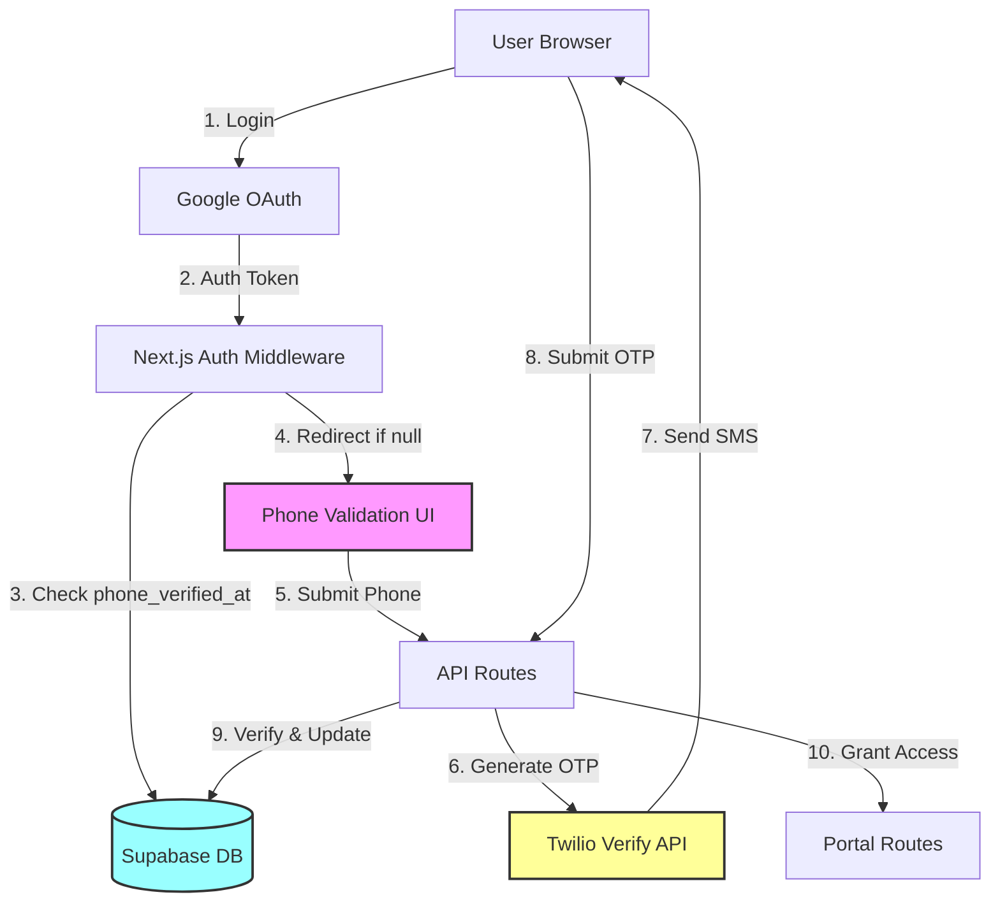
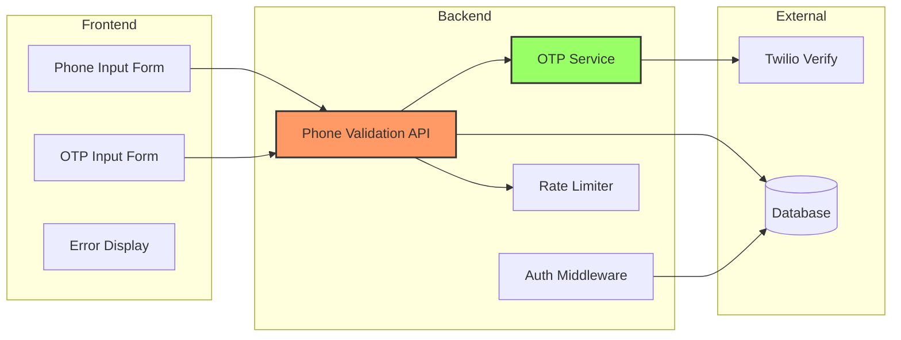
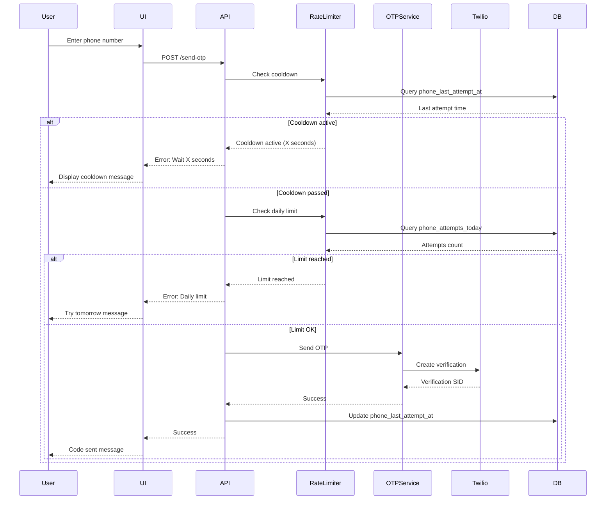
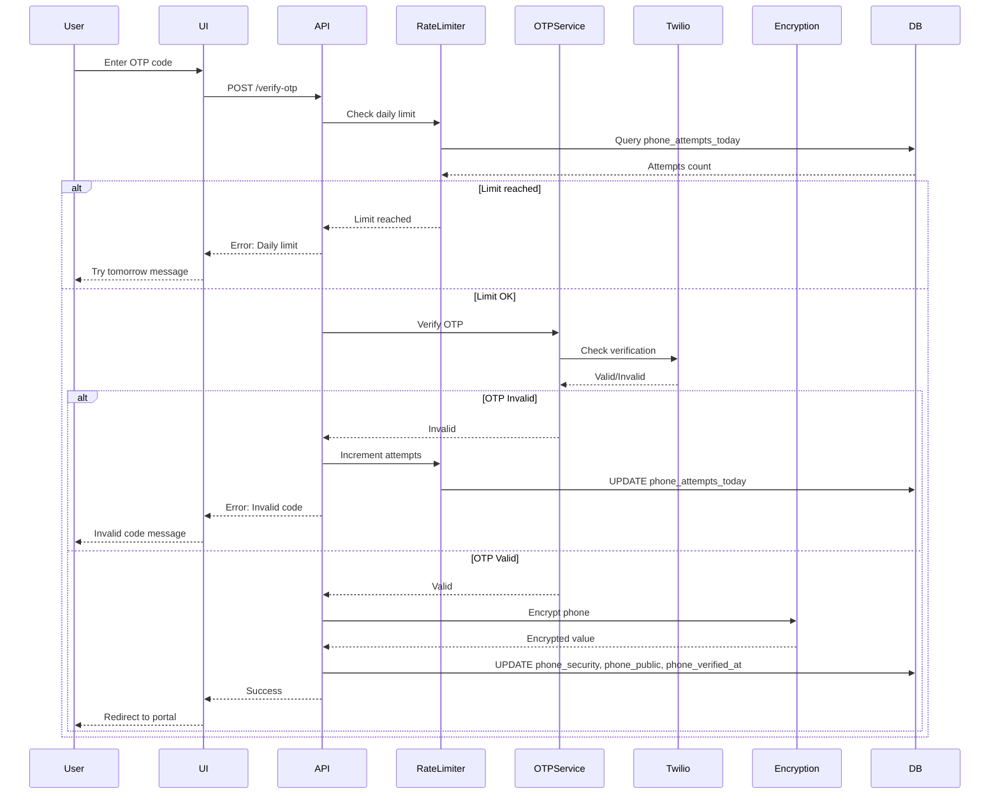

# Design Document: Phone Validation After Login

## Overview

This document outlines the technical design for implementing phone validation after Google OAuth login. The system ensures that new users validate a phone number via OTP SMS before accessing the portal, establishing identity verification and security.

### Goals

- Implement mandatory phone validation for new users after first login
- Integrate Twilio Verify API for OTP generation and delivery
- Secure storage of validated phone numbers using encryption
- Rate limiting to prevent abuse and SMS spam
- Seamless user experience with clear feedback and error handling

### Non-Goals

- Phone validation for existing users (only new users after first login)
- Phone number as primary authentication method (OAuth remains primary)
- International SMS delivery optimization (handled by Twilio)
- Phone number portability verification

### Technology Stack

- **Frontend**: Next.js 16, React 19, TypeScript
- **Backend**: Next.js API Routes (Server Actions)
- **Database**: Supabase (PostgreSQL)
- **SMS Provider**: Twilio Verify API
- **Encryption**: Supabase built-in encryption (pgsodium)
- **Testing**: Vitest, fast-check (property-based testing)

## Architecture

### High-Level Architecture



### Component Architecture



## Components and Interfaces

### 1. Authentication Middleware

**Purpose**: Intercept requests and redirect unauthenticated or unverified users

**Location**: `middleware.ts`

**Interface**:
```typescript
export async function middleware(request: NextRequest): Promise<NextResponse>
```

**Responsibilities**:
- Check if user is authenticated via Supabase session
- Check if `phone_verified_at` is null for authenticated users
- Redirect to `/phone-validation` if phone not verified
- Allow access to portal routes only if phone verified
- Exempt `/phone-validation` and public routes from checks

### 2. Phone Validation UI Component

**Purpose**: Collect phone number and OTP from user

**Location**: `app/phone-validation/page.tsx`

**Interface**:
```typescript
export default function PhoneValidationPage(): JSX.Element
```

**Sub-components**:
- `PhoneInputForm`: Phone number input with E.164 format validation
- `OTPInputForm`: 6-digit OTP input with auto-focus
- `ResendButton`: Cooldown-aware resend button
- `ErrorMessage`: Accessible error display with ARIA live regions

**State Management**:
```typescript
interface ValidationState {
  phoneNumber: string;
  otpCode: string;
  isLoading: boolean;
  error: string | null;
  otpSent: boolean;
  cooldownSeconds: number;
  attemptsRemaining: number;
}
```

### 3. Phone Validation API

**Purpose**: Handle phone validation requests and OTP verification

**Location**: `app/api/phone-validation/route.ts`

**Endpoints**:

#### POST /api/phone-validation/send-otp
```typescript
interface SendOTPRequest {
  phoneNumber: string; // E.164 format
}

interface SendOTPResponse {
  success: boolean;
  message: string;
  cooldownSeconds?: number;
  error?: string;
}
```

#### POST /api/phone-validation/verify-otp
```typescript
interface VerifyOTPRequest {
  phoneNumber: string;
  otpCode: string;
}

interface VerifyOTPResponse {
  success: boolean;
  message: string;
  error?: string;
}
```

### 4. OTP Service

**Purpose**: Encapsulate Twilio Verify API integration

**Location**: `lib/services/otp-service.ts`

**Interface**:
```typescript
export class OTPService {
  async sendOTP(phoneNumber: string): Promise<OTPSendResult>;
  async verifyOTP(phoneNumber: string, code: string): Promise<OTPVerifyResult>;
}

interface OTPSendResult {
  success: boolean;
  sid?: string;
  error?: TwilioError;
}

interface OTPVerifyResult {
  success: boolean;
  valid: boolean;
  error?: TwilioError;
}

interface TwilioError {
  code: number;
  message: string;
  status: number;
}
```

**Implementation Details**:
- Uses Twilio Verify API (not Messages API)
- Verify service handles OTP generation, storage, and expiration
- 10-minute OTP expiration (Twilio default)
- Automatic retry logic for transient failures

### 5. Rate Limiter Service

**Purpose**: Enforce rate limits and cooldowns

**Location**: `lib/services/rate-limiter.ts`

**Interface**:
```typescript
export class RateLimiter {
  async checkAttemptLimit(userId: string): Promise<RateLimitResult>;
  async checkCooldown(userId: string): Promise<CooldownResult>;
  async incrementAttempts(userId: string): Promise<void>;
  async updateLastAttempt(userId: string): Promise<void>;
  async resetDailyAttempts(userId: string): Promise<void>;
}

interface RateLimitResult {
  allowed: boolean;
  attemptsToday: number;
  maxAttempts: number;
}

interface CooldownResult {
  allowed: boolean;
  secondsRemaining: number;
}
```

**Implementation Details**:
- Reads `phone_attempts_today` and `phone_last_attempt_at` from database
- 5 attempts per calendar day (UTC)
- 60-second cooldown between OTP sends
- Daily reset at 00:00 UTC (handled by scheduled job or on-demand check)

### 6. Phone Encryption Service

**Purpose**: Encrypt and decrypt phone numbers for secure storage

**Location**: `lib/services/phone-encryption.ts`

**Interface**:
```typescript
export class PhoneEncryption {
  async encrypt(phoneNumber: string): Promise<string>;
  async decrypt(encryptedPhone: string): Promise<string>;
}
```

**Implementation Details**:
- Uses Supabase pgsodium extension for encryption
- AES-256-GCM encryption
- Encryption key stored in Supabase Vault
- Never expose decrypted `phone_security` in API responses

## Data Models

### Database Schema Changes

#### Users Table Modifications

```sql
-- Add new columns to users table
ALTER TABLE users 
ADD COLUMN phone_security TEXT, -- Encrypted phone number
ADD COLUMN phone_public TEXT, -- Optional public phone
ADD COLUMN phone_attempts_today INTEGER DEFAULT 0,
ADD COLUMN phone_last_attempt_at TIMESTAMPTZ;

-- Add index for phone_verified_at (query performance)
CREATE INDEX idx_users_phone_verified ON users(phone_verified_at);

-- Add index for rate limiting queries
CREATE INDEX idx_users_phone_attempts ON users(phone_attempts_today, phone_last_attempt_at);
```

#### Updated User Type

```typescript
export interface User {
  id: string;
  email: string;
  name: string;
  avatar_url: string | null;
  phone_number: string | null; // Deprecated, kept for backward compatibility
  phone_security: string | null; // Encrypted validated phone
  phone_public: string | null; // Optional public display phone
  phone_verified_at: Date | null;
  phone_attempts_today: number;
  phone_last_attempt_at: Date | null;
  terms_accepted_at: Date | null;
  onboarding_completed: boolean;
  role: "provider" | "moderator" | "admin";
  status: "active" | "suspended" | "banned";
  created_at: Date;
  updated_at: Date;
}
```

### Data Flow Diagrams

#### OTP Send Flow



#### OTP Verify Flow



## API Endpoints

### POST /api/phone-validation/send-otp

**Purpose**: Send OTP to user's phone number

**Authentication**: Required (Supabase session)

**Request**:
```typescript
{
  phoneNumber: string; // E.164 format: +5511999999999
}
```

**Response Success (200)**:
```typescript
{
  success: true,
  message: "Código enviado para +5511999999999"
}
```

**Response Error (400)**:
```typescript
{
  success: false,
  error: "Formato de telefone inválido. Use o formato internacional (+55...)"
}
```

**Response Error (429)**:
```typescript
{
  success: false,
  error: "Aguarde 45 segundos antes de solicitar novo código",
  cooldownSeconds: 45
}
```

**Response Error (429)**:
```typescript
{
  success: false,
  error: "Limite de tentativas atingido. Tente novamente amanhã"
}
```

**Response Error (503)**:
```typescript
{
  success: false,
  error: "Serviço temporariamente indisponível. Tente novamente em alguns minutos"
}
```

### POST /api/phone-validation/verify-otp

**Purpose**: Verify OTP code and validate phone

**Authentication**: Required (Supabase session)

**Request**:
```typescript
{
  phoneNumber: string;
  otpCode: string; // 6 digits
}
```

**Response Success (200)**:
```typescript
{
  success: true,
  message: "Telefone validado com sucesso"
}
```

**Response Error (400)**:
```typescript
{
  success: false,
  error: "Código inválido"
}
```

**Response Error (400)**:
```typescript
{
  success: false,
  error: "Código expirado"
}
```

**Response Error (429)**:
```typescript
{
  success: false,
  error: "Limite de tentativas atingido. Tente novamente amanhã"
}
```

### GET /api/phone-validation/status

**Purpose**: Get current validation status and rate limit info

**Authentication**: Required (Supabase session)

**Response Success (200)**:
```typescript
{
  phoneVerified: boolean;
  attemptsToday: number;
  maxAttempts: number;
  cooldownSeconds: number;
  canSendOTP: boolean;
}
```

## Security Considerations

### 1. Phone Number Encryption

**Threat**: Unauthorized access to phone numbers in database breach

**Mitigation**:
- Store validated phone in `phone_security` column using Supabase encryption
- Use AES-256-GCM encryption via pgsodium extension
- Encryption keys stored in Supabase Vault (separate from data)
- Never expose `phone_security` in API responses or public profiles
- Only decrypt when verifying phone ownership

**Implementation**:
```sql
-- Enable pgsodium extension
CREATE EXTENSION IF NOT EXISTS pgsodium;

-- Create encryption key in vault
SELECT pgsodium.create_key(name := 'phone_encryption_key');

-- Encrypt phone number
UPDATE users 
SET phone_security = pgsodium.crypto_aead_det_encrypt(
  '+5511999999999'::bytea,
  (SELECT id FROM pgsodium.valid_key WHERE name = 'phone_encryption_key')
);
```

### 2. Rate Limiting

**Threat**: SMS spam and abuse

**Mitigation**:
- 5 verification attempts per user per calendar day
- 60-second cooldown between OTP sends
- Track attempts in database (`phone_attempts_today`)
- Reset counter at 00:00 UTC daily
- Return clear error messages without exposing system details

### 3. OTP Security

**Threat**: OTP interception or brute force

**Mitigation**:
- Use Twilio Verify API (handles OTP generation and storage)
- 6-digit numeric codes (1 million combinations)
- 10-minute expiration window
- Rate limiting prevents brute force
- OTP tied to specific phone number (can't reuse)
- Twilio handles secure SMS delivery

### 4. Session Security

**Threat**: Session hijacking during validation

**Mitigation**:
- Maintain Supabase session throughout validation flow
- Session cookies are httpOnly and secure
- CSRF protection via Supabase Auth
- Validation state stored server-side (not in client)
- Redirect to validation page on every request until verified

### 5. Input Validation

**Threat**: Injection attacks or malformed data

**Mitigation**:
- Validate phone format using E.164 regex before API call
- Sanitize input on both client and server
- Use Zod schemas for request validation
- Parameterized queries for database operations
- Twilio SDK handles phone number validation

**Validation Schema**:
```typescript
import { z } from 'zod';

const phoneSchema = z.string().regex(
  /^\+[1-9]\d{1,14}$/,
  'Invalid phone format. Use E.164 format (+55...)'
);

const otpSchema = z.string().regex(
  /^\d{6}$/,
  'OTP must be 6 digits'
);
```

### 6. Error Message Security

**Threat**: Information disclosure through error messages

**Mitigation**:
- Generic error messages for security-sensitive operations
- Don't reveal if phone number exists in system
- Don't expose Twilio error details to client
- Log detailed errors server-side for debugging
- Use consistent error format

**Error Mapping**:
```typescript
const ERROR_MESSAGES = {
  INVALID_PHONE: 'Formato de telefone inválido. Use o formato internacional (+55...)',
  INVALID_OTP: 'Código inválido',
  EXPIRED_OTP: 'Código expirado',
  RATE_LIMIT: 'Limite de tentativas atingido. Tente novamente amanhã',
  COOLDOWN: 'Aguarde {seconds} segundos antes de solicitar novo código',
  SERVICE_ERROR: 'Serviço temporariamente indisponível. Tente novamente em alguns minutos'
};
```

### 7. Database Security

**Threat**: Unauthorized database access

**Mitigation**:
- Row Level Security (RLS) policies on users table
- Users can only read/update their own phone validation data
- API routes use service role for privileged operations
- Audit logging for phone validation events
- Separate read/write permissions

**RLS Policies**:
```sql
-- Users can only read their own phone validation status
CREATE POLICY "Users can read own phone status"
ON users FOR SELECT
USING (auth.uid() = id);

-- Users can only update their own phone validation
CREATE POLICY "Users can update own phone validation"
ON users FOR UPDATE
USING (auth.uid() = id)
WITH CHECK (auth.uid() = id);
```

## Integration Details

### Twilio Verify API Integration

**Service**: Twilio Verify (not Messages API)

**Why Verify API**:
- Built-in OTP generation and storage
- Automatic expiration handling (10 minutes)
- Rate limiting and fraud detection
- Delivery status tracking
- Multiple channel support (SMS, Voice, Email)

**Configuration**:
```typescript
// Environment variables
TWILIO_ACCOUNT_SID=ACxxxxxxxxxxxxxxxxxxxxxxxxxxxxx
TWILIO_AUTH_TOKEN=your_auth_token
TWILIO_VERIFY_SERVICE_SID=VAxxxxxxxxxxxxxxxxxxxxxxxxxxxxx
```

**API Calls**:

1. **Create Verification**:
```typescript
const verification = await twilioClient.verify.v2
  .services(process.env.TWILIO_VERIFY_SERVICE_SID!)
  .verifications
  .create({
    to: phoneNumber,
    channel: 'sms',
    locale: 'pt-BR'
  });
```

2. **Check Verification**:
```typescript
const verificationCheck = await twilioClient.verify.v2
  .services(process.env.TWILIO_VERIFY_SERVICE_SID!)
  .verificationChecks
  .create({
    to: phoneNumber,
    code: otpCode
  });

const isValid = verificationCheck.status === 'approved';
```

**Error Handling**:
```typescript
try {
  await sendOTP(phoneNumber);
} catch (error) {
  if (error.code === 20429) {
    // Rate limit exceeded
    return { error: 'SERVICE_ERROR' };
  } else if (error.code === 21211) {
    // Invalid phone number
    return { error: 'INVALID_PHONE' };
  } else if (error.code === 21608) {
    // Unverified phone number (trial account)
    return { error: 'SERVICE_ERROR' };
  } else {
    // Generic error
    return { error: 'SERVICE_ERROR' };
  }
}
```

### Supabase Integration

**Authentication**:
- Use existing Supabase Auth (Google OAuth)
- Session management via `@supabase/ssr`
- Server-side session validation in middleware

**Database Operations**:

1. **Check Verification Status**:
```typescript
const { data: user } = await supabase
  .from('users')
  .select('phone_verified_at, phone_attempts_today, phone_last_attempt_at')
  .eq('id', userId)
  .single();
```

2. **Update After Verification**:
```typescript
const { error } = await supabase
  .from('users')
  .update({
    phone_security: encryptedPhone,
    phone_public: phoneNumber,
    phone_verified_at: new Date().toISOString(),
    phone_attempts_today: 0
  })
  .eq('id', userId);
```

3. **Increment Attempts**:
```typescript
const { error } = await supabase.rpc('increment_phone_attempts', {
  user_id: userId
});
```

**Database Function**:
```sql
CREATE OR REPLACE FUNCTION increment_phone_attempts(user_id UUID)
RETURNS void AS $
BEGIN
  UPDATE users
  SET phone_attempts_today = phone_attempts_today + 1
  WHERE id = user_id;
END;
$ LANGUAGE plpgsql SECURITY DEFINER;
```

### Middleware Integration

**Purpose**: Enforce phone validation before portal access

**Location**: `middleware.ts`

**Logic**:
```typescript
export async function middleware(request: NextRequest) {
  const supabase = createServerClient(/* ... */);
  
  // Check authentication
  const { data: { user } } = await supabase.auth.getUser();
  
  if (!user) {
    // Redirect to login
    return NextResponse.redirect(new URL('/login', request.url));
  }
  
  // Check phone verification for portal routes
  if (request.nextUrl.pathname.startsWith('/portal')) {
    const { data: userData } = await supabase
      .from('users')
      .select('phone_verified_at')
      .eq('id', user.id)
      .single();
    
    if (!userData?.phone_verified_at) {
      // Redirect to phone validation
      return NextResponse.redirect(new URL('/phone-validation', request.url));
    }
  }
  
  return NextResponse.next();
}

export const config = {
  matcher: ['/portal/:path*', '/phone-validation']
};
```


## Correctness Properties

A property is a characteristic or behavior that should hold true across all valid executions of a system—essentially, a formal statement about what the system should do. Properties serve as the bridge between human-readable specifications and machine-verifiable correctness guarantees.

### Property Reflection

After analyzing all acceptance criteria, I identified several redundancies:

**Redundancies Eliminated**:
- Property 1.5 (portal access when verified) is the logical inverse of 1.2 (portal denial when not verified) - combined into Property 1
- Property 4.2 (increment attempts) is redundant with 3.5 (same behavior) - combined into Property 3
- Property 5.4 (allow after cooldown) is the inverse of 5.2 (block during cooldown) - combined into Property 5
- Property 5.5 (update timestamp on send) is redundant with 4.6 (same behavior) - combined into Property 4
- Property 6.2 (store in phone_security) is redundant with 3.3 (same behavior) - eliminated
- Property 6.4 (don't display in profile) is redundant with 6.3 (same behavior for API) - combined into Property 6
- Property 7.1 (pre-populate phone_public) is redundant with 3.4 (same behavior) - eliminated
- Property 8.3 (accept country code) is part of E.164 validation in 8.1 - eliminated
- Property 10.3 (redirect on return) is redundant with 1.1 (same redirect behavior) - eliminated

### Property 1: Unverified users are redirected to validation

For any authenticated user where `phone_verified_at` is null, attempting to access any portal route should result in a redirect to the phone validation screen, and the portal route should not be accessible.

**Validates: Requirements 1.1, 1.2, 1.5**

### Property 2: Profile publication requires phone verification

For any user profile, attempting to publish the profile when `phone_verified_at` is null should be rejected, and the profile status should remain unchanged.

**Validates: Requirements 1.3**

### Property 3: Successful validation sets timestamp and encrypts phone

For any valid phone number and correct OTP, when verification succeeds, the system should set `phone_verified_at` to a recent timestamp (within last 5 seconds), set `phone_security` to an encrypted value (different from plaintext), set `phone_public` to the plaintext phone number, and reset `phone_attempts_today` to 0.

**Validates: Requirements 1.4, 3.2, 3.3, 3.4**

### Property 4: Failed verification increments attempt counter

For any user with `phone_attempts_today` less than 5, when OTP verification fails, the system should increment `phone_attempts_today` by exactly 1 and update `phone_last_attempt_at` to the current time.

**Validates: Requirements 3.5, 4.1, 4.2, 4.6**

### Property 5: Cooldown prevents rapid OTP requests

For any user where less than 60 seconds have elapsed since `phone_last_attempt_at`, attempting to send a new OTP should be blocked and return a cooldown error with the remaining seconds.

**Validates: Requirements 5.1, 5.2, 5.3, 5.4**

### Property 6: Rate limit blocks excessive attempts

For any user where `phone_attempts_today` equals or exceeds 5, attempting to send OTP or verify OTP should be blocked and return a rate limit error.

**Validates: Requirements 4.3**

### Property 7: Daily reset clears attempt counter

For any user with `phone_attempts_today` greater than 0, when the daily reset function is called, `phone_attempts_today` should be set to 0.

**Validates: Requirements 4.5**

### Property 8: Phone encryption round trip preserves value

For any valid E.164 phone number, encrypting then decrypting the phone number should return the original phone number unchanged.

**Validates: Requirements 6.1, 6.5**

### Property 9: Encrypted phone never exposed in API responses

For any API endpoint that returns user data, the response object should never contain the `phone_security` field, even when the user is authenticated.

**Validates: Requirements 6.3, 6.4**

### Property 10: Phone format validation accepts only E.164

For any string, the phone validation function should return true if and only if the string matches E.164 format (starts with +, followed by 1-15 digits).

**Validates: Requirements 8.1, 8.3**

### Property 11: Phone input sanitization normalizes format

For any phone number string with whitespace or formatting characters (spaces, dashes, parentheses), the sanitization function should remove all non-digit characters except the leading + sign, producing a valid E.164 format string.

**Validates: Requirements 8.4**

### Property 12: Twilio error codes map to user-friendly messages

For any Twilio API error code (20429, 21211, 21608, etc.), the error handling function should return a user-friendly error message in Portuguese that does not expose technical details.

**Validates: Requirements 2.5, 11.3, 11.4**

### Property 13: Session persists during validation flow

For any authenticated user on the phone validation screen, refreshing the page should maintain the authentication session and preserve any pending phone number in the session state.

**Validates: Requirements 10.1, 10.2, 10.4**

### Property 14: Successful validation clears session state

For any user with pending validation session data, when phone verification succeeds, all validation-related session data should be cleared.

**Validates: Requirements 10.5**

### Property 15: Changing phone_public requires re-validation

For any user with a validated phone, when attempting to change `phone_public` to a different phone number, the system should require OTP validation for the new number before updating the field.

**Validates: Requirements 7.2, 7.3, 7.4**

### Property 16: OTP service correctly calls Twilio Verify API

For any valid phone number, when sending an OTP, the OTP service should call Twilio Verify API's create verification endpoint and return a success result with a verification SID.

**Validates: Requirements 2.1, 3.1**

### Property 17: API logs all Twilio interactions

For any Twilio API call (send OTP or verify OTP), the system should create a log entry containing the request parameters (excluding sensitive data), response status, and timestamp.

**Validates: Requirements 11.5**

### Property 18: UI elements have proper ARIA labels

For any interactive element in the phone validation UI (input fields, buttons), the rendered HTML should include appropriate ARIA labels and roles for screen reader accessibility.

**Validates: Requirements 12.2**

### Property 19: Error messages use ARIA live regions

For any error message displayed in the phone validation UI, the error container should have an ARIA live region attribute (aria-live="polite" or "assertive") to announce errors to screen readers.

**Validates: Requirements 12.3**

### Property 20: Loading states provide visual feedback

For any asynchronous operation (send OTP, verify OTP), the UI should display a loading indicator while the operation is in progress and hide it when complete.

**Validates: Requirements 12.4**

### Property 21: Focus management after OTP send

For any successful OTP send operation, the UI should automatically move focus to the OTP input field to improve user experience.

**Validates: Requirements 12.6**

### Property 22: Keyboard navigation support

For any interactive element in the phone validation UI, the element should be reachable and operable using only keyboard navigation (Tab, Enter, Space keys).

**Validates: Requirements 12.7**

## Error Handling

### Error Categories

1. **Validation Errors** (400 Bad Request)
   - Invalid phone format
   - Invalid OTP format
   - Missing required fields

2. **Rate Limit Errors** (429 Too Many Requests)
   - Daily attempt limit exceeded
   - Cooldown period active

3. **Authentication Errors** (401 Unauthorized)
   - Invalid OTP code
   - Expired OTP code
   - No active session

4. **External Service Errors** (503 Service Unavailable)
   - Twilio API failures
   - Database connection errors
   - Encryption service errors

### Error Response Format

All API errors follow a consistent format:

```typescript
interface ErrorResponse {
  success: false;
  error: string; // User-friendly message in Portuguese
  code?: string; // Machine-readable error code
  details?: Record<string, any>; // Additional context (dev mode only)
}
```

### Error Handling Strategy

**Client-Side**:
- Display errors in ARIA live regions for accessibility
- Show specific error messages for user-correctable issues
- Provide actionable guidance (e.g., "Wait 45 seconds")
- Log errors to browser console for debugging

**Server-Side**:
- Log all errors with full context (user ID, timestamp, stack trace)
- Map technical errors to user-friendly messages
- Never expose sensitive information in error messages
- Implement retry logic for transient failures

**Twilio Error Mapping**:
```typescript
const TWILIO_ERROR_MAP: Record<number, string> = {
  20429: 'SERVICE_ERROR', // Rate limit
  21211: 'INVALID_PHONE', // Invalid phone
  21608: 'SERVICE_ERROR', // Unverified number (trial)
  60200: 'INVALID_OTP', // Invalid code
  60202: 'EXPIRED_OTP', // Max attempts reached
  60203: 'EXPIRED_OTP', // Expired code
  60205: 'SERVICE_ERROR', // SMS not sent
};
```

### Retry Strategy

**Transient Failures**:
- Retry up to 3 times with exponential backoff
- Initial delay: 1 second
- Backoff multiplier: 2x
- Max delay: 10 seconds

**Non-Retryable Errors**:
- Invalid phone format
- Invalid OTP code
- Rate limit exceeded
- Authentication failures

### Monitoring and Alerting

**Metrics to Track**:
- OTP send success rate
- OTP verification success rate
- Average time to verification
- Rate limit hit rate
- Twilio API error rate

**Alerts**:
- Twilio API error rate > 5%
- OTP send success rate < 95%
- Verification success rate < 80%
- Rate limit hit rate > 10%

## Testing Strategy

### Dual Testing Approach

This feature requires both unit tests and property-based tests for comprehensive coverage:

**Unit Tests**: Focus on specific examples, edge cases, and integration points
**Property Tests**: Verify universal properties across all inputs using randomization

### Property-Based Testing Configuration

**Library**: fast-check (already in package.json)

**Configuration**:
- Minimum 100 iterations per property test
- Each test tagged with feature name and property number
- Tag format: `Feature: phone-validation-after-login, Property {N}: {description}`

**Example Property Test**:
```typescript
import fc from 'fast-check';
import { describe, it, expect } from 'vitest';

describe('Feature: phone-validation-after-login', () => {
  it('Property 10: Phone format validation accepts only E.164', () => {
    // Feature: phone-validation-after-login, Property 10: Phone format validation accepts only E.164
    
    fc.assert(
      fc.property(
        fc.string(),
        (input) => {
          const isValid = validateE164Format(input);
          const matchesE164 = /^\+[1-9]\d{1,14}$/.test(input);
          
          expect(isValid).toBe(matchesE164);
        }
      ),
      { numRuns: 100 }
    );
  });
});
```

### Unit Testing Strategy

**Focus Areas**:
1. **API Endpoints**: Test request/response handling, authentication, validation
2. **Rate Limiting**: Test cooldown and daily limit enforcement
3. **Error Handling**: Test error mapping and message formatting
4. **Encryption**: Test encryption/decryption round trips
5. **Middleware**: Test redirect logic for verified/unverified users

**Example Unit Test**:
```typescript
describe('Phone Validation API', () => {
  it('should return cooldown error when attempting to resend too quickly', async () => {
    // Setup: User with recent attempt (30 seconds ago)
    const user = await createTestUser({
      phone_last_attempt_at: new Date(Date.now() - 30000)
    });
    
    // Execute: Attempt to send OTP
    const response = await POST('/api/phone-validation/send-otp', {
      phoneNumber: '+5511999999999'
    }, { userId: user.id });
    
    // Assert: Should return cooldown error
    expect(response.status).toBe(429);
    expect(response.body.error).toContain('Aguarde');
    expect(response.body.cooldownSeconds).toBeGreaterThan(0);
  });
});
```

### Integration Testing

**Twilio Integration**:
- Use Twilio test credentials in development
- Mock Twilio API in CI/CD pipeline
- Test error scenarios with Twilio's test phone numbers

**Database Integration**:
- Use Supabase local development instance
- Test migrations and schema changes
- Verify RLS policies work correctly

**End-to-End Testing**:
- Test complete flow: login → validation → portal access
- Test error scenarios: invalid OTP, rate limits, cooldowns
- Test accessibility with screen readers

### Test Coverage Goals

- **Line Coverage**: > 80%
- **Branch Coverage**: > 75%
- **Property Tests**: All 22 properties implemented
- **Unit Tests**: All critical paths covered
- **Integration Tests**: All external service interactions covered

### Testing Checklist

- [ ] Property 1: Unverified users redirected
- [ ] Property 2: Profile publication blocked
- [ ] Property 3: Successful validation updates fields
- [ ] Property 4: Failed verification increments counter
- [ ] Property 5: Cooldown prevents rapid requests
- [ ] Property 6: Rate limit blocks excessive attempts
- [ ] Property 7: Daily reset clears counter
- [ ] Property 8: Encryption round trip
- [ ] Property 9: Encrypted phone never exposed
- [ ] Property 10: E.164 format validation
- [ ] Property 11: Input sanitization
- [ ] Property 12: Error message mapping
- [ ] Property 13: Session persistence
- [ ] Property 14: Session cleanup
- [ ] Property 15: Phone change requires validation
- [ ] Property 16: Twilio API integration
- [ ] Property 17: API logging
- [ ] Property 18: ARIA labels
- [ ] Property 19: ARIA live regions
- [ ] Property 20: Loading states
- [ ] Property 21: Focus management
- [ ] Property 22: Keyboard navigation
- [ ] Unit test: Send OTP endpoint
- [ ] Unit test: Verify OTP endpoint
- [ ] Unit test: Rate limiter service
- [ ] Unit test: OTP service
- [ ] Unit test: Encryption service
- [ ] Unit test: Middleware redirect logic
- [ ] Integration test: Complete validation flow
- [ ] Integration test: Twilio error handling
- [ ] E2E test: Full user journey

## Implementation Notes

### Migration Strategy

1. **Database Migration**: Add new columns to users table
2. **Backward Compatibility**: Keep existing `phone_number` column for reference
3. **Gradual Rollout**: Enable for new users first, then existing users
4. **Monitoring**: Track validation completion rates and errors

### Performance Considerations

- **Database Queries**: Use indexes on `phone_verified_at` and `phone_attempts_today`
- **Caching**: Cache rate limit checks for 1 minute to reduce DB load
- **Twilio API**: Use connection pooling and timeout configuration
- **Encryption**: Use Supabase built-in encryption (hardware-accelerated)

### Security Checklist

- [ ] Phone numbers encrypted at rest
- [ ] Rate limiting implemented
- [ ] Cooldown enforced
- [ ] Input validation on client and server
- [ ] Error messages don't leak information
- [ ] RLS policies configured
- [ ] Audit logging enabled
- [ ] HTTPS enforced
- [ ] CSRF protection enabled
- [ ] Session security configured

### Accessibility Checklist

- [ ] ARIA labels on all inputs
- [ ] ARIA live regions for errors
- [ ] Keyboard navigation support
- [ ] Focus management
- [ ] Screen reader testing
- [ ] Color contrast compliance
- [ ] Error messages clear and actionable
- [ ] Loading states announced

### Deployment Checklist

- [ ] Environment variables configured
- [ ] Twilio Verify service created
- [ ] Database migration applied
- [ ] RLS policies deployed
- [ ] Monitoring configured
- [ ] Error tracking enabled
- [ ] Load testing completed
- [ ] Security audit completed
- [ ] Accessibility audit completed
- [ ] Documentation updated
