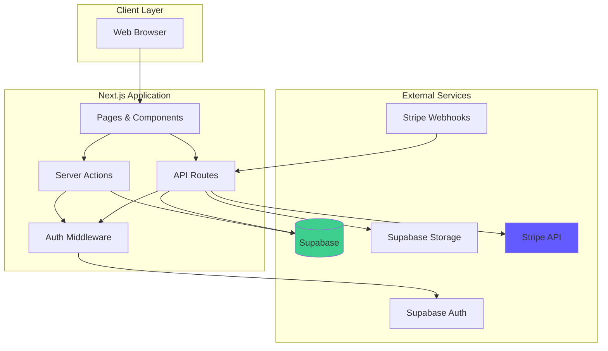
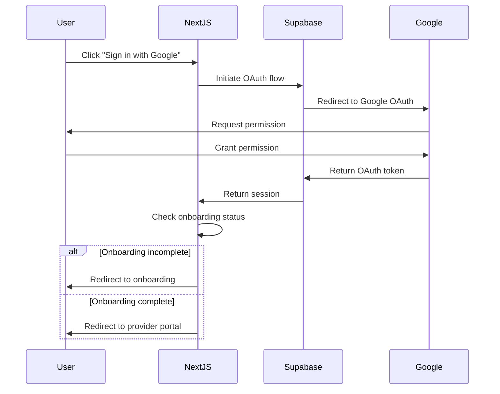
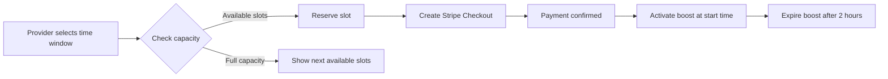

# Design Document: Premium Service Marketplace

## Overview

### Purpose

This document provides the technical design for a premium service marketplace web application that enables service providers to create public profiles with subscription-based tiers, allows visitors to discover providers through a searchable catalog, and provides administrators with moderation tools. The system implements a freemium business model with paid subscriptions and optional boost features for increased visibility.

### Technology Stack

- **Frontend Framework**: Next.js 14+ (App Router) with TypeScript
- **UI Components**: shadcn/ui with Tailwind CSS
- **Backend**: Next.js API Routes and Server Actions
- **Database**: PostgreSQL via Supabase
- **Authentication**: Supabase Auth (Google OAuth)
- **Storage**: Supabase Storage for media files
- **Payment Processing**: Stripe (Checkout, Customer Portal, Webhooks)
- **Deployment**: Vercel (recommended) or similar Next.js-compatible platform

### Key Design Principles

1. **Security First**: Row Level Security (RLS) policies enforce data access at the database level
2. **Privacy Preserving**: Location data is truncated to neighborhood-level precision using geohash
3. **Minimal Dependencies**: Leverage platform capabilities (Supabase, Stripe) to reduce custom code
4. **Scalability**: Stateless architecture with database-backed rate limiting and caching strategies
5. **Maintainability**: Clear separation of concerns with typed interfaces and configuration-driven features


## Architecture

### System Architecture

The application follows a modern full-stack architecture using Next.js as both the frontend and backend platform:



### Application Layers

1. **Presentation Layer** (Next.js Pages/Components)
   - Public catalog pages (Server-Side Rendered)
   - Provider portal (Client-Side with authentication)
   - Admin backoffice (Client-Side with role-based access)
   - Responsive UI components

2. **API Layer** (Next.js API Routes & Server Actions)
   - RESTful endpoints for CRUD operations
   - Server Actions for form submissions and mutations
   - Webhook handlers for Stripe events
   - Rate limiting middleware

3. **Data Layer** (Supabase PostgreSQL)
   - Relational database with RLS policies
   - Indexed queries for catalog search
   - Transactional operations for critical workflows

4. **Storage Layer** (Supabase Storage)
   - Media file storage with signed URLs
   - Access control policies
   - CDN-backed delivery

5. **External Integration Layer**
   - Stripe for payment processing
   - Google OAuth via Supabase Auth
   - SMS provider for phone verification (e.g., Twilio)


### Authentication Flow



### Boost Capacity Management

The system limits concurrent boosts to 15 per boost context (combination of geographic region and category). This prevents oversaturation and maintains boost value:




## Components and Interfaces

### Core Domain Models

#### User

```typescript
interface User {
  id: string; // UUID from Supabase Auth
  email: string;
  name: string;
  avatar_url: string | null;
  phone_number: string | null;
  phone_verified_at: Date | null;
  terms_accepted_at: Date | null;
  onboarding_completed: boolean;
  role: 'provider' | 'moderator' | 'admin';
  status: 'active' | 'suspended' | 'banned';
  created_at: Date;
  updated_at: Date;
}
```

#### Profile

```typescript
interface Profile {
  id: string; // UUID
  user_id: string; // Foreign key to User
  display_name: string;
  slug: string; // Unique URL identifier
  slug_last_changed_at: Date | null;
  category: string;
  short_description: string; // Max 160 chars
  long_description: string;
  age_attribute: number | null; // Optional age display
  city: string;
  region: string;
  geohash: string; // Truncated for privacy
  latitude: number;
  longitude: number;
  status: 'draft' | 'published' | 'unpublished';
  online_status_updated_at: Date;
  external_links: ExternalLink[];
  pricing_packages: PricingPackage[];
  created_at: Date;
  updated_at: Date;
}

interface ExternalLink {
  type: 'whatsapp' | 'telegram' | 'instagram' | 'website' | 'other';
  url: string;
  label: string;
}

interface PricingPackage {
  name: string;
  price: number;
  currency: string;
  description: string;
}
```


#### Media

```typescript
interface Media {
  id: string; // UUID
  profile_id: string; // Foreign key to Profile
  type: 'photo' | 'video';
  storage_path: string; // Path in Supabase Storage
  public_url: string;
  is_cover: boolean;
  sort_order: number;
  file_size: number; // Bytes
  created_at: Date;
}
```

#### Availability

```typescript
interface Availability {
  id: string; // UUID
  profile_id: string; // Foreign key to Profile
  weekday: 0 | 1 | 2 | 3 | 4 | 5 | 6; // 0 = Sunday
  start_time: string; // HH:MM format
  end_time: string; // HH:MM format
  is_available: boolean;
  created_at: Date;
}
```

#### Feature

```typescript
interface Feature {
  id: string; // UUID
  group_name: string; // e.g., "Services", "Attributes"
  feature_name: string;
  display_order: number;
  created_at: Date;
}

interface ProfileFeature {
  profile_id: string; // Foreign key to Profile
  feature_id: string; // Foreign key to Feature
  created_at: Date;
}
```


#### Subscription

```typescript
interface Plan {
  id: string; // UUID
  code: 'free' | 'premium' | 'black';
  name: string;
  price: number; // Monthly price in cents
  currency: string;
  max_photos: number;
  max_videos: number;
  stripe_price_id: string | null;
  created_at: Date;
}

interface Subscription {
  id: string; // UUID
  user_id: string; // Foreign key to User
  plan_id: string; // Foreign key to Plan
  stripe_customer_id: string | null;
  stripe_subscription_id: string | null;
  status: 'active' | 'past_due' | 'canceled' | 'incomplete';
  current_period_start: Date | null;
  current_period_end: Date | null;
  created_at: Date;
  updated_at: Date;
}
```

#### Boost

```typescript
interface Boost {
  id: string; // UUID
  profile_id: string; // Foreign key to Profile
  boost_context: string; // "{city}:{region}:{category}"
  start_time: Date;
  end_time: Date;
  status: 'scheduled' | 'active' | 'expired' | 'canceled';
  stripe_payment_intent_id: string | null;
  amount_paid: number; // In cents
  created_at: Date;
  updated_at: Date;
}
```


#### Report

```typescript
interface Report {
  id: string; // UUID
  profile_id: string; // Foreign key to Profile
  reporter_user_id: string | null; // Null for anonymous reports
  reporter_fingerprint: string | null; // Browser fingerprint for anonymous
  reason: 'inappropriate_content' | 'fake_profile' | 'spam' | 'other';
  details: string;
  status: 'new' | 'under_review' | 'resolved' | 'dismissed';
  reviewed_by: string | null; // User ID of admin/moderator
  reviewed_at: Date | null;
  created_at: Date;
}
```

#### Audit Log

```typescript
interface AuditLog {
  id: string; // UUID
  actor_user_id: string; // Foreign key to User
  action: 'profile_unpublished' | 'user_suspended' | 'user_banned' | 'report_status_updated';
  target_type: 'profile' | 'user' | 'report';
  target_id: string;
  metadata: Record<string, any>; // JSON field for additional context
  created_at: Date;
}
```

#### Analytics Event

```typescript
interface AnalyticsEvent {
  id: string; // UUID
  profile_id: string; // Foreign key to Profile
  event_type: 'visit' | 'contact_click';
  contact_method: string | null; // For contact_click events
  visitor_fingerprint: string | null;
  created_at: Date;
}
```


### API Endpoints

#### Authentication & Onboarding

- `POST /api/auth/callback` - Handle OAuth callback from Supabase
- `POST /api/onboarding/send-verification` - Send SMS verification code
- `POST /api/onboarding/verify-phone` - Verify phone number with code
- `POST /api/onboarding/complete` - Complete onboarding process

#### Profile Management

- `GET /api/profiles/me` - Get current user's profile
- `POST /api/profiles` - Create new profile
- `PATCH /api/profiles/:id` - Update profile
- `POST /api/profiles/:id/publish` - Publish profile
- `POST /api/profiles/:id/unpublish` - Unpublish profile (admin only)

#### Media Management

- `POST /api/media/upload-url` - Generate signed upload URL
- `POST /api/media` - Create media record after upload
- `PATCH /api/media/:id` - Update media (cover, sort order)
- `DELETE /api/media/:id` - Delete media

#### Availability Management

- `GET /api/availability/:profileId` - Get availability schedule
- `POST /api/availability` - Create availability slot
- `PATCH /api/availability/:id` - Update availability slot
- `DELETE /api/availability/:id` - Delete availability slot


#### Subscription Management

- `GET /api/subscriptions/plans` - List available plans
- `POST /api/subscriptions/checkout` - Create Stripe Checkout session
- `GET /api/subscriptions/portal` - Get Stripe Customer Portal URL
- `POST /api/webhooks/stripe` - Handle Stripe webhook events

#### Boost Management

- `GET /api/boosts/availability` - Check boost slot availability
- `POST /api/boosts/checkout` - Create boost Checkout session
- `GET /api/boosts/me` - Get current user's boosts

#### Catalog & Search

- `GET /api/catalog` - Search and filter profiles (public)
- `GET /api/profiles/:slug` - Get public profile by slug (public)

#### Analytics

- `POST /api/analytics/visit` - Track profile visit (public)
- `POST /api/analytics/contact-click` - Track contact button click (public)
- `GET /api/analytics/dashboard` - Get provider analytics dashboard

#### Reports & Moderation

- `POST /api/reports` - Submit report (public)
- `GET /api/admin/reports` - List reports (admin/moderator)
- `PATCH /api/admin/reports/:id` - Update report status (admin/moderator)
- `POST /api/admin/users/:id/suspend` - Suspend user (admin only)
- `POST /api/admin/users/:id/ban` - Ban user (admin only)

#### Audit Logs

- `GET /api/admin/audit-logs` - List audit logs (admin only)


### Key Services and Utilities

#### AuthService

Handles authentication state and user session management.

```typescript
class AuthService {
  async getCurrentUser(): Promise<User | null>;
  async signInWithGoogle(): Promise<void>;
  async signOut(): Promise<void>;
  async checkOnboardingStatus(userId: string): Promise<boolean>;
  async requireAuth(): Promise<User>; // Throws if not authenticated
  async requireRole(role: 'admin' | 'moderator'): Promise<User>;
}
```

#### ProfileService

Manages profile CRUD operations and publishing logic.

```typescript
class ProfileService {
  async createProfile(userId: string, data: CreateProfileInput): Promise<Profile>;
  async updateProfile(profileId: string, data: UpdateProfileInput): Promise<Profile>;
  async getProfile(profileId: string): Promise<Profile | null>;
  async getProfileBySlug(slug: string): Promise<Profile | null>;
  async canChangeSlug(profileId: string): Promise<boolean>;
  async publishProfile(profileId: string): Promise<void>;
  async unpublishProfile(profileId: string, actorId: string): Promise<void>;
  async checkPublishingEligibility(userId: string): Promise<boolean>;
}
```


#### SubscriptionService

Manages subscription lifecycle and Stripe integration.

```typescript
class SubscriptionService {
  async createCheckoutSession(userId: string, planCode: string): Promise<string>; // Returns checkout URL
  async getCustomerPortalUrl(userId: string): Promise<string>;
  async handleCheckoutCompleted(session: Stripe.Checkout.Session): Promise<void>;
  async handleSubscriptionUpdated(subscription: Stripe.Subscription): Promise<void>;
  async handleSubscriptionDeleted(subscription: Stripe.Subscription): Promise<void>;
  async handleInvoicePaymentFailed(invoice: Stripe.Invoice): Promise<void>;
  async getCurrentSubscription(userId: string): Promise<Subscription | null>;
  async getMediaLimits(userId: string): Promise<{ maxPhotos: number; maxVideos: number }>;
}
```

#### BoostService

Manages boost scheduling and capacity checks.

```typescript
class BoostService {
  async checkAvailability(context: string, startTime: Date, endTime: Date): Promise<boolean>;
  async getNextAvailableSlots(context: string, preferredStart: Date): Promise<Date[]>;
  async createBoostCheckout(profileId: string, startTime: Date, endTime: Date): Promise<string>;
  async confirmBoost(boostId: string, paymentIntentId: string): Promise<void>;
  async activateScheduledBoosts(): Promise<void>; // Cron job
  async expireActiveBoosts(): Promise<void>; // Cron job
  async getBoostContext(profile: Profile): Promise<string>;
}
```


#### CatalogService

Handles catalog search, filtering, and sorting.

```typescript
interface CatalogFilters {
  search?: string;
  category?: string;
  city?: string;
  region?: string;
  features?: string[]; // Feature IDs
}

interface CatalogResult {
  boostedProfiles: Profile[];
  regularProfiles: Profile[];
  totalCount: number;
  hasMore: boolean;
}

class CatalogService {
  async searchCatalog(filters: CatalogFilters, page: number, pageSize: number): Promise<CatalogResult>;
  async getBoostedProfiles(filters: CatalogFilters): Promise<Profile[]>;
  async getRegularProfiles(filters: CatalogFilters, page: number, pageSize: number): Promise<Profile[]>;
}
```

#### MediaService

Handles media upload and management.

```typescript
class MediaService {
  async generateUploadUrl(profileId: string, fileType: string, fileSize: number): Promise<string>;
  async createMediaRecord(profileId: string, data: CreateMediaInput): Promise<Media>;
  async updateMedia(mediaId: string, data: UpdateMediaInput): Promise<Media>;
  async deleteMedia(mediaId: string): Promise<void>;
  async validateMediaLimits(profileId: string, type: 'photo' | 'video'): Promise<boolean>;
  async setCoverImage(profileId: string, mediaId: string): Promise<void>;
}
```


#### ReportService

Manages report submission and review workflow.

```typescript
class ReportService {
  async submitReport(data: CreateReportInput): Promise<Report>;
  async listReports(filters: ReportFilters): Promise<Report[]>;
  async updateReportStatus(reportId: string, status: string, reviewerId: string): Promise<Report>;
  async canSubmitReport(fingerprint: string): Promise<boolean>; // Rate limit check
}
```

#### AnalyticsService

Tracks and aggregates analytics events.

```typescript
interface AnalyticsSummary {
  visitsToday: number;
  visits7Days: number;
  visits30Days: number;
  visits12Months: number;
  clicksByMethod: Record<string, number>;
}

class AnalyticsService {
  async trackVisit(profileId: string, fingerprint: string): Promise<void>;
  async trackContactClick(profileId: string, method: string, fingerprint: string): Promise<void>;
  async getAnalyticsSummary(profileId: string): Promise<AnalyticsSummary>;
}
```

#### LocationService

Handles geohash generation and approximate location display.

```typescript
class LocationService {
  generateGeohash(lat: number, lon: number, precision: number): string;
  truncateGeohash(geohash: string, targetPrecision: number): string;
  decodeGeohash(geohash: string): { lat: number; lon: number; latError: number; lonError: number };
  getApproximateLocation(lat: number, lon: number): { geohash: string; displayLat: number; displayLon: number };
}
```


#### RateLimiter

Implements rate limiting for sensitive operations.

```typescript
interface RateLimitConfig {
  maxRequests: number;
  windowMs: number;
  keyGenerator: (req: Request) => string;
}

class RateLimiter {
  async checkLimit(key: string, config: RateLimitConfig): Promise<boolean>;
  async incrementCounter(key: string, config: RateLimitConfig): Promise<void>;
  async getRemainingRequests(key: string, config: RateLimitConfig): Promise<number>;
}
```

#### ConfigParser

Parses and validates configuration files for plans and features.

```typescript
interface PlanConfig {
  code: string;
  name: string;
  price: number;
  currency: string;
  maxPhotos: number;
  maxVideos: number;
  stripePriceId?: string;
}

interface FeatureConfig {
  groupName: string;
  features: Array<{ name: string; displayOrder: number }>;
}

class ConfigParser {
  parsePlans(configText: string): PlanConfig[];
  parseFeatures(configText: string): FeatureConfig[];
  validatePlanConfig(config: PlanConfig): ValidationResult;
  validateFeatureConfig(config: FeatureConfig): ValidationResult;
  prettyPrintPlans(plans: PlanConfig[]): string;
  prettyPrintFeatures(features: FeatureConfig[]): string;
}
```


## Data Models

### Database Schema

The database schema is implemented in PostgreSQL via Supabase with the following tables:

#### Users Table

```sql
CREATE TABLE users (
  id UUID PRIMARY KEY REFERENCES auth.users(id),
  email TEXT NOT NULL,
  name TEXT NOT NULL,
  avatar_url TEXT,
  phone_number TEXT,
  phone_verified_at TIMESTAMPTZ,
  terms_accepted_at TIMESTAMPTZ,
  onboarding_completed BOOLEAN DEFAULT FALSE,
  role TEXT DEFAULT 'provider' CHECK (role IN ('provider', 'moderator', 'admin')),
  status TEXT DEFAULT 'active' CHECK (status IN ('active', 'suspended', 'banned')),
  created_at TIMESTAMPTZ DEFAULT NOW(),
  updated_at TIMESTAMPTZ DEFAULT NOW()
);

CREATE INDEX idx_users_email ON users(email);
CREATE INDEX idx_users_role ON users(role);
CREATE INDEX idx_users_status ON users(status);
```


#### Profiles Table

```sql
CREATE TABLE profiles (
  id UUID PRIMARY KEY DEFAULT gen_random_uuid(),
  user_id UUID NOT NULL REFERENCES users(id) ON DELETE CASCADE,
  display_name TEXT NOT NULL,
  slug TEXT NOT NULL UNIQUE,
  slug_last_changed_at TIMESTAMPTZ,
  category TEXT NOT NULL,
  short_description TEXT NOT NULL CHECK (LENGTH(short_description) <= 160),
  long_description TEXT NOT NULL,
  age_attribute INTEGER,
  city TEXT NOT NULL,
  region TEXT NOT NULL,
  geohash TEXT NOT NULL,
  latitude DECIMAL(10, 8) NOT NULL,
  longitude DECIMAL(11, 8) NOT NULL,
  status TEXT DEFAULT 'draft' CHECK (status IN ('draft', 'published', 'unpublished')),
  online_status_updated_at TIMESTAMPTZ DEFAULT NOW(),
  external_links JSONB DEFAULT '[]',
  pricing_packages JSONB DEFAULT '[]',
  created_at TIMESTAMPTZ DEFAULT NOW(),
  updated_at TIMESTAMPTZ DEFAULT NOW()
);

CREATE UNIQUE INDEX idx_profiles_slug ON profiles(slug);
CREATE INDEX idx_profiles_user_id ON profiles(user_id);
CREATE INDEX idx_profiles_status ON profiles(status);
CREATE INDEX idx_profiles_category ON profiles(category);
CREATE INDEX idx_profiles_city ON profiles(city);
CREATE INDEX idx_profiles_region ON profiles(region);
CREATE INDEX idx_profiles_geohash ON profiles(geohash);
CREATE INDEX idx_profiles_updated_at ON profiles(updated_at DESC);
```


#### Media Table

```sql
CREATE TABLE media (
  id UUID PRIMARY KEY DEFAULT gen_random_uuid(),
  profile_id UUID NOT NULL REFERENCES profiles(id) ON DELETE CASCADE,
  type TEXT NOT NULL CHECK (type IN ('photo', 'video')),
  storage_path TEXT NOT NULL,
  public_url TEXT NOT NULL,
  is_cover BOOLEAN DEFAULT FALSE,
  sort_order INTEGER DEFAULT 0,
  file_size INTEGER NOT NULL,
  created_at TIMESTAMPTZ DEFAULT NOW()
);

CREATE INDEX idx_media_profile_id ON media(profile_id);
CREATE INDEX idx_media_sort_order ON media(profile_id, sort_order);
```

#### Availability Table

```sql
CREATE TABLE availability (
  id UUID PRIMARY KEY DEFAULT gen_random_uuid(),
  profile_id UUID NOT NULL REFERENCES profiles(id) ON DELETE CASCADE,
  weekday INTEGER NOT NULL CHECK (weekday >= 0 AND weekday <= 6),
  start_time TEXT NOT NULL,
  end_time TEXT NOT NULL,
  is_available BOOLEAN DEFAULT TRUE,
  created_at TIMESTAMPTZ DEFAULT NOW()
);

CREATE INDEX idx_availability_profile_id ON availability(profile_id);
```


#### Features Tables

```sql
CREATE TABLE features (
  id UUID PRIMARY KEY DEFAULT gen_random_uuid(),
  group_name TEXT NOT NULL,
  feature_name TEXT NOT NULL,
  display_order INTEGER DEFAULT 0,
  created_at TIMESTAMPTZ DEFAULT NOW()
);

CREATE INDEX idx_features_group_name ON features(group_name);

CREATE TABLE profile_features (
  profile_id UUID NOT NULL REFERENCES profiles(id) ON DELETE CASCADE,
  feature_id UUID NOT NULL REFERENCES features(id) ON DELETE CASCADE,
  created_at TIMESTAMPTZ DEFAULT NOW(),
  PRIMARY KEY (profile_id, feature_id)
);

CREATE INDEX idx_profile_features_profile_id ON profile_features(profile_id);
CREATE INDEX idx_profile_features_feature_id ON profile_features(feature_id);
```


#### Plans and Subscriptions Tables

```sql
CREATE TABLE plans (
  id UUID PRIMARY KEY DEFAULT gen_random_uuid(),
  code TEXT NOT NULL UNIQUE CHECK (code IN ('free', 'premium', 'black')),
  name TEXT NOT NULL,
  price INTEGER NOT NULL,
  currency TEXT DEFAULT 'BRL',
  max_photos INTEGER NOT NULL,
  max_videos INTEGER NOT NULL,
  stripe_price_id TEXT,
  created_at TIMESTAMPTZ DEFAULT NOW()
);

CREATE UNIQUE INDEX idx_plans_code ON plans(code);

CREATE TABLE subscriptions (
  id UUID PRIMARY KEY DEFAULT gen_random_uuid(),
  user_id UUID NOT NULL REFERENCES users(id) ON DELETE CASCADE,
  plan_id UUID NOT NULL REFERENCES plans(id),
  stripe_customer_id TEXT,
  stripe_subscription_id TEXT,
  status TEXT DEFAULT 'active' CHECK (status IN ('active', 'past_due', 'canceled', 'incomplete')),
  current_period_start TIMESTAMPTZ,
  current_period_end TIMESTAMPTZ,
  created_at TIMESTAMPTZ DEFAULT NOW(),
  updated_at TIMESTAMPTZ DEFAULT NOW()
);

CREATE INDEX idx_subscriptions_user_id ON subscriptions(user_id);
CREATE INDEX idx_subscriptions_status ON subscriptions(status);
CREATE INDEX idx_subscriptions_stripe_customer_id ON subscriptions(stripe_customer_id);
```


#### Boosts Table

```sql
CREATE TABLE boosts (
  id UUID PRIMARY KEY DEFAULT gen_random_uuid(),
  profile_id UUID NOT NULL REFERENCES profiles(id) ON DELETE CASCADE,
  boost_context TEXT NOT NULL,
  start_time TIMESTAMPTZ NOT NULL,
  end_time TIMESTAMPTZ NOT NULL,
  status TEXT DEFAULT 'scheduled' CHECK (status IN ('scheduled', 'active', 'expired', 'canceled')),
  stripe_payment_intent_id TEXT,
  amount_paid INTEGER NOT NULL,
  created_at TIMESTAMPTZ DEFAULT NOW(),
  updated_at TIMESTAMPTZ DEFAULT NOW()
);

CREATE INDEX idx_boosts_profile_id ON boosts(profile_id);
CREATE INDEX idx_boosts_status ON boosts(status);
CREATE INDEX idx_boosts_context_time ON boosts(boost_context, start_time, end_time);
CREATE INDEX idx_boosts_start_time ON boosts(start_time);
CREATE INDEX idx_boosts_end_time ON boosts(end_time);
```


#### Reports Table

```sql
CREATE TABLE reports (
  id UUID PRIMARY KEY DEFAULT gen_random_uuid(),
  profile_id UUID NOT NULL REFERENCES profiles(id) ON DELETE CASCADE,
  reporter_user_id UUID REFERENCES users(id) ON DELETE SET NULL,
  reporter_fingerprint TEXT,
  reason TEXT NOT NULL CHECK (reason IN ('inappropriate_content', 'fake_profile', 'spam', 'other')),
  details TEXT NOT NULL,
  status TEXT DEFAULT 'new' CHECK (status IN ('new', 'under_review', 'resolved', 'dismissed')),
  reviewed_by UUID REFERENCES users(id) ON DELETE SET NULL,
  reviewed_at TIMESTAMPTZ,
  created_at TIMESTAMPTZ DEFAULT NOW()
);

CREATE INDEX idx_reports_profile_id ON reports(profile_id);
CREATE INDEX idx_reports_status ON reports(status);
CREATE INDEX idx_reports_created_at ON reports(created_at DESC);
CREATE INDEX idx_reports_fingerprint ON reports(reporter_fingerprint);
```


#### Audit Logs Table

```sql
CREATE TABLE audit_logs (
  id UUID PRIMARY KEY DEFAULT gen_random_uuid(),
  actor_user_id UUID NOT NULL REFERENCES users(id) ON DELETE CASCADE,
  action TEXT NOT NULL CHECK (action IN ('profile_unpublished', 'user_suspended', 'user_banned', 'report_status_updated')),
  target_type TEXT NOT NULL CHECK (target_type IN ('profile', 'user', 'report')),
  target_id UUID NOT NULL,
  metadata JSONB DEFAULT '{}',
  created_at TIMESTAMPTZ DEFAULT NOW()
);

CREATE INDEX idx_audit_logs_actor ON audit_logs(actor_user_id);
CREATE INDEX idx_audit_logs_action ON audit_logs(action);
CREATE INDEX idx_audit_logs_created_at ON audit_logs(created_at DESC);
```

#### Analytics Events Table

```sql
CREATE TABLE analytics_events (
  id UUID PRIMARY KEY DEFAULT gen_random_uuid(),
  profile_id UUID NOT NULL REFERENCES profiles(id) ON DELETE CASCADE,
  event_type TEXT NOT NULL CHECK (event_type IN ('visit', 'contact_click')),
  contact_method TEXT,
  visitor_fingerprint TEXT,
  created_at TIMESTAMPTZ DEFAULT NOW()
);

CREATE INDEX idx_analytics_profile_id ON analytics_events(profile_id);
CREATE INDEX idx_analytics_event_type ON analytics_events(event_type);
CREATE INDEX idx_analytics_created_at ON analytics_events(created_at DESC);
CREATE INDEX idx_analytics_profile_created ON analytics_events(profile_id, created_at DESC);
```


### Row Level Security Policies

RLS policies enforce data access control at the database level:

#### Profiles RLS

```sql
-- Providers can read their own profiles
CREATE POLICY "Providers can read own profile"
  ON profiles FOR SELECT
  USING (auth.uid() = user_id);

-- Providers can update their own profiles
CREATE POLICY "Providers can update own profile"
  ON profiles FOR UPDATE
  USING (auth.uid() = user_id);

-- Providers can insert their own profiles
CREATE POLICY "Providers can insert own profile"
  ON profiles FOR INSERT
  WITH CHECK (auth.uid() = user_id);

-- Admins can read all profiles
CREATE POLICY "Admins can read all profiles"
  ON profiles FOR SELECT
  USING (
    EXISTS (
      SELECT 1 FROM users
      WHERE users.id = auth.uid()
      AND users.role = 'admin'
    )
  );

-- Admins can update all profiles
CREATE POLICY "Admins can update all profiles"
  ON profiles FOR UPDATE
  USING (
    EXISTS (
      SELECT 1 FROM users
      WHERE users.id = auth.uid()
      AND users.role = 'admin'
    )
  );

-- Public can read published profiles
CREATE POLICY "Public can read published profiles"
  ON profiles FOR SELECT
  USING (status = 'published');
```


#### Media RLS

```sql
-- Providers can manage their own media
CREATE POLICY "Providers can manage own media"
  ON media FOR ALL
  USING (
    EXISTS (
      SELECT 1 FROM profiles
      WHERE profiles.id = media.profile_id
      AND profiles.user_id = auth.uid()
    )
  );

-- Public can read media for published profiles
CREATE POLICY "Public can read published media"
  ON media FOR SELECT
  USING (
    EXISTS (
      SELECT 1 FROM profiles
      WHERE profiles.id = media.profile_id
      AND profiles.status = 'published'
    )
  );
```

#### Availability RLS

```sql
-- Providers can manage their own availability
CREATE POLICY "Providers can manage own availability"
  ON availability FOR ALL
  USING (
    EXISTS (
      SELECT 1 FROM profiles
      WHERE profiles.id = availability.profile_id
      AND profiles.user_id = auth.uid()
    )
  );

-- Public can read availability for published profiles
CREATE POLICY "Public can read published availability"
  ON availability FOR SELECT
  USING (
    EXISTS (
      SELECT 1 FROM profiles
      WHERE profiles.id = availability.profile_id
      AND profiles.status = 'published'
    )
  );
```


#### Subscriptions RLS

```sql
-- Users can read their own subscriptions
CREATE POLICY "Users can read own subscriptions"
  ON subscriptions FOR SELECT
  USING (auth.uid() = user_id);

-- Admins can read all subscriptions
CREATE POLICY "Admins can read all subscriptions"
  ON subscriptions FOR SELECT
  USING (
    EXISTS (
      SELECT 1 FROM users
      WHERE users.id = auth.uid()
      AND users.role = 'admin'
    )
  );
```

#### Reports RLS

```sql
-- Admins and moderators can read all reports
CREATE POLICY "Admins and moderators can read reports"
  ON reports FOR SELECT
  USING (
    EXISTS (
      SELECT 1 FROM users
      WHERE users.id = auth.uid()
      AND users.role IN ('admin', 'moderator')
    )
  );

-- Admins and moderators can update reports
CREATE POLICY "Admins and moderators can update reports"
  ON reports FOR UPDATE
  USING (
    EXISTS (
      SELECT 1 FROM users
      WHERE users.id = auth.uid()
      AND users.role IN ('admin', 'moderator')
    )
  );
```

### Data Validation Rules

1. **Slug Uniqueness**: Enforced by unique index on profiles.slug
2. **Slug Change Frequency**: 90-day cooldown enforced in application logic
3. **Short Description Length**: Maximum 160 characters enforced by CHECK constraint
4. **Time Range Validation**: start_time < end_time enforced in application logic
5. **Boost Capacity**: Maximum 15 concurrent boosts per context enforced in application logic
6. **Media Limits**: Enforced by subscription plan limits in application logic
7. **File Size Limits**: Enforced during upload validation
8. **Geohash Precision**: Truncated to 5 characters for neighborhood-level privacy

 logic
7. **File Size Limits**: Enforced during upload validation
8. **Geohash Precision**: Truncated to 5 characters for neighborhood-level privacy

## Correctness Properties

A property is a characteristic or behavior that should hold true across all valid executions of a system—essentially, a formal statement about what the system should do. Properties serve as the bridge between human-readable specifications and machine-verifiable correctness guarantees.

### Property Reflection

After analyzing all acceptance criteria, I identified several areas of redundancy that need consolidation:

1. **Webhook Processing Properties**: Requirements 7.1-7.4 all test webhook processing for different event types. These can be consolidated into a single comprehensive property about webhook event handling.

2. **Catalog Filtering**: Requirements 8.4 and 9.1 both test that unpublished profiles are excluded from the catalog - these are identical and should be one property.

3. **Analytics Display**: Requirements 14.3 and 24.1 are identical (visitor counts), and 14.4 and 24.2 are identical (click counts) - these duplicates will be removed.

4. **Boost Sorting**: Requirements 10.3 and 10.4 test the same sorting logic with and without filters - these can be combined into one property that covers both cases.

5. **RLS Policies**: Requirements 21.1-21.3 all test provider ownership access control - these can be consolidated into a single property about resource ownership.

6. **Rate Limiting**: Requirements 22.1-22.3 test rate limiting for different endpoints - these can be consolidated into a general rate limiting property.

7. **File Validation**: Requirements 23.2 and 23.3 both test upload validation - these can be combined into a single validation property.

8. **Audit Logging**: Requirements 20.1-20.4 all test audit log creation for different actions - these can be consolidated into a single property about audit trail completeness.


### Property 1: OAuth Data Persistence

For any user authenticating via Google OAuth, the system should store the user's email, name, and avatar URL from the OAuth response in the user record.

**Validates: Requirements 1.4**

### Property 2: Onboarding Access Control

For any user who has not completed onboarding, attempting to access the provider portal should result in access being blocked.

**Validates: Requirements 2.1**

### Property 3: Phone Verification Completion

For any valid verification code submitted by a user, the system should mark the phone number as verified and store the verification timestamp.

**Validates: Requirements 2.5, 2.9**

### Property 4: Onboarding Completion Grants Access

For any user who completes onboarding (accepts terms and verifies phone), the system should mark onboarding as complete and grant access to the provider portal.

**Validates: Requirements 2.7, 2.8**

### Property 5: Slug Uniqueness

For any profile slug, attempting to create or update a profile with a slug that already exists should be rejected by the system.

**Validates: Requirements 3.2**

### Property 6: Slug Change Cooldown

For any profile, if less than 90 days have elapsed since the last slug change, attempting to change the slug should be rejected and the next available change date should be displayed.

**Validates: Requirements 3.3, 3.4**

### Property 7: Profile Update Timestamp

For any profile update operation, the system should update the updated_at timestamp to reflect the current time.

**Validates: Requirements 3.6**

### Property 8: Profile Ownership Authorization

For any profile, only the profile owner should be able to edit their profile; attempts by other users should be rejected.

**Validates: Requirements 3.7**

### Property 9: Required Fields Validation

For any profile save operation, if any required fields are missing, the system should reject the save and return a validation error.

**Validates: Requirements 3.8**

### Property 10: Time Range Validation

For any availability time range, if the start time is not before the end time, the system should reject the save operation.

**Validates: Requirements 4.4**


### Property 11: Media Upload Limits Enforcement

For any provider with a subscription plan, attempting to upload photos or videos exceeding their plan's limits should be rejected with an error displaying the current limit.

**Validates: Requirements 5.1, 5.2, 5.8**

### Property 12: Signed URL Generation

For any media upload request, the system should generate a signed URL with an expiration time for secure upload to storage.

**Validates: Requirements 5.3, 23.1**

### Property 13: File Upload Validation

For any file upload, the system should validate both file type (images and videos only) and file size (within limits), rejecting invalid uploads with descriptive error messages.

**Validates: Requirements 5.4, 23.2, 23.3, 23.4**

### Property 14: Cover Image Designation

For any profile, designating a photo as the cover image should set is_cover to true for that photo and false for all other photos in the profile.

**Validates: Requirements 5.5**

### Property 15: Media Deletion

For any media item, deleting it should remove the record from the database and the file from storage.

**Validates: Requirements 5.7**

### Property 16: Subscription Checkout Creation

For any provider selecting a paid plan (Premium or Black), the system should create a Stripe Checkout session with the correct plan details.

**Validates: Requirements 6.3**

### Property 17: Subscription Data Persistence

For any completed subscription checkout, the system should store the Stripe customer ID and subscription ID in the subscription record.

**Validates: Requirements 6.5**

### Property 18: Plan Downgrade Limit Enforcement

For any provider who downgrades their subscription plan, the new media limits should be enforced on their next upload attempt.

**Validates: Requirements 6.8**

### Property 19: Webhook Event Processing

For any valid Stripe webhook event (checkout.session.completed, customer.subscription.updated, customer.subscription.deleted, invoice.payment_failed), the system should update the subscription record with the appropriate status and data.

**Validates: Requirements 7.1, 7.2, 7.3, 7.4**

### Property 20: Webhook Signature Verification

For any Stripe webhook request, if the signature verification fails, the system should reject the webhook and log the attempt without processing the event.

**Validates: Requirements 7.5, 7.6, 16.4**


### Property 21: Automatic Profile Publishing

For any provider who completes onboarding and has a valid subscription (including Free tier), the system should automatically set the profile status to published.

**Validates: Requirements 8.1, 8.3**

### Property 22: Automatic Profile Unpublishing

For any provider whose subscription becomes invalid (canceled or past_due), the system should automatically set the profile status to unpublished.

**Validates: Requirements 8.2**

### Property 23: Catalog Published Filter

For any catalog query, the results should only include profiles with status 'published', excluding all draft and unpublished profiles.

**Validates: Requirements 8.4, 9.1**

### Property 24: Catalog Search Filtering

For any search query with text input, the system should return only profiles where the display name or description contains the search text.

**Validates: Requirements 9.2**

### Property 25: Catalog Multi-Filter Conjunction

For any catalog query with multiple filters applied (category, city, region, features), the system should return only profiles matching all selected criteria (AND logic).

**Validates: Requirements 9.3, 9.5**

### Property 26: Profile Card Required Fields

For any profile card rendered in the catalog, the output should contain all required fields: cover image, display name, short description, age attribute, city, region, online status timestamp, and tier badge.

**Validates: Requirements 9.7**

### Property 27: Boosted Section Capacity Limit

For any catalog display, the boosted section should show at most 15 active boosted profiles, even if more exist.

**Validates: Requirements 10.1**

### Property 28: Boosted Profiles Filter Matching

For any catalog query with filters applied, the boosted section should display only boosted profiles that match the filter criteria.

**Validates: Requirements 10.2**

### Property 29: Boosted Profiles Expiration Sorting

For any set of boosted profiles (filtered or unfiltered), they should be ordered by soonest expiring boost to latest expiring boost, and expired boosts should be excluded.

**Validates: Requirements 10.3, 10.4, 10.6**

### Property 30: Catalog Section Ordering

For any catalog display, boosted profiles should appear first, followed by non-boosted profiles ordered by most recently updated.

**Validates: Requirements 11.1, 11.2**


### Property 31: Catalog Pagination

For any catalog query with pagination parameters, each page should contain exactly the specified page size of results (except the last page), and navigating to the next page should load the next set of results without duplicates.

**Validates: Requirements 11.3, 11.5**

### Property 32: Public Profile Required Content

For any public profile page accessed by a visitor, the system should display all required content: display name, descriptions, category, media gallery, contact buttons, pricing table, availability schedule, and approximate location map.

**Validates: Requirements 12.1, 12.2, 12.3, 12.4, 12.5**

### Property 33: Phone Number Privacy

For any public profile page, the provider's phone number should not be displayed or included in the rendered output.

**Validates: Requirements 12.8**

### Property 34: Geohash Truncation for Privacy

For any location set by a provider, the system should store a geohash truncated to 5 characters (neighborhood-level precision) rather than the exact coordinates.

**Validates: Requirements 13.1**

### Property 35: Exact Address Privacy

For any public profile page, the provider's exact address should not be displayed; only the approximate neighborhood-level location should be shown.

**Validates: Requirements 13.2, 13.3**

### Property 36: Geographic Filtering with Approximate Location

For any catalog query with geographic filters (city, region), the system should use the truncated geohash for filtering rather than exact coordinates.

**Validates: Requirements 13.4**

### Property 37: Analytics Event Recording

For any profile visit or contact button click, the system should record an analytics event with the profile ID, event type, timestamp, and visitor fingerprint.

**Validates: Requirements 14.1, 14.2**

### Property 38: Analytics Aggregation Accuracy

For any profile's analytics dashboard, the displayed visit and click counts should accurately reflect the sum of events within the specified time periods (today, 7 days, 30 days, 12 months).

**Validates: Requirements 14.3, 14.4, 24.1, 24.2**

### Property 39: Boost Checkout Creation

For any provider purchasing a boost, the system should create a Stripe Checkout session for the boost amount with the selected time window.

**Validates: Requirements 15.2**

### Property 40: Boost Capacity Check

For any boost time window selection, the system should check that fewer than 15 concurrent boosts exist for that boost context (city:region:category) before allowing the purchase.

**Validates: Requirements 15.4, 15.6**


### Property 41: Boost Capacity Full Handling

For any boost time window selection where capacity is full (15 concurrent boosts), the system should display the next available time slots instead of allowing the purchase.

**Validates: Requirements 15.7**

### Property 42: Boost Record Creation

For any successful boost purchase, the system should create a boost record with start time, end time, scheduled status, and payment amount.

**Validates: Requirements 15.8**

### Property 43: Boost Status Transitions

For any boost, when the start time arrives the status should change to 'active', and when the end time passes the status should change to 'expired'.

**Validates: Requirements 15.9, 15.10**

### Property 44: Boost Webhook Confirmation

For any checkout.session.completed webhook for a boost payment, the system should update the boost record with the payment intent ID and confirm the boost if capacity is still available.

**Validates: Requirements 16.1, 16.2**

### Property 45: Boost Capacity Conflict Refund

For any boost confirmation where capacity is no longer available, the system should refund the payment and notify the provider.

**Validates: Requirements 16.3**

### Property 46: Anonymous Report Submission

For any report submitted without authentication, the system should create a report record with a browser fingerprint and null reporter_user_id.

**Validates: Requirements 17.3**

### Property 47: Authenticated Report Submission

For any report submitted by an authenticated user, the system should create a report record with the user ID and status 'new'.

**Validates: Requirements 17.4, 17.5**

### Property 48: Report Submission Rate Limiting

For any browser fingerprint, attempting to submit more than 5 reports per hour should be blocked by rate limiting.

**Validates: Requirements 17.6, 22.2**

### Property 49: Report Field Validation

For any report submission, if the reason or details fields are empty, the system should reject the submission with a validation error.

**Validates: Requirements 17.7**

### Property 50: Report Status Filtering

For any admin or moderator viewing reports, applying a status filter should return only reports matching that status.

**Validates: Requirements 18.2**


### Property 51: Admin Moderation Actions

For any admin user, the system should allow profile unpublish, user suspend, and user ban actions; for any moderator user, these actions should be rejected.

**Validates: Requirements 18.5, 18.6, 18.7, 19.3**

### Property 52: Moderator Report Management

For any moderator user, the system should allow viewing and updating report status, but should reject profile unpublish, user suspend, and user ban actions.

**Validates: Requirements 18.4, 19.4**

### Property 53: Admin Backoffice Access Control

For any user without moderator or admin role, attempting to access admin backoffice routes should return a 403 Forbidden response.

**Validates: Requirements 19.2, 19.5**

### Property 54: Audit Log Creation for Admin Actions

For any admin action (profile unpublish, user suspend, user ban, report status update), the system should create an audit log entry with the actor user ID, action type, target type, target ID, and timestamp.

**Validates: Requirements 18.8, 20.1, 20.2, 20.3, 20.4**

### Property 55: Audit Log Metadata Storage

For any audit log entry, additional context should be stored in the metadata field as valid JSON.

**Validates: Requirements 20.5**

### Property 56: RLS Profile Ownership

For any provider user, database RLS policies should allow reading and updating only their own profile, media, and availability records; attempts to access other users' resources should be blocked at the database level.

**Validates: Requirements 21.1, 21.2, 21.3**

### Property 57: RLS Admin Access

For any admin user, database RLS policies should allow reading and updating all profiles regardless of ownership.

**Validates: Requirements 21.4**

### Property 58: RLS Public Profile Access

For any authenticated or anonymous user, database RLS policies should allow reading profiles with status 'published' but not 'draft' or 'unpublished' profiles.

**Validates: Requirements 21.5, 21.6**

### Property 59: Rate Limiting Enforcement

For any rate-limited endpoint (catalog search: 60/min per IP, report submission: 5/hour per fingerprint, boost availability: 30/min per user), exceeding the limit should return a 429 Too Many Requests response with a Retry-After header.

**Validates: Requirements 22.1, 22.2, 22.3, 22.4, 22.5**

### Property 60: Config Parser Round Trip

For any valid configuration object (plan or feature), parsing the config text, then pretty-printing it, then parsing again should produce an equivalent object.

**Validates: Requirements 26.7**


### Property 61: Config Validation Error Reporting

For any invalid configuration file, the config parser should return a descriptive error message with line and column information indicating where the error occurred.

**Validates: Requirements 26.3**

### Property 62: Config Required Fields Validation

For any plan configuration, the validator should verify that all required fields (code, name, price, currency, maxPhotos, maxVideos) are present and that media limits are positive integers.

**Validates: Requirements 26.4, 26.5**

## Error Handling

### Error Categories

1. **Validation Errors** (400 Bad Request)
   - Missing required fields
   - Invalid data formats
   - Business rule violations (e.g., slug cooldown, media limits)
   - File type/size validation failures

2. **Authentication Errors** (401 Unauthorized)
   - Missing or invalid session token
   - Expired session
   - OAuth flow failures

3. **Authorization Errors** (403 Forbidden)
   - Insufficient role permissions
   - Resource ownership violations
   - RLS policy blocks

4. **Not Found Errors** (404 Not Found)
   - Profile slug not found
   - Resource ID not found

5. **Rate Limiting Errors** (429 Too Many Requests)
   - Exceeded request rate limits
   - Includes Retry-After header

6. **External Service Errors** (502 Bad Gateway / 503 Service Unavailable)
   - Stripe API failures
   - Supabase connection issues
   - SMS provider failures

7. **Server Errors** (500 Internal Server Error)
   - Unexpected exceptions
   - Database constraint violations
   - Configuration errors


### Error Response Format

All API errors follow a consistent JSON structure:

```typescript
interface ErrorResponse {
  error: {
    code: string; // Machine-readable error code
    message: string; // Human-readable error message
    details?: Record<string, any>; // Optional additional context
    field?: string; // For validation errors, the field that failed
  };
}
```

### Error Handling Strategies

1. **Graceful Degradation**: Non-critical features (analytics, boost recommendations) fail silently with logging
2. **Retry Logic**: Transient external service failures use exponential backoff (max 3 retries)
3. **Transaction Rollback**: Database operations use transactions to maintain consistency
4. **Webhook Idempotency**: Stripe webhooks are processed idempotently using payment intent IDs
5. **User Feedback**: All user-facing errors include actionable messages
6. **Logging**: All errors are logged with context (user ID, request ID, stack trace)

### Critical Error Scenarios

1. **Boost Capacity Race Condition**: Use database transactions with row-level locks to prevent overbooking
2. **Webhook Replay Attacks**: Verify Stripe signatures and track processed webhook IDs
3. **Media Upload Failures**: Clean up orphaned storage files if database record creation fails
4. **Subscription Status Sync**: Handle webhook delivery delays with eventual consistency checks
5. **RLS Policy Bypass**: Never expose raw database queries; always use Supabase client with RLS enabled

## Testing Strategy

### Dual Testing Approach

The testing strategy employs both unit tests and property-based tests to ensure comprehensive coverage:

- **Unit Tests**: Verify specific examples, edge cases, error conditions, and integration points
- **Property-Based Tests**: Verify universal properties across all inputs through randomized testing

Both approaches are complementary and necessary. Unit tests catch concrete bugs in specific scenarios, while property-based tests verify general correctness across a wide range of inputs.


### Property-Based Testing Configuration

**Library**: fast-check (for TypeScript/JavaScript)

**Configuration**:
- Minimum 100 iterations per property test (due to randomization)
- Each property test must reference its design document property
- Tag format: `Feature: premium-service-marketplace, Property {number}: {property_text}`

**Example Property Test Structure**:

```typescript
import fc from 'fast-check';

describe('Feature: premium-service-marketplace, Property 5: Slug Uniqueness', () => {
  it('should reject duplicate slugs across all profiles', () => {
    fc.assert(
      fc.property(
        fc.array(fc.record({
          userId: fc.uuid(),
          slug: fc.string({ minLength: 3, maxLength: 50 }),
          displayName: fc.string({ minLength: 1 })
        }), { minLength: 2 }),
        async (profiles) => {
          // Create first profile
          await createProfile(profiles[0]);
          
          // Attempt to create second profile with same slug
          const duplicateSlug = { ...profiles[1], slug: profiles[0].slug };
          
          // Should be rejected
          await expect(createProfile(duplicateSlug)).rejects.toThrow();
        }
      ),
      { numRuns: 100 }
    );
  });
});
```

### Unit Testing Strategy

**Framework**: Jest with React Testing Library (for UI components)

**Coverage Areas**:

1. **Authentication Flow**
   - OAuth callback handling
   - Session management
   - Onboarding redirect logic

2. **Profile Management**
   - CRUD operations
   - Slug validation edge cases
   - Publishing eligibility checks

3. **Media Upload**
   - Signed URL generation
   - File type validation (specific formats)
   - Size limit edge cases (exactly at limit, 1 byte over)

4. **Subscription Webhooks**
   - Each webhook event type with sample payloads
   - Signature verification with invalid signatures
   - Idempotency with duplicate webhooks

5. **Boost Management**
   - Capacity calculation at boundaries (14, 15, 16 concurrent)
   - Time window overlap detection
   - Status transition timing

6. **Catalog Search**
   - Empty result sets
   - Single result
   - Pagination boundaries (first page, last page, single page)

7. **Rate Limiting**
   - Exactly at limit
   - One request over limit
   - Reset after time window

8. **RLS Policies**
   - Ownership checks with specific user IDs
   - Role-based access with each role
   - Anonymous access scenarios


### Integration Testing

**Focus Areas**:

1. **Stripe Integration**
   - Checkout session creation
   - Webhook event processing
   - Customer portal URL generation
   - Use Stripe test mode with test clock

2. **Supabase Integration**
   - OAuth flow end-to-end
   - RLS policy enforcement
   - Storage upload and retrieval
   - Real-time subscription updates

3. **SMS Verification**
   - Code generation and delivery
   - Code validation
   - Rate limiting
   - Use test phone numbers

### End-to-End Testing

**Framework**: Playwright

**Critical User Journeys**:

1. **Provider Onboarding Flow**
   - Sign in with Google → Phone verification → Terms acceptance → Portal access

2. **Profile Creation and Publishing**
   - Create profile → Upload media → Set availability → Publish → Verify in catalog

3. **Subscription Upgrade**
   - Select Premium plan → Complete Stripe checkout → Verify increased limits

4. **Boost Purchase**
   - Select time window → Complete payment → Verify boost appears in catalog

5. **Report Submission and Review**
   - Submit report as visitor → Review as moderator → Take action as admin

### Performance Testing

**Tools**: k6 or Artillery

**Scenarios**:

1. **Catalog Search Load**
   - 100 concurrent users searching and filtering
   - Target: < 500ms p95 response time

2. **Media Upload Concurrency**
   - 50 concurrent uploads
   - Target: All uploads complete successfully

3. **Webhook Processing**
   - 1000 webhook events per minute
   - Target: All processed within 5 seconds

4. **Analytics Aggregation**
   - Query dashboard with 1M+ events
   - Target: < 2s response time

### Security Testing

**Focus Areas**:

1. **Authentication Bypass Attempts**
2. **Authorization Escalation Attempts**
3. **SQL Injection via RLS policies**
4. **XSS in user-generated content**
5. **CSRF on state-changing operations**
6. **Rate limit bypass attempts**
7. **Webhook signature forgery**

