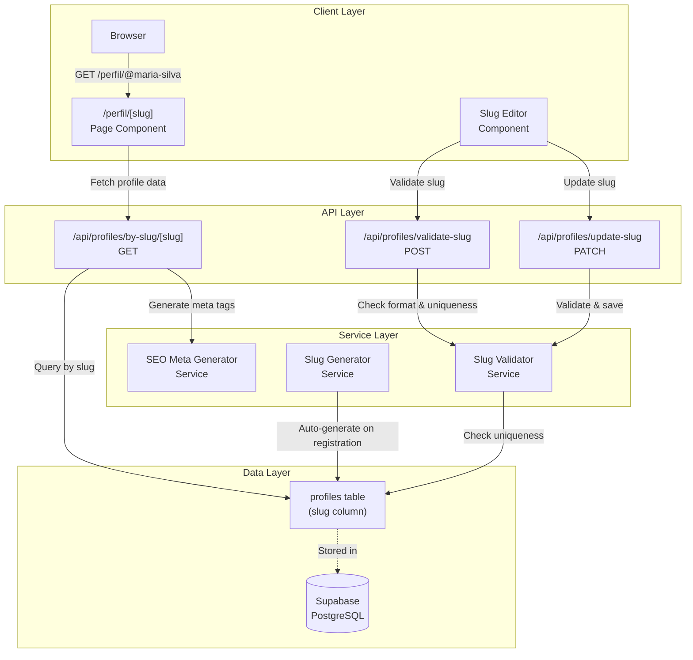

# Design Document: Página Pública do Perfil

## Overview

Este documento descreve o design técnico para a funcionalidade de Página Pública do Perfil (US05), que permite que visitantes acessem perfis de usuários através de URLs amigáveis usando slugs únicos. A feature já possui uma implementação parcial que será estendida e refinada para atender todos os requisitos.

### Objetivos

- Fornecer URLs amigáveis e memoráveis para perfis públicos usando slugs únicos
- Garantir validação robusta de slugs no frontend e backend
- Otimizar páginas de perfil para SEO e compartilhamento social
- Implementar geração automática de slugs durante o registro
- Fornecer interface intuitiva para gerenciamento de slugs

### Escopo

**Incluído:**
- Rota dinâmica Next.js para páginas de perfil público (`/perfil/[slug]`)
- Validação de formato e unicidade de slugs
- Geração automática de slugs baseada no nome do usuário
- Interface de preview de URL em tempo real
- Meta tags para SEO (Open Graph, Twitter Cards)
- API endpoints para validação e atualização de slugs
- Sanitização de entrada para prevenir ataques de injeção

**Não Incluído:**
- Sistema de analytics de visualizações (já implementado)
- Sistema de denúncias (já implementado)
- Funcionalidade de boost de perfis (feature separada)

## Architecture

### High-Level Architecture




### Architectural Decisions

**1. Next.js Dynamic Routes**
- Utilizamos o padrão de rotas dinâmicas do Next.js (`/perfil/[slug]`) para renderização eficiente
- Server-side rendering (SSR) para suporte a SEO e crawlers de redes sociais
- Permite geração de meta tags dinâmicas baseadas no perfil

**2. Dual Validation (Frontend + Backend)**
- Validação no frontend para feedback imediato ao usuário
- Validação no backend para garantir integridade dos dados
- Backend é a fonte de verdade para regras de negócio

**3. Slug Storage in Profiles Table**
- Slug armazenado na tabela `profiles` (não `users`) pois é um atributo do perfil público
- Índice único para garantir unicidade e performance de lookup
- Campo `slug_last_changed_at` para rastrear mudanças

**4. Atomic Slug Generation**
- Geração automática durante criação do perfil
- Algoritmo de sufixo numérico para resolver colisões
- Transação atômica para evitar race conditions

## Components and Interfaces

### Frontend Components

#### 1. PublicProfilePage Component
**Localização:** `app/profiles/[slug]/page.tsx`

**Responsabilidades:**
- Renderizar página pública do perfil
- Buscar dados do perfil via API
- Gerar meta tags para SEO
- Tratar erros (404 para slugs inexistentes)

**Props:**
```typescript
interface PublicProfilePageProps {
  params: {
    slug: string;
  };
}
```

**Estado:**
```typescript
interface ProfilePageState {
  profile: Profile | null;
  media: Media[];
  availability: Availability[];
  features: Feature[];
  loading: boolean;
  error: string | null;
}
```

#### 2. SlugEditor Component
**Localização:** `app/portal/profile/components/SlugEditorComponent.tsx` (novo)

**Responsabilidades:**
- Permitir edição do slug do perfil
- Validar formato em tempo real
- Mostrar preview da URL
- Verificar disponibilidade do slug
- Exibir mensagens de erro descritivas

**Props:**
```typescript
interface SlugEditorProps {
  currentSlug: string;
  onSlugUpdate: (newSlug: string) => Promise<void>;
  lastChangedAt: Date | null;
}
```

**Estado:**
```typescript
interface SlugEditorState {
  inputValue: string;
  isValidating: boolean;
  validationError: string | null;
  isAvailable: boolean | null;
  previewUrl: string;
}
```

#### 3. SEOMetaTags Component
**Localização:** `app/profiles/[slug]/components/SEOMetaTags.tsx` (novo)

**Responsabilidades:**
- Gerar meta tags Open Graph
- Gerar meta tags Twitter Cards
- Gerar canonical URL
- Usar dados do perfil para popular tags

**Props:**
```typescript
interface SEOMetaTagsProps {
  profile: Profile;
  coverImage: string | null;
}
```

### Backend API Endpoints

#### 1. GET /api/profiles/by-slug/[slug]
**Status:** Já implementado

**Responsabilidades:**
- Buscar perfil por slug
- Retornar apenas perfis publicados
- Incluir dados relacionados (media, availability, features)
- Retornar 404 para slugs inexistentes

**Response:**
```typescript
interface ProfileResponse {
  profile: Omit<Profile, 'phone_number'>;
  media: Media[];
  availability: Availability[];
  features: Feature[];
  pricing_packages: PricingPackage[];
  external_links: ExternalLink[];
}
```

#### 2. POST /api/profiles/validate-slug
**Status:** Novo

**Responsabilidades:**
- Validar formato do slug
- Verificar unicidade do slug
- Retornar erros descritivos

**Request:**
```typescript
interface ValidateSlugRequest {
  slug: string;
  currentSlug?: string; // Para permitir manter o slug atual
}
```

**Response:**
```typescript
interface ValidateSlugResponse {
  valid: boolean;
  available: boolean;
  errors: string[];
}
```

#### 3. PATCH /api/profiles/update-slug
**Status:** Novo

**Responsabilidades:**
- Validar novo slug
- Atualizar slug do perfil
- Atualizar timestamp de última mudança
- Retornar erros descritivos

**Request:**
```typescript
interface UpdateSlugRequest {
  slug: string;
}
```

**Response:**
```typescript
interface UpdateSlugResponse {
  success: boolean;
  slug: string;
  error?: string;
}
```

### Service Layer

#### 1. SlugValidator Service
**Localização:** `lib/services/slug-validator.ts` (novo)

**Responsabilidades:**
- Validar formato do slug (regex)
- Verificar comprimento mínimo
- Verificar unicidade no banco
- Sanitizar entrada

**Interface:**
```typescript
interface SlugValidatorService {
  validateFormat(slug: string): ValidationResult;
  checkUniqueness(slug: string, excludeProfileId?: string): Promise<boolean>;
  sanitize(input: string): string;
  validate(slug: string, excludeProfileId?: string): Promise<ValidationResult>;
}

interface ValidationResult {
  valid: boolean;
  errors: string[];
}
```

**Regras de Validação:**
- Comprimento mínimo: 4 caracteres
- Caracteres permitidos: `a-z`, `0-9`, `-`
- Não pode começar ou terminar com hífen
- Não pode ter hífens consecutivos
- Deve ser único na tabela profiles

#### 2. SlugGenerator Service
**Localização:** `lib/services/slug-generator.ts` (novo)

**Responsabilidades:**
- Gerar slug a partir do nome do usuário
- Resolver colisões com sufixos numéricos
- Garantir conformidade com regras de validação

**Interface:**
```typescript
interface SlugGeneratorService {
  generateFromName(name: string): string;
  generateUnique(baseName: string): Promise<string>;
  normalizeString(input: string): string;
}
```

**Algoritmo:**
1. Converter nome para lowercase
2. Substituir espaços por hífens
3. Remover caracteres especiais
4. Remover hífens consecutivos
5. Truncar para comprimento máximo (50 caracteres)
6. Se slug já existe, adicionar sufixo `-2`, `-3`, etc.

#### 3. SEOMetaGenerator Service
**Localização:** `lib/services/seo-meta-generator.ts` (novo)

**Responsabilidades:**
- Gerar meta tags Open Graph
- Gerar meta tags Twitter Cards
- Gerar canonical URL
- Formatar dados do perfil para SEO

**Interface:**
```typescript
interface SEOMetaGeneratorService {
  generateMetaTags(profile: Profile, coverImage: string | null): MetaTags;
}

interface MetaTags {
  title: string;
  description: string;
  canonical: string;
  openGraph: OpenGraphTags;
  twitter: TwitterCardTags;
}

interface OpenGraphTags {
  type: string;
  title: string;
  description: string;
  image: string;
  url: string;
}

interface TwitterCardTags {
  card: string;
  title: string;
  description: string;
  image: string;
}
```

## Data Models

### Database Schema

#### Profiles Table (Existing)
```sql
CREATE TABLE profiles (
  id UUID PRIMARY KEY DEFAULT gen_random_uuid(),
  user_id UUID NOT NULL REFERENCES users(id) ON DELETE CASCADE,
  display_name TEXT NOT NULL,
  slug TEXT NOT NULL UNIQUE,
  slug_last_changed_at TIMESTAMPTZ,
  category TEXT NOT NULL,
  short_description TEXT NOT NULL CHECK (LENGTH(short_description) <= 160),
  long_description TEXT NOT NULL,
  age_attribute INTEGER,
  city TEXT NOT NULL,
  region TEXT NOT NULL,
  geohash TEXT NOT NULL,
  latitude DECIMAL(10, 8) NOT NULL,
  longitude DECIMAL(11, 8) NOT NULL,
  status TEXT DEFAULT 'draft' CHECK (status IN ('draft', 'published', 'unpublished')),
  online_status_updated_at TIMESTAMPTZ DEFAULT NOW(),
  external_links JSONB DEFAULT '[]',
  pricing_packages JSONB DEFAULT '[]',
  created_at TIMESTAMPTZ DEFAULT NOW(),
  updated_at TIMESTAMPTZ DEFAULT NOW()
);

CREATE UNIQUE INDEX idx_profiles_slug ON profiles(slug);
```

**Observações:**
- O campo `slug` já existe e possui índice único
- O campo `slug_last_changed_at` já existe para rastrear mudanças
- Não são necessárias migrações de schema

### TypeScript Types

#### Profile Type (Existing)
```typescript
export interface Profile {
  id: string;
  user_id: string;
  display_name: string;
  slug: string;
  slug_last_changed_at: Date | null;
  category: string;
  short_description: string;
  long_description: string;
  age_attribute: number | null;
  city: string;
  region: string;
  geohash: string;
  latitude: number;
  longitude: number;
  status: "draft" | "published" | "unpublished";
  online_status_updated_at: Date;
  external_links: ExternalLink[];
  pricing_packages: PricingPackage[];
  created_at: Date;
  updated_at: Date;
}
```

#### Slug Validation Types (New)
```typescript
export interface SlugValidationError {
  code: 'TOO_SHORT' | 'INVALID_CHARACTERS' | 'ALREADY_EXISTS' | 'INVALID_FORMAT';
  message: string;
}

export interface SlugValidationResult {
  valid: boolean;
  available: boolean;
  errors: SlugValidationError[];
}
```


## Correctness Properties

*A property is a characteristic or behavior that should hold true across all valid executions of a system-essentially, a formal statement about what the system should do. Properties serve as the bridge between human-readable specifications and machine-verifiable correctness guarantees.*

### Property Reflection

Após análise dos critérios de aceitação, identificamos as seguintes redundâncias que foram eliminadas:

- **Requisito 7.1 é redundante com 2.3**: Ambos testam geração automática de slugs
- **Requisito 3.5 é redundante com 3.2**: Ambos testam validação de caracteres permitidos (inverso lógico)
- **Requisito 7.4 é redundante**: Implícito na lógica de geração seguir regras de validação
- **Requisito 8.2 é redundante com 1.1**: Ambos testam resolução de slug para perfil
- **Requisito 8.3 é redundante com 1.3**: Ambos testam retorno de 404 para slugs inexistentes
- **Requisito 10.3 é redundante com 2.1**: Ambos testam verificação de unicidade

As propriedades abaixo representam validações únicas e não redundantes.

### Property 1: Slug Resolution

*For any* valid slug that exists in the database, when a visitor accesses the URL `/perfil/@{slug}`, the system should return the corresponding profile data with HTTP 200 status.

**Validates: Requirements 1.1, 8.2**

**Test Strategy:** Generate random profiles with valid slugs, make GET requests to their URLs, and verify the correct profile is returned.

### Property 2: Complete Profile Data Display

*For any* published profile, the public profile page response should include all required public fields: display_name, slug, category, short_description, long_description, city, region, external_links, and pricing_packages.

**Validates: Requirements 1.2**

**Test Strategy:** Generate random profiles, fetch via API, and verify all required fields are present in the response.

### Property 3: Non-Existent Slug Returns 404

*For any* slug that does not exist in the database, when a visitor accesses the URL `/perfil/@{slug}`, the system should return HTTP 404 status.

**Validates: Requirements 1.3, 8.3**

**Test Strategy:** Generate random non-existent slugs, make GET requests, and verify 404 response.

### Property 4: Unauthenticated Access

*For any* published profile, the public profile page should be accessible without authentication, returning HTTP 200 for unauthenticated requests.

**Validates: Requirements 1.4**

**Test Strategy:** Make requests without authentication tokens and verify successful access to published profiles.

### Property 5: Slug Uniqueness Validation

*For any* slug that already exists in the database, when a profile owner attempts to use that slug for a different profile, the system should reject the request with an error indicating the slug is already in use.

**Validates: Requirements 2.1, 10.3**

**Test Strategy:** Create a profile with a slug, attempt to create/update another profile with the same slug, and verify rejection.

### Property 6: Slug Persistence

*For any* valid slug, when a profile is created or updated with that slug, the slug should be correctly stored in the profiles table and retrievable via query.

**Validates: Requirements 2.4**

**Test Strategy:** Create/update profiles with random slugs, query the database, and verify the slug is stored correctly.

### Property 7: Slug Auto-Generation from Name

*For any* user name, when a new profile is created, the system should automatically generate a slug by converting the name to lowercase and replacing spaces with hyphens.

**Validates: Requirements 2.3, 7.1, 7.2**

**Test Strategy:** Generate random user names, create profiles, and verify slugs follow the transformation rules (lowercase, spaces to hyphens).

### Property 8: Slug Minimum Length Validation

*For any* slug with fewer than 4 characters, the slug validator should reject it with an error indicating the minimum length requirement.

**Validates: Requirements 3.1**

**Test Strategy:** Generate slugs of various lengths (1-10 characters), validate them, and verify those under 4 characters are rejected.

### Property 9: Slug Character Validation

*For any* slug containing characters other than lowercase letters, numbers, and hyphens, the slug validator should reject it with an error listing the allowed characters.

**Validates: Requirements 3.2, 3.5**

**Test Strategy:** Generate slugs with various character sets (uppercase, special chars, spaces), validate them, and verify only valid character sets are accepted.

### Property 10: URL Preview Format

*For any* slug input value, the preview component should display the URL in the format `site.com/perfil/@{slug}` where {slug} is the current input value.

**Validates: Requirements 4.1, 4.2**

**Test Strategy:** Generate random slug inputs, render the preview component, and verify the URL format matches the expected pattern.

### Property 11: Validation Status Display

*For any* slug input (valid or invalid), the slug editor should display a validation status indicator showing whether the slug is valid or invalid.

**Validates: Requirements 4.4**

**Test Strategy:** Input valid and invalid slugs, and verify the validation status indicator appears with the correct state.

### Property 12: Profile Navigation

*For any* profile owner, when they click the "Ver meu perfil público" button, the system should navigate to their public profile page at `/perfil/@{their-slug}`.

**Validates: Requirements 5.2**

**Test Strategy:** Simulate button clicks for profiles with various slugs and verify navigation to the correct URL.

### Property 13: Open Graph Meta Tags Generation

*For any* published profile, the public profile page HTML should include Open Graph meta tags with og:title, og:description, og:image, og:url, and og:type properties.

**Validates: Requirements 6.1**

**Test Strategy:** Generate random profiles, render the page, and verify all required OG meta tags are present in the HTML.

### Property 14: Twitter Card Meta Tags Generation

*For any* published profile, the public profile page HTML should include Twitter Card meta tags with twitter:card, twitter:title, twitter:description, and twitter:image properties.

**Validates: Requirements 6.2**

**Test Strategy:** Generate random profiles, render the page, and verify all required Twitter Card meta tags are present.

### Property 15: Canonical URL Meta Tag

*For any* published profile, the public profile page HTML should include a canonical link tag pointing to the profile's unique URL.

**Validates: Requirements 6.3**

**Test Strategy:** Generate random profiles, render the page, and verify the canonical tag exists and points to the correct URL.

### Property 16: Page Title from Profile Name

*For any* published profile, the page title should match the profile's display_name.

**Validates: Requirements 6.4**

**Test Strategy:** Generate random profiles with various names, render the page, and verify the title tag content matches the display_name.

### Property 17: Meta Description from Bio

*For any* published profile, the meta description tag should contain the profile's short_description.

**Validates: Requirements 6.5**

**Test Strategy:** Generate random profiles with various bios, render the page, and verify the meta description matches the short_description.

### Property 18: Open Graph Image from Avatar

*For any* published profile with a cover image, the og:image meta tag should point to the profile's cover image URL.

**Validates: Requirements 6.6**

**Test Strategy:** Generate random profiles with cover images, render the page, and verify the og:image tag points to the correct image URL.

### Property 19: Slug Collision Resolution

*For any* base slug that already exists, when the auto-generation algorithm encounters a collision, it should append a numeric suffix (starting with -2) to ensure uniqueness.

**Validates: Requirements 7.3**

**Test Strategy:** Create multiple profiles with the same base name, and verify subsequent profiles get suffixes (-2, -3, etc.).

### Property 20: Slug Update Capability

*For any* profile owner, they should be able to successfully update their profile's slug to a new valid and available slug.

**Validates: Requirements 7.5**

**Test Strategy:** Create profiles, attempt to update their slugs to new valid values, and verify the updates succeed.

### Property 21: Format Validation Before Persistence

*For any* slug update request with invalid format, the system should reject the request with HTTP 400 before attempting any database operations.

**Validates: Requirements 10.2**

**Test Strategy:** Send slug update requests with invalid formats, and verify they're rejected with 400 status without database queries.

### Property 22: Validation Error Response Format

*For any* slug validation failure, the system should return an HTTP 400 error with a descriptive error message indicating the specific validation failure.

**Validates: Requirements 10.4**

**Test Strategy:** Send various invalid slug requests, and verify each returns 400 with a descriptive error message.

### Property 23: Input Sanitization

*For any* slug input containing potentially malicious characters (e.g., SQL injection attempts, XSS payloads), the system should sanitize the input and either reject it or safely process it without executing malicious code.

**Validates: Requirements 10.5**

**Test Strategy:** Generate inputs with SQL injection patterns, XSS payloads, and other malicious strings, and verify they're safely handled without causing security issues.

### Property 24: Slug Round-Trip Consistency

*For any* valid slug, when it is saved to the database and then retrieved, the retrieved value should be identical to the original value.

**Validates: Data integrity across the system**

**Test Strategy:** Generate random valid slugs, save them to profiles, retrieve the profiles, and verify the slug values match exactly.


## Error Handling

### Error Categories

#### 1. Validation Errors (HTTP 400)

**Slug Format Errors:**
```typescript
{
  code: 'INVALID_FORMAT',
  message: 'Slug deve conter apenas letras minúsculas, números e hífens',
  field: 'slug'
}
```

**Slug Length Errors:**
```typescript
{
  code: 'TOO_SHORT',
  message: 'Slug deve ter no mínimo 4 caracteres',
  field: 'slug'
}
```

**Slug Uniqueness Errors:**
```typescript
{
  code: 'ALREADY_EXISTS',
  message: 'Este slug já está em uso. Por favor, escolha outro.',
  field: 'slug'
}
```

#### 2. Not Found Errors (HTTP 404)

**Profile Not Found:**
```typescript
{
  code: 'NOT_FOUND',
  message: 'Perfil não encontrado'
}
```

**Slug Not Found:**
```typescript
{
  code: 'SLUG_NOT_FOUND',
  message: 'Nenhum perfil encontrado com este slug'
}
```

#### 3. Authorization Errors (HTTP 403)

**Unauthorized Slug Update:**
```typescript
{
  code: 'FORBIDDEN',
  message: 'Você não tem permissão para atualizar este perfil'
}
```

#### 4. Server Errors (HTTP 500)

**Database Errors:**
```typescript
{
  code: 'INTERNAL_ERROR',
  message: 'Erro ao processar requisição. Tente novamente.'
}
```

### Error Handling Strategy

#### Frontend Error Handling

**1. Validation Errors:**
- Exibir mensagens de erro inline no campo de slug
- Destacar campo com borda vermelha
- Desabilitar botão de salvar enquanto houver erros
- Mostrar sugestões de correção quando possível

**2. Network Errors:**
- Exibir toast notification com mensagem de erro
- Permitir retry da operação
- Manter estado do formulário para não perder dados

**3. 404 Errors:**
- Exibir página de erro amigável
- Oferecer link para voltar ao catálogo
- Sugerir perfis similares (feature futura)

#### Backend Error Handling

**1. Input Validation:**
- Validar todos os inputs antes de processar
- Retornar erros descritivos e acionáveis
- Usar códigos de erro consistentes

**2. Database Errors:**
- Capturar erros de constraint violation
- Traduzir erros técnicos para mensagens amigáveis
- Logar erros para debugging

**3. Race Conditions:**
- Usar transações para operações atômicas
- Implementar retry logic para conflitos temporários
- Validar unicidade no momento da inserção

### Error Recovery

**Slug Collision During Auto-Generation:**
```typescript
async function generateUniqueSlug(baseName: string): Promise<string> {
  let slug = normalizeString(baseName);
  let suffix = 1;
  
  while (await slugExists(slug)) {
    suffix++;
    slug = `${normalizeString(baseName)}-${suffix}`;
  }
  
  return slug;
}
```

**Validation Failure Recovery:**
- Frontend: Permitir edição imediata após erro
- Backend: Retornar estado anterior em caso de falha
- Não persistir mudanças parciais

## Testing Strategy

### Dual Testing Approach

Esta feature utilizará uma abordagem dual de testes:

**Unit Tests:** Verificar exemplos específicos, casos extremos e condições de erro
**Property Tests:** Verificar propriedades universais através de múltiplos inputs gerados

Ambos são complementares e necessários para cobertura abrangente. Unit tests capturam bugs concretos, enquanto property tests verificam corretude geral.

### Property-Based Testing

**Framework:** `fast-check` (JavaScript/TypeScript property-based testing library)

**Configuration:**
- Mínimo de 100 iterações por teste de propriedade
- Cada teste deve referenciar a propriedade do design document
- Tag format: `Feature: public-profile-page, Property {number}: {property_text}`

**Example Property Test:**
```typescript
import fc from 'fast-check';
import { describe, it, expect } from 'vitest';
import { validateSlug } from '@/lib/services/slug-validator';

describe('Slug Validation Properties', () => {
  // Feature: public-profile-page, Property 8: Slug Minimum Length Validation
  it('should reject slugs with fewer than 4 characters', () => {
    fc.assert(
      fc.property(
        fc.string({ minLength: 1, maxLength: 3 }),
        (shortSlug) => {
          const result = validateSlug(shortSlug);
          expect(result.valid).toBe(false);
          expect(result.errors).toContainEqual(
            expect.objectContaining({ code: 'TOO_SHORT' })
          );
        }
      ),
      { numRuns: 100 }
    );
  });

  // Feature: public-profile-page, Property 9: Slug Character Validation
  it('should reject slugs with invalid characters', () => {
    fc.assert(
      fc.property(
        fc.string().filter(s => /[^a-z0-9-]/.test(s)),
        (invalidSlug) => {
          const result = validateSlug(invalidSlug);
          expect(result.valid).toBe(false);
          expect(result.errors).toContainEqual(
            expect.objectContaining({ code: 'INVALID_CHARACTERS' })
          );
        }
      ),
      { numRuns: 100 }
    );
  });

  // Feature: public-profile-page, Property 24: Slug Round-Trip Consistency
  it('should maintain slug value through save and retrieve', async () => {
    fc.assert(
      await fc.asyncProperty(
        fc.string({ minLength: 4, maxLength: 50 })
          .filter(s => /^[a-z0-9-]+$/.test(s)),
        async (validSlug) => {
          const profile = await createTestProfile({ slug: validSlug });
          const retrieved = await getProfileBySlug(validSlug);
          expect(retrieved.slug).toBe(validSlug);
        }
      ),
      { numRuns: 100 }
    );
  });
});
```

### Unit Testing

**Focus Areas:**
- Specific examples of valid and invalid slugs
- Edge cases (empty strings, very long strings, special characters)
- Error message formatting
- Integration between components
- API endpoint behavior

**Example Unit Tests:**
```typescript
describe('SlugValidator', () => {
  describe('format validation', () => {
    it('should accept valid slug "maria-silva"', () => {
      const result = validateSlug('maria-silva');
      expect(result.valid).toBe(true);
      expect(result.errors).toHaveLength(0);
    });

    it('should reject slug with uppercase letters', () => {
      const result = validateSlug('Maria-Silva');
      expect(result.valid).toBe(false);
      expect(result.errors[0].code).toBe('INVALID_CHARACTERS');
    });

    it('should reject slug with spaces', () => {
      const result = validateSlug('maria silva');
      expect(result.valid).toBe(false);
    });

    it('should reject slug shorter than 4 characters', () => {
      const result = validateSlug('abc');
      expect(result.valid).toBe(false);
      expect(result.errors[0].code).toBe('TOO_SHORT');
    });
  });

  describe('uniqueness validation', () => {
    it('should reject duplicate slug', async () => {
      await createTestProfile({ slug: 'existing-slug' });
      const result = await validateSlugUniqueness('existing-slug');
      expect(result.available).toBe(false);
    });

    it('should allow slug for same profile', async () => {
      const profile = await createTestProfile({ slug: 'my-slug' });
      const result = await validateSlugUniqueness('my-slug', profile.id);
      expect(result.available).toBe(true);
    });
  });
});

describe('SlugGenerator', () => {
  it('should generate slug from name "Maria Silva"', () => {
    const slug = generateFromName('Maria Silva');
    expect(slug).toBe('maria-silva');
  });

  it('should handle names with special characters', () => {
    const slug = generateFromName('José Antônio');
    expect(slug).toBe('jose-antonio');
  });

  it('should add suffix for duplicate slugs', async () => {
    await createTestProfile({ slug: 'maria-silva' });
    const slug = await generateUniqueSlug('Maria Silva');
    expect(slug).toBe('maria-silva-2');
  });
});

describe('GET /api/profiles/by-slug/[slug]', () => {
  it('should return profile for valid slug', async () => {
    const profile = await createTestProfile({ slug: 'test-profile' });
    const response = await fetch('/api/profiles/by-slug/test-profile');
    expect(response.status).toBe(200);
    const data = await response.json();
    expect(data.profile.id).toBe(profile.id);
  });

  it('should return 404 for non-existent slug', async () => {
    const response = await fetch('/api/profiles/by-slug/non-existent');
    expect(response.status).toBe(404);
  });

  it('should not return unpublished profiles', async () => {
    await createTestProfile({ slug: 'draft-profile', status: 'draft' });
    const response = await fetch('/api/profiles/by-slug/draft-profile');
    expect(response.status).toBe(404);
  });
});
```

### Integration Testing

**Scenarios to Test:**
1. Complete user flow: Register → Auto-generate slug → View public profile
2. Slug update flow: Edit slug → Validate → Save → Verify URL change
3. SEO meta tags: Create profile → Access public page → Verify meta tags
4. Error handling: Invalid slug → See error → Correct → Success

### Test Data Generators

**For Property-Based Tests:**
```typescript
// Valid slug generator
const validSlugArbitrary = fc.string({ minLength: 4, maxLength: 50 })
  .filter(s => /^[a-z0-9-]+$/.test(s))
  .filter(s => !s.startsWith('-') && !s.endsWith('-'))
  .filter(s => !s.includes('--'));

// Invalid slug generator
const invalidSlugArbitrary = fc.oneof(
  fc.string({ maxLength: 3 }), // Too short
  fc.string().filter(s => /[A-Z]/.test(s)), // Uppercase
  fc.string().filter(s => /[^a-z0-9-]/.test(s)), // Special chars
  fc.constant(''), // Empty
);

// Profile generator
const profileArbitrary = fc.record({
  display_name: fc.string({ minLength: 1, maxLength: 100 }),
  slug: validSlugArbitrary,
  category: fc.constantFrom('categoria1', 'categoria2', 'categoria3'),
  short_description: fc.string({ maxLength: 160 }),
  long_description: fc.string({ minLength: 10, maxLength: 1000 }),
  city: fc.string({ minLength: 2, maxLength: 50 }),
  region: fc.string({ minLength: 2, maxLength: 50 }),
});
```

### Test Coverage Goals

- **Unit Tests:** 90%+ code coverage
- **Property Tests:** All 24 correctness properties implemented
- **Integration Tests:** All critical user flows covered
- **E2E Tests:** Main scenarios (register, view profile, update slug)

### Continuous Testing

- Run unit tests on every commit
- Run property tests on every PR
- Run integration tests before deployment
- Monitor production for slug-related errors

